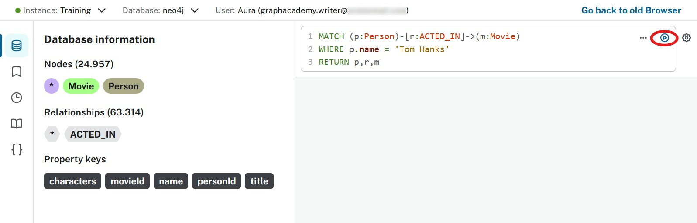
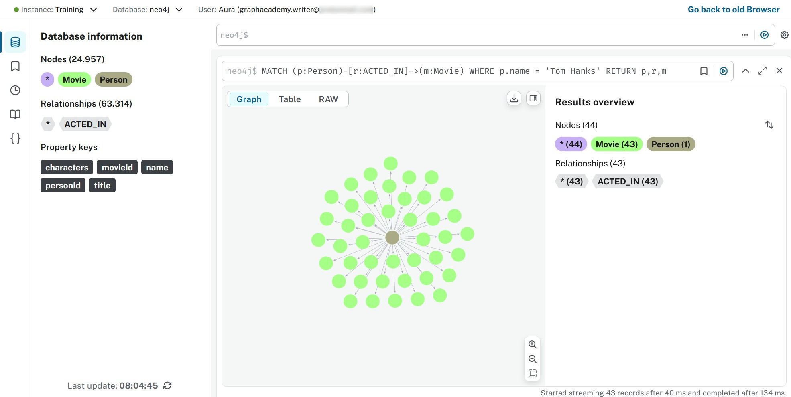

= Query tool
:type: lesson
:order: 2
:slides: true

In the previous lesson, you learned how to import data into your Aura instance.
In this lesson, you will learn how to:

* Connect to your Aura instance using the integrated query tool
* Execute Cypher queries to explore your data
* Visualize query results using different formats

[.slide]

== Connecting

Before you start, make sure you have completed the previous lesson and imported the sample data into your Aura instance.

If you haven't done that yet, go back to the previous lesson and follow the steps to import the data.

Open the Aura console and select the instance you want to connect to.

image::images/02_query_tool_connect.jpg[querytool_connect,width=500,align=center]

Before you select **Query**, check that you've loaded the data from the previous lesson.

image::images/02_query_tool_start.jpg[querytool_start,width=500,align=center]

The Query UI consists of the sidebar, the Cypher editor, and the result frame(s).

As a good practice, you should remove the result-frames you don't want/need.

Click on the three dots next to the frame title and select **Remove frame**.

[.slide.col=2]

== Querying
Start by exploring the database details.

Click on the labels and relationship types under **Database Information** to see the number of nodes and relationships in the database.

Copy the following Cypher query into the query editor:

[source,cypher]
----
MATCH (p:Person)-[r:ACTED_IN]->(m:Movie)
WHERE p.name = 'Tom Hanks'
RETURN p,r,m
----

Use the **Run** button or press `Ctrl+Enter` to execute the query.

If you want to change the styling of the results, click on the labels in the **Results overview** and make changes according to your preferences.

image::images/02_query_tool_styling.jpg[querytool_styling,width=600,align=center]

== Conclusion
The **Query Tool** is a powerful interface for interacting with your Neo4j database. It allows you to run Cypher queries, visualize results, and explore your graph data.

* Manage schema
* Manage roles and permissions
* Develop, test and troubleshooting queries

In the next lesson we take a look at an alternative way to **explore** the database!

== Check your understanding
include::questions/1-purpose.adoc[leveloffset=+1]

[.summary]
== Summary

In this lesson you learned how to use the integrated Query tool in the Aura console to connect to your database instance, execute Cypher queries, and visualize the results.

In the next lesson, you will learn a different way to explore your data.
