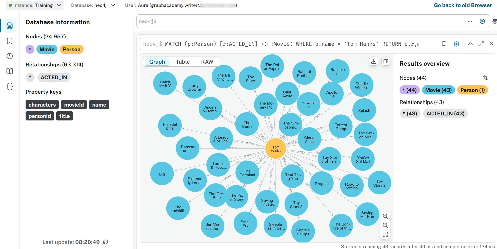

= Query tool
:type: lesson
:order: 2
:slides: true

[.slide.discrete]
== Querying data

In the previous lesson, you imported data into your Aura instance.

In this lesson, you will learn how to:

* Connect to your Aura instance using the Query tool
* Execute Cypher queries to explore your data
* Visualize query results in different formats

[.slide]
== Prerequisites

Before starting, complete the previous lesson and import the sample data into your Aura instance.

Open the Aura console and select your instance.

[.slide]
== Accessing the Query tool
image::images/02_query_tool_connect.jpg[querytool_connect,width=500,align=center]

Before you select **Query**, check that you've loaded the data from the previous lesson.

[.slide]
== Query Tool interface
image::images/02_query_tool_start.jpg[querytool_start,width=500,align=center]

The Query UI consists of the sidebar, the Cypher editor, and the result frame(s).

[.slide]

== AI generated queries

Generate queries from a prompt using the **Generate with AI** button.

Enter a description of what you want to query and the Cypher will be created for you. For example, "Find all movies".

video::https://cdn.graphacademy.neo4j.com/courses/aura-fundamentals/generate-query-ai.mp4["Generate Query AI",role="cdn", width=100%]

[.slide]

== Querying
Start by exploring the database details.

Click on the labels and relationship types under **Database Information** to see the number of nodes and relationships in the database.

// Copy the following Cypher query into the query editor:

// ----
// MATCH (p:Person)-[r:ACTED_IN]->(m:Movie)
// WHERE p.name = 'Tom Hanks'
// RETURN p,r,m
// ----

[.slide]
== Running a query
image::images/02_query_tool_command.jpg[querytool_command,width=600,align=center]

Use the **Run** button or press `Ctrl+Enter` to execute the query.

[.slide]
== Query results

image::images/02_query_tool_result.jpg[querytool_result,width=600,align=center]

To customize the result styling, click on the labels in the **Results overview** and adjust the appearance.

[.slide]
== Styling results

Customize how nodes and relationships appear in the graph view:

* **Colors** - Assign different colors to node labels for visual distinction
* **Size** - Adjust node size based on importance or a property value
* **Captions** - Choose which property to display as the node label (e.g., name, title)
* **Icons** - Add icons to nodes for quick visual identification

These styling choices help you quickly identify patterns and distinguish between different types of nodes in your results.

[.slide]
== Query tool capabilities

The Query tool provides an interface for database interaction through Cypher:

* Run Cypher queries and view results in multiple formats
* Execute administrative commands (schema, indexes, constraints)
* Develop, test, and troubleshoot queries
* Generate queries using AI assistance

[.slide]
== Result visualization formats

The Query tool displays results in multiple formats depending on your data:

**Graph view** displays nodes and relationships visually:

* Visualizes relationships between nodes
* Reveals connection patterns
* Works well with small to medium result sets (up to a few hundred nodes)

**Table view** organizes results in rows and columns:

* Displays aggregated results (counts, sums, averages)
* Enables property comparisons across nodes
* Supports exporting data for further analysis

**Text/JSON view** shows raw output:

* Useful for debugging query results
* Allows copying data programmatically
* Displays raw property values

[.slide]
== When to use Query vs other tools

Use the **Query tool** when you need to:

* Write and test Cypher queries
* Perform database administration (schema, indexes, constraints)
* Debug application queries
* Work with precise, code-based data manipulation

Consider **Explore** instead when:

* Users don't know Cypher
* You need to visualize thousands of nodes
* You want to share standardized views via Perspectives

Consider **Dashboards** instead when:

* End users need self-service access to insights
* You want to present aggregated metrics
* Stakeholders need interactive reports

In the next lesson, you will explore an alternative visual approach to exploring your data.

[.quiz]
== Check your understanding

include::questions/1-purpose.adoc[leveloffset=+1]

[.summary]
== Summary

In this lesson, you learned how to use the Query tool to connect to your database, execute Cypher queries, and visualize results.

Key capabilities include running queries, managing schema, and customizing result visualization.

For more information on the Query tool and Cypher syntax, see the link:https://neo4j.com/docs/aura/query/introduction/[Neo4j Aura Query documentation^] and the link:https://neo4j.com/docs/cypher-manual/current/[Cypher Manual^].

In the next lesson, you will learn to explore your data visually without writing Cypher.
