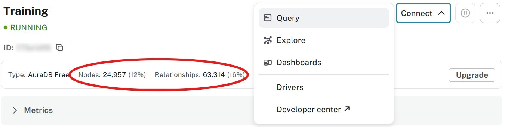
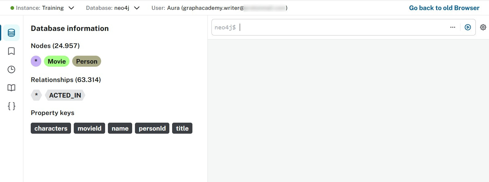

= Query tool
:type: lesson
:order: 2
:slides: true

[.slide.discrete]
== Using the Query tool

In the previous lesson, you learned how to import data into your Aura instance.
In this lesson, you will learn how to:

* Connect to your Aura instance using the integrated query tool
* Execute Cypher queries to explore your data
* Visualize query results using different formats

   
[.slide]

== Connecting

Before you start, make sure you have completed the previous lesson and imported the sample data into your Aura instance.

If you haven't done that yet, go back to the previous lesson and follow the steps to import the data.

Open the Aura console and select the instance you want to connect to.

[.slide]
== Accessing the Query tool

Before you select **Query**, check that you've loaded the data from the previous lesson.

[.slide]
== Query Tool interface

The Query UI consists of the sidebar, the Cypher editor, and the result frame(s).

[.slide]
  
== AI generated queries

You can generate queries from a prompt using the "Generate with AI" button. 

Enter a description of what you want to query and the Cypher will be created for you. For example, "FInd all movies".

video::https://cdn.graphacademy.neo4j.com/courses/aura-fundamentals/generate-query-ai.mp4["Generate Query AI",role="cdn",  width=100%]

[.slide]

== Querying
Start by exploring the database details.

Click on the labels and relationship types under **Database Information** to see the number of nodes and relationships in the database.

Copy the following Cypher query into the query editor:

[source,cypher]
----
MATCH (p:Person)-[r:ACTED_IN]->(m:Movie)
WHERE p.name = 'Tom Hanks'
RETURN p,r,m
----
[.slide]
== Running a query
image::images/02_query_tool_command.jpg[querytool_command,width=600,align=center]

Use the **Run** button or press `Ctrl+Enter` to execute the query.

[.slide]
== Query results
image::images/02_query_tool_result.jpg[querytool_result,width=600,align=center]

If you want to change the styling of the results, click on the labels in the **Results overview** and make changes according to your preferences.

[.slide]
== Styling results
image::images/02_query_tool_styling.jpg[querytool_styling,width=600,align=center]

[.slide]

== Conclusion
The **Query Tool** is a powerful interface for interacting with your Neo4j database. It allows you to run Cypher queries, visualize results, and explore your graph data.

* Manage schema
* Manage roles and permissions
* Develop, test and troubleshooting queries

In the next lesson we take a look at an alternative way to **explore** the database!

[.quiz]
== Check your understanding

include::questions/1-purpose.adoc[leveloffset=+1]

[.summary]
== Summary

In this lesson you learned how to use the integrated Query tool in the Aura console to connect to your database instance, execute Cypher queries, and visualize the results.

In the next lesson, you will learn a different way to explore your data.
