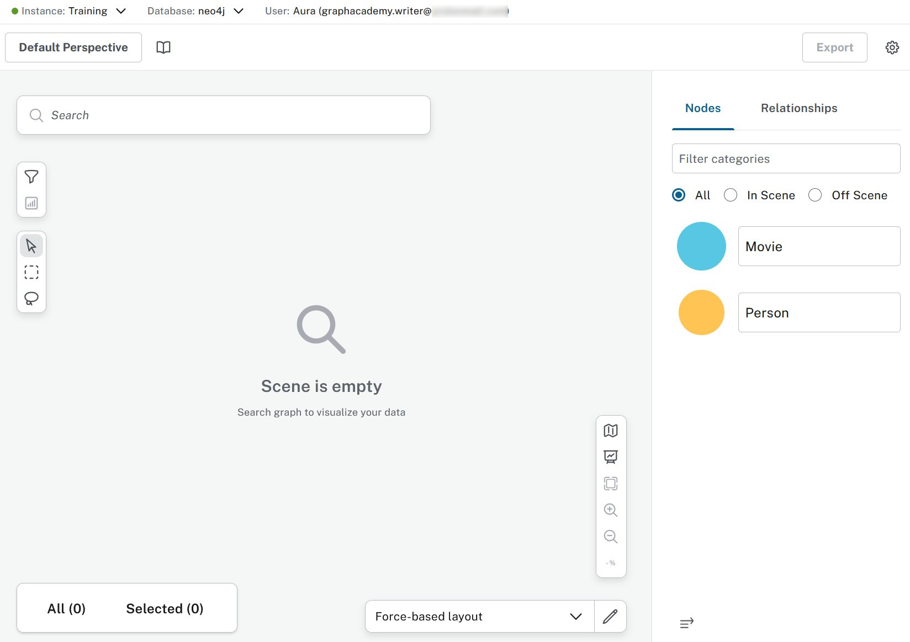
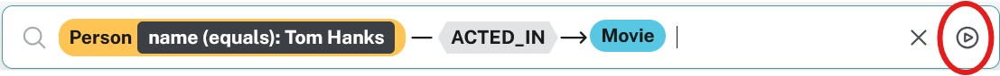
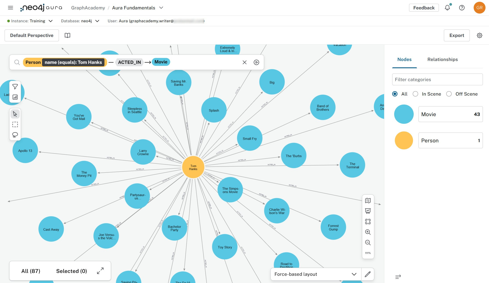
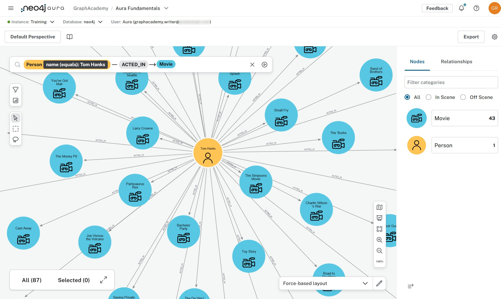

= Explore data
:type: lesson
:order: 3
:slides: true

In the previous lesson, you learned how to query data in an Aura database.

In this lesson, you will learn how to:

* Connect to your Aura instance using the integrated explore tool
* Explore and visualize your data without using Cypher
* Understand the differences between the **Query Tool** and the **Explore Tool**

[.slide]
== Quick introduction

The **Explore** tool is a powerful interface for visualizing and exploring your graph data. It allows you to interact with your data in a more intuitive way, without needing to write Cypher queries. You can search for nodes and relationships, visualize them, and even edit the graph directly.

Before diving into the integrated Explore tool, note that you can also use link:https://explore.neo4j.io[Neo4j Bloom^]. You can connect to the instance using your credentials and conneciton URL and carry on from there.

[.slide][.col=2]

== Connecting
From the Aura console, either go to **Instances** and select the instance you want to connect to and use the **Connect** dropdown and select **Explore**, or directly to **Explore** and use the Connect button from there.

image::images/03_explore_tool_connect.jpg[exploretool_connect,width=500,align=center]

Before you do either, check that the data from the Import lesson has been loaded.

== Explore
Once connected, you can start exploring your data without writing any Cypher.
The UI consists of a searchbar, a scene where the results are visualized, and a legend panel.
To get started:

* <click> in the searchbar

* <select> Person

* <select> Person name:value

* <select> Person name(equals):value

* <type> Tom Hanks

* <select> ACTED_IN

* <select> Movie

Use the **Run** button or press `Ctrl+Enter` to execute the search.

[NOTE]
====
You may have to zoom in a bit before the details are shown.
====

Notice that your styling choices are kept between runs and can even be shared with other users, using the **Perspectives** feature.

[.slide]

== Differences
The **Explore** tool is designed for users who may not be familiar with Cypher syntax or prefer a more visual approach to exploring their data. It provides several advantages over the **Query Tool**:

* **No Cypher knowledge required**: You can explore your data without needing to write Cypher queries (1).

* **Visual exploration**: You can interact with your data visually, making it easier to understand relationships and patterns.

* **Editing capabilities**: You can edit nodes and relationships directly in the graph view, without needing to write Cypher commands.

* **Perspectives**: You can create and share Perspectives, which are predefined views of your data that can include specific search phrases and styling options.

* Further exploration is possible from an initial set of results (via contextmenu on the nodes).

* Editing the graph is possible without knowing Cypher syntax (2).

* Customization is possible through the use of Perspectives and Scenes. This goes beyond mere styling and can include defined parametrized queries (3). Perspectives can be shared. This allows for a uniform experience in an organization.

* Whereas the **Query tool** is fit for maybe a few hundred nodes and relationships, **Explore** can easily manage thousands.

[NOTE]
====
1. The model has to be understood. You can explore the data knowing what the database holds and how it is organized.

2. Security does apply. If the user's role does not allow editing the database this step will not work. The user will be informed about that.

3. Defining these queries (also known as **search phrases**) does require knowledge of Cypher syntax. As the Perspectives can be shared, not everybody needs to have that knowledge.
====

[.slide]
== More information
The **Explore** tool is a powerful way to visualize and interact with your graph data. It is particularly useful for business users and analysts who want to explore data without needing to write complex queries.
For more information on how to use the **Explore** tool, you can refer to the [Neo4j Aura documentation](https://neo4j.com/docs/aura-user-guide/current/explore).

**Explore/Bloom is NOT an application development enviroment!**

It is a tool for exploring and visualizing data. If you want to build applications that interact with Neo4j, you should use the **Query Tool** or one of the Neo4j drivers.

== Check your understanding
include::questions/1-purpose.adoc[leveloffset=+1]

[.summary]
== Summary
===
In this lesson you learned how to use the integrated Explore tool in the Aura console to connect to your database instance, explore your data visually, and understand the differences between the **Query Tool** and the **Explore Tool**.

In the next lesson, you will explore the Dashboards tool to create visual representations of your data.
===
