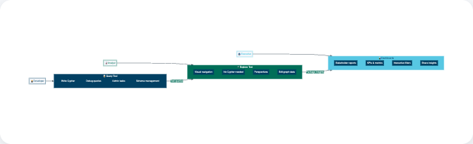

= Building dashboards
:type: lesson
:order: 6
:slides: true

[.slide.discrete]
== Building dashboards

You have learned how to execute Cypher queries using the Query tool and explore your data using the Explore tool.

In this lesson, you will learn how to:

* Create interactive dashboards using the Aura dashboard tool
* Build dashboard cards with Cypher queries
* Add filters to make dashboards dynamic

[.slide]

== Understanding dashboards

Dashboards transform raw data into visual representations that anyone can understand, regardless of their technical background.

Dashboards serve as the "storefront window" for your graph data - they display the most important insights in an accessible, visual format that business users can interact with without writing code.
In Aura, the dashboard tool allows you to quickly prototype and build production-ready dashboards.

[.slide]
 
== Creating your first dashboard

You will learn how to build a dashboard that visualizes actor relationships in the movie database.

First, navigate to the Dashboards section in your Aura console:

image::images/04_dashboard_tool_connect.jpg[dashboard_connect,width=500,align=center]

[.slide]
== Starting a new dashboard

Before creating your dashboard, verify that you've loaded the sample movie data in your instance.

Click **Create dashboard** to begin:

image::images/04_dashboard_tool_start.jpg[dashboard_start,width=500,align=center]

[.slide]
== Dashboard interface tour
video::https://cdn.graphacademy.neo4j.com/courses/aura-fundamentals/create-edit-dashboard.mp4["Create and Edit Dashboard",role="cdn", width=100%]

Rename your dashboard from "New dashboard" to something descriptive like "Movie Analytics Dashboard" by clicking on the title.

[.slide]
== Dashboard interface overview

Rename your dashboard from "New dashboard" to something descriptive like "Movie Analytics Dashboard" by clicking on the title.
image::images/04_dashboard_tool_tour.jpg[dashboard_tour,width=500,align=center]

[.slide]
== Building dashboards with AI assistance

Create an AI-generated dashboard by clicking the **Generate with AI** button. Enter a description of the insights you want to visualize, and the AI generates a dashboard based on your description: 

video::https://cdn.graphacademy.neo4j.com/courses/aura-fundamentals/create-dashboard-with-ai.mp4["Generate Dashboard with AI",role="cdn", width=100%]

[.slide]

== Adding cards

To display specific data visualizations, you need to add dashboard cards.

video::https://cdn.graphacademy.neo4j.com/courses/aura-fundamentals/new-card-ai.mp4["Create New Card with AI",role="cdn", width=100%]

[.slide]
== Configuring a card

Click **Add a card** to create your first visualization:

* Change the card title from "New card" to "Actor Overview"
* Select **Graph** from the visualization type dropdown
* Paste the following Cypher query in the Query field:

----
MATCH (p:Person)-[r:ACTED_IN]->(m:Movie)
WHERE p.name = 'Tom Hanks'
RETURN p,r,m
----

[.slide]
== Saving and viewing the card

Click **Save card** to add it to your dashboard:

image::images/04_dashboard_tool_card.jpg[dashboard_card,width=500,align=center]

Your dashboard will display a graph visualization showing Tom Hanks' movie connections:

image::images/04_dashboard_tool_hanks.jpg[dashboard_hanks,width=500,align=center]

[.slide]
[TIP]
.Repositioning cards
====
Move cards by dragging them using the six-dot handle that appears when you hover over a card.
====

[.slide]

== Making dashboards interactive with filters

Use static dashboards to present fixed insights, or add interactivity to allow users to explore data dynamically.

Filters allow users to dynamically change what data is displayed without modifying queries.

To add a filter to your dashboard, go to the dashboard view and select **Add filter**. 

Fill in the filter name and select the property you want to filter by.

[.slide]
== Configuring a filter
image::images/04_dashboard_tool_filter.jpg[dashboard_filter,width=300,align=center]

For example, create a "Person selection" filter that will control which actor's data is displayed.

[.slide]
== Linking filters to dashboard cards

Now update your Actor Overview card query to use the filter parameter.

----
MATCH (p:Person)-[r:ACTED_IN]->(m:Movie)
WHERE p.name = $person_name
RETURN p,r,m
----

[.slide]
== Testing the filter

Save your changes and test the filter:

image::images/04_dashboard_tool_selection.jpg[dashboard_selection,width=500,align=center]

[.slide]
== Dynamic dashboard results

Your dashboard now responds dynamically to filter selections:

image::images/04_dashboard_tool_result.jpg[dashboard_result,width=500,align=center]

[.slide]

== Editing cards

Production dashboards often require updates as data and requirements evolve. 

After creating a dashboard card, edit it at any time by clicking the three-dot menu on the card and selecting **Edit card**.

video::https://cdn.graphacademy.neo4j.com/courses/aura-fundamentals/edit-card.mp4["Edit Card", role="cdn", width=100%]

[.slide]
== Updating a card

After making changes to your card (updating the query, changing visualization type, or adjusting filters), save those changes.

video::https://cdn.graphacademy.neo4j.com/courses/aura-fundamentals/save-card.mp4["Save Card", role="cdn", width=100%]

[.slide]
== Dashboard visualization types

Choose the right visualization based on your data:

[cols="1,3"]
|===
|Type |Use case

|**Graph**
|Relationships and connections, network visualizations, entity displays

|**Table**
|Detailed listings, sortable/searchable data, export-ready formats

|**Bar/Column**
|Category comparisons, rankings, discrete values

|**Line**
|Trends over time, continuous data, multiple series

|**Pie/Donut**
|Part-to-whole relationships, distributions (limit to 5-7 categories)

|**Single value/KPI**
|Key metrics at a glance, status indicators, executive summaries
|===

[.slide]
== Where dashboards fit in your workflow

Dashboards serve as the bridge between your graph database and business stakeholders.

They enable rapid prototyping of data visualizations and can often become production solutions for organizations that need quick insights without custom application development.

The dashboard tool excels at:

* Quick data exploration and validation
* Creating stakeholder presentations
* Building operational monitoring dashboards
* Prototyping before investing in custom applications

[.slide.col-2]
== Query, Explore, and Dashboards

[.col]
====
Each tool serves a different purpose in your data workflow. The diagram shows which users typically use each tool and how they connect.

These tools complement each other in a typical workflow:

1. **Query** - Develop and test your Cypher queries
2. **Explore** - Validate results visually and create Perspectives
3. **Dashboards** - Package insights for stakeholders
====

[.col]
====

====

[.slide]
== Summary video
video::https://cdn.graphacademy.neo4j.com/courses/aura-fundamentals/dashboards-long-version.mp4["Dashboard Prototyping", role="cdn", width=100%]

[.quiz]
== Check your understanding

include::questions/1-purpose.adoc[leveloffset=+1]

[.summary]
== Summary

In this lesson, you learned how to create interactive dashboards in Aura, build dashboard cards with Cypher queries, and add filters to make your dashboards dynamic and user-friendly.

For more information on dashboards, see the link:https://neo4j.com/docs/aura/dashboards/[Neo4j Aura Dashboards documentation^].

In the next module, you will learn about operations, including shared responsibilities, security, and further learning resources.
