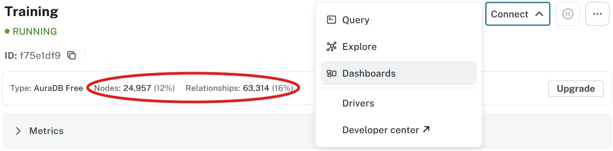

= Building dashboards
:type: lesson
:order: 4
:slides: true

In the previous lessons, you learned how to execute Cypher queries using the Query tab and explored your data using the Explore tab.
Now you'll learn how to create visual dashboards that make your data accessible to business users and stakeholders.

In this lesson, you will learn how to:

* Create interactive dashboards using Aura's integrated dashboard tool
* Build dashboard cards with Cypher queries
* Add filters to make dashboards dynamic

[.slide]
== Understanding dashboard tools

A dashboard tool transforms raw data into visual representations that anyone can understand, regardless of their technical background.

Think of dashboards as the "storefront window" for your graph data - they display the most important insights in an accessible, visual format that business users can interact with without writing code.

In Aura, you have access to an integrated dashboard tool that allows you to quickly prototype and build production-ready dashboards.

[NOTE]
.Dashboard tool evolution
====
The integrated dashboard tool was formerly known as Neodash and is now fully integrated into the Aura console for seamless access.
====
[.slide][.col=2]
== Creating your first dashboard

You will learn how to build a dashboard that visualizes actor relationships in the movie database.

First, navigate to the Dashboards section in your Aura console:

Before creating your dashboard, verify that you've loaded the sample movie data in your instance.

Click **Create dashboard** to begin:

Rename your dashboard from "New dashboard" to something descriptive like "Movie Analytics Dashboard" by clicking on the title.

[.slide][.col=2]
== Adding dashboard cards

Dashboard cards are individual components that display specific data visualizations.

Click **Add a card** to create your first visualization:

* Change the card title from "New card" to "Actor Overview"
* Select **Graph** from the visualization type dropdown
* Paste the following Cypher query in the Query field:

[source,cypher]
----
MATCH (p:Person)-[r:ACTED_IN]->(m:Movie)
WHERE p.name = 'Tom Hanks'
RETURN p,r,m
----

Your dashboard will display a graph visualization showing Tom Hanks' movie connections:

[TIP]
.Repositioning cards
====
You can move cards by dragging them using the six-dot handle that appears when you hover over a card.
====

[.slide][.col=2]

== Making dashboards interactive with filters

Static dashboards are useful, but interactive dashboards are powerful.
Filters allow users to dynamically change what data is displayed without modifying queries.

Add a filter to your dashboard:

Create a "Person selection" filter that will control which actor's data is displayed.

Now update your Actor Overview card query to use the filter parameter:

[source,cypher]
----
MATCH (p:Person)-[r:ACTED_IN]->(m:Movie)
WHERE p.name = $person_name
RETURN p,r,m
----

Save your changes and test the filter:

Your dashboard now responds dynamically to filter selections:

image::images/04_dashboard_tool_result.jpg[dashboard_result,width=500,align=center]

[.slide][.col=2]

== Where dashboards fit in your workflow

Dashboards serve as the bridge between your graph database and business stakeholders.
They enable rapid prototyping of data visualizations and can often become production solutions for organizations that need quick insights without custom application development.

The integrated dashboard tool excels at:

* Quick data exploration and validation
* Creating stakeholder presentations
* Building operational monitoring dashboards
* Prototyping before investing in custom applications

[NOTE]
.Advanced dashboarding
====
For more advanced features, you can also use the standalone link:https://neodash.graphapp.io/[Neodash application^] which offers additional customization options.
====

Next, you'll learn how to manage and optimize your Aura database performance.

== Check your understanding

include::questions/1-purpose.adoc[leveloffset=+1]

[.summary]
== Summary

In this lesson, you learned how to create interactive dashboards in Aura, build dashboard cards with Cypher queries and add filters to make your dashboards dynamic and user-friendly.

In the next lesson, you will learn how to manage and optimize your Aura database performance.
