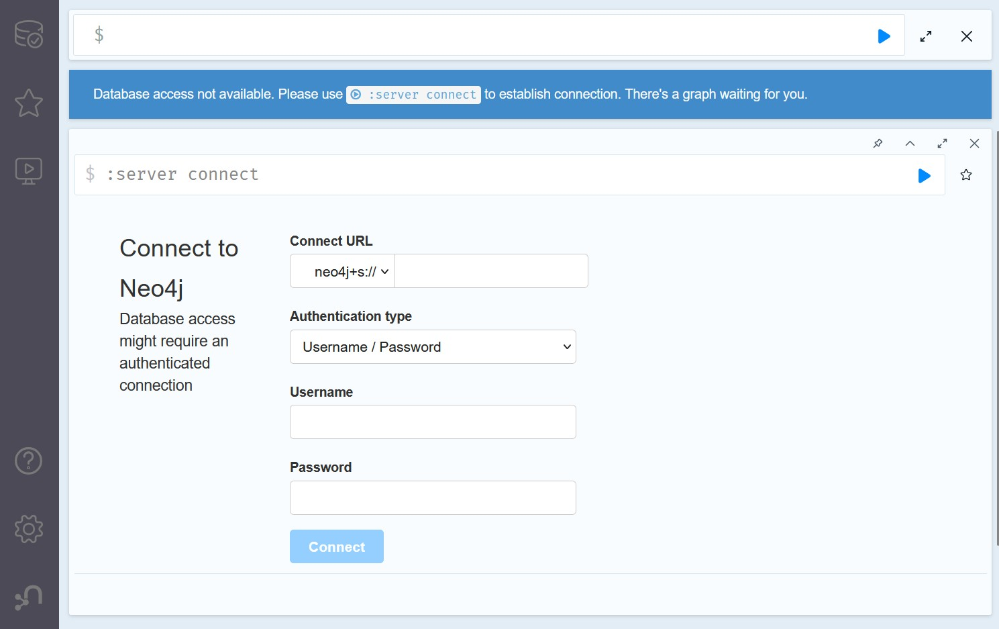
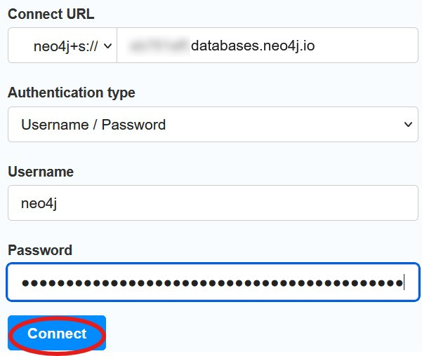
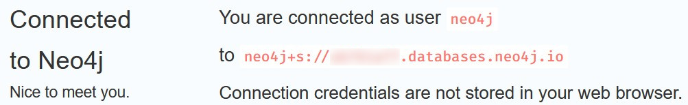
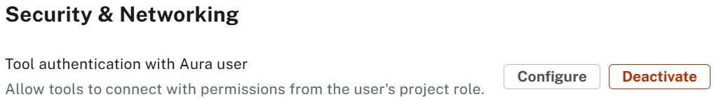
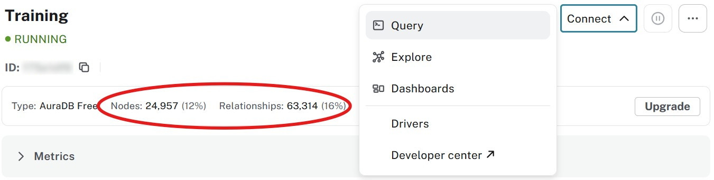
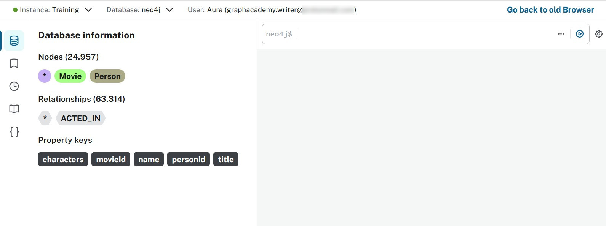
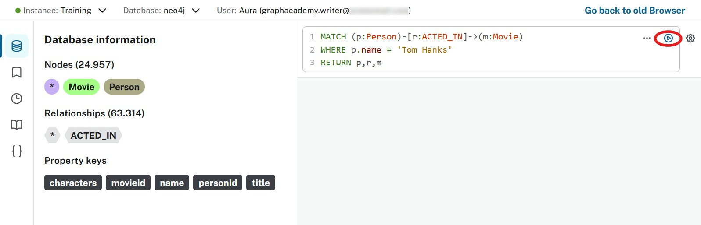
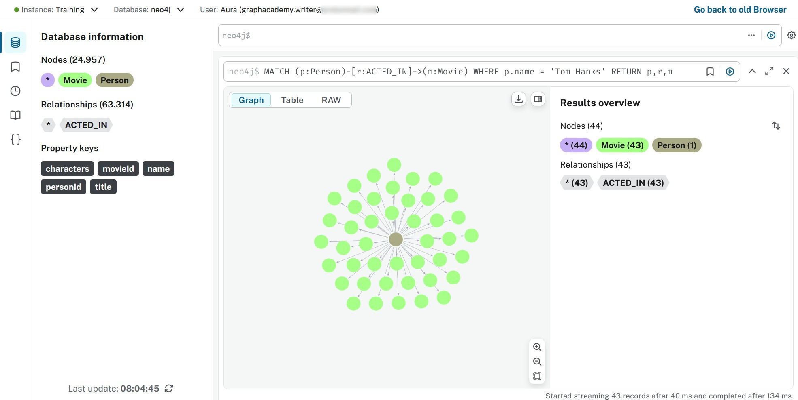
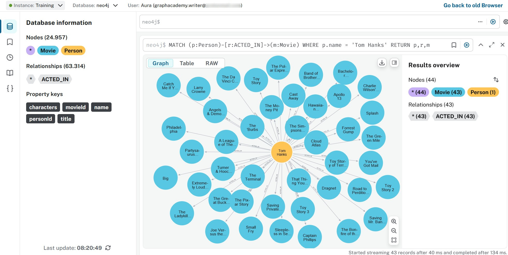

= Query tool

Formerly known as the **Neo4j Browser**.
Currently fully integrated into the Aura console.

== Old way (is better?)
Before diving into the integrated query tool, open a new private window in your browser and go to the link:https://browser.neo4j.io[Neo4j Browser^].

Do you remember where you can find the necessary information to fill that connection pane?

If you remembered that correctly you will be greeted with this:

Isn't that nice? You could start playing around with your database now, but let's do the same in the Aura console.

[NOTE]
====
The reason for this little piece of nostalgia is **not** that the **old ways are better**. The Aura console makes this really easy. So easy in fact that you may not understand what is going on. Which may then cause problems down the road.

You didn't need credentials for the **data importer**. You just had to click **Connect**. The reason is that since May 2025 link:https://neo4j.com/docs/aura/security/tool-auth/[tool authentication^] is activated. Access to the Aura console also gives access to the database instances themselves.

You can find that setting in the organization menu. Note that the option only becomes visible after you've created a paid-for instance. You can not override the setting for **Aura Free**.

It's a very convenient option.
Turn it **OFF** for production instances!
====

== Connecting
It's really not hard to find:

Before you click on the **Query** option, check that you've loaded the data from the previous lesson.

It's good practice to remove the result-frames you don't want/need. So if it looks like the image is missing a few things ... that's why! 

== Querying
You could start clicking around. Click on the labels and relationship types under **Database Information** for example. Coloured bubbles and arrows appear. Fun!

For something a bit more serious, copy-paste this in the command-frame.

[source,cypher]
----
MATCH (p:Person)-[r:ACTED_IN]->(m:Movie)
WHERE p.name = 'Tom Hanks'
RETURN p,r,m
----

Hit that blue arrow!

Don't know about you, but the default styling hurts my eyes and it's not very informative. You can fix that by clicking on the labels in the **Results overview** and making changes according to your taste.

== Conclusion

As this is not a link:https://graphacademy.neo4j.com/courses/cypher-fundamentals/[Cypher Fundamentals] training this is where we are going to leave it at for this tool.

The **Query Tool** (aka Neo4j Browser) aims at power users, at those that understand (or are willing to learn) the syntax to:

* Manage schema
* Manage roles and permissions
* Develop, test and troubleshooting queries
* ...

In the next lesson we take a look at an alternative way to **explore** the database!

[.quiz]
== Check your understanding
include::questions/1-purpose.adoc[leveloffset=+1]

[.summary]
== Summary
In this lesson you queried data in an Aura database.
