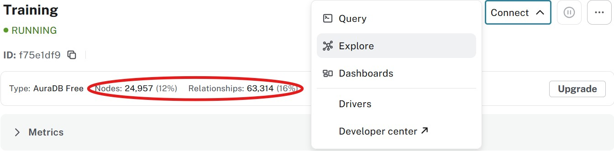
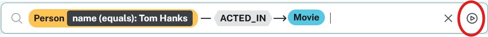
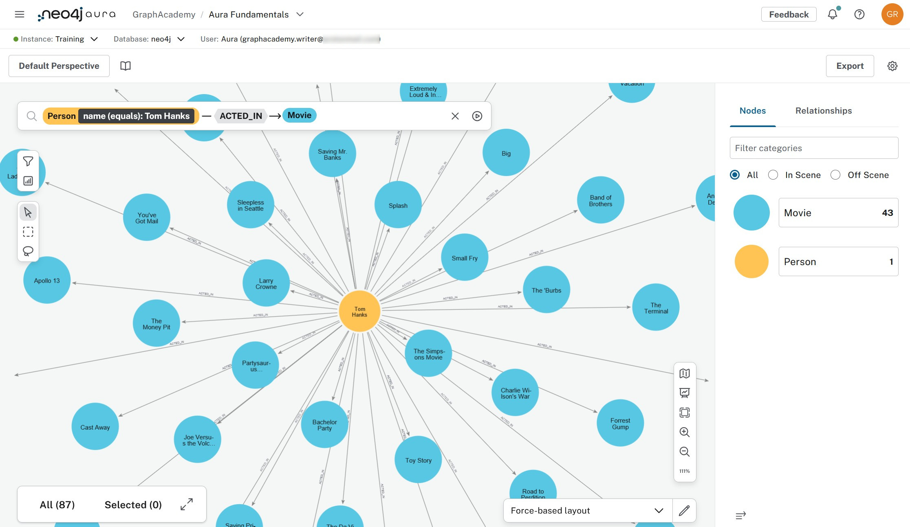
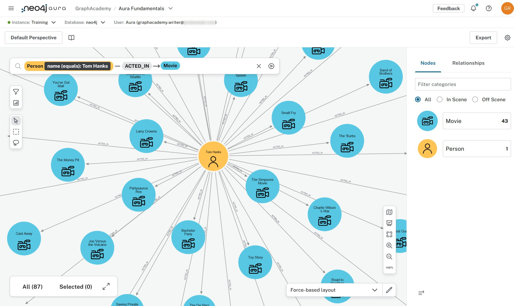

= Explore data

Formerly known as **Neo4j Bloom**.
Currently fully integrated into the Aura console.

== Old way (is better?)
Before diving into the integrated explore tool, note that you can also use link:https://explore.neo4j.io[Neo4j Bloom^]. Same procedure as before, you connect to the instance using the credentials and carry on from there.

[NOTE]
====
**Same procedure as before** is of course a reference to link:https://en.wikipedia.org/wiki/Dinner_for_One[Dinner for One]. Enjoy!
====

== Connecting
It's really not hard to find:

Before you click on the **Explore** option, check that you've loaded the data.

image::images/03_explore_tool_start.jpg[exploretool_start,width=500,align=center]

== Explore
Clicking around isn't going to accomplish a lot here. Instead you tell it what you are looking for in the search bar. It will try to help you.

* <click> in the searchbar

* <select> Person

* <select> Person name:value

* <select> Person name(equals):value

* <type> Tom Hanks

* <select> ACTED_IN

* <select> Movie

Smash that arrow and you'll execute the exact same query we did in the previous lesson.

[NOTE]
====
You may have to zoom in a bit before the details are shown.
====

Styling is also a thing here. It's persisted in something called a **Perspective**. What that means is that your styling choices are kept between runs and can even be shared with other users!

== Differences
By doing the same thing as in the previous lesson things are easy to follow. It might be unclear why you'd want to use the **explore tool** though.

* Exploration is possible without knowing Cypher syntax (1).

* Further exploration is possible from an initial set of results (via contextmenu on the nodes).

* Editing the graph is possible without knowing Cypher syntax (2).

* Customization is possible through the use of perspectives and scenes. This goes beyond mere styling and can include defined parametrized queries (3). Perspectives can be shared. This allows for a uniform experience in an organization.

* Whereas the **query tool** is fit for maybe a few hundred nodes and relationships, **explore** can easily manage thousands.

[NOTE]
====
1. The model has to be understood though. You can not explore efficiently if you have no idea what data the database holds and how it is organized.

2. Security does apply. If the user's role does not allow editing the database this will not work.

3. Defining these queries (also known as **search phrases**) does require knowledge of Cypher syntax. As the perspectives can be shared, not everybody needs to have that knowledge though.
====

== Misconception
As you can tell there's a lot more to the **explore tool** than meets the eye at first glance. Documentation can be found link:https://neo4j.com/docs/bloom-user-guide/current/[here].

Before we can move to the next lesson there is however an important misconception that needs to be addressed.

**Explore/Bloom is NOT an application development enviroment!**

A lot of Neo4j POCs use the **explore tool** as the visualization layer. And why not. It's right there. But the next step is hard. It's an application, not an easily adaptable framework. Not something you can plug into your company portal.

As a tool for a model-savvy business user, it's fantastic. As the foundation for your custom visualization layer, it's not. Be aware of that.

[.quiz]
== Check your understanding
include::questions/1-purpose.adoc[leveloffset=+1]

[.summary]
== Summary
In this lesson you explored data in an Aura database.
