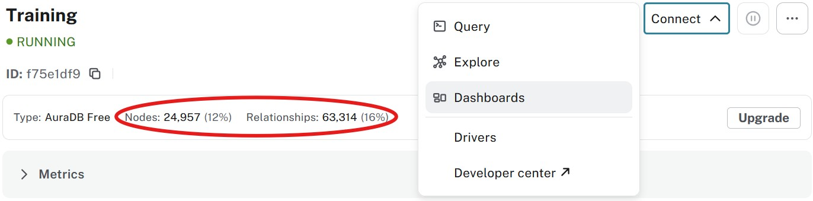
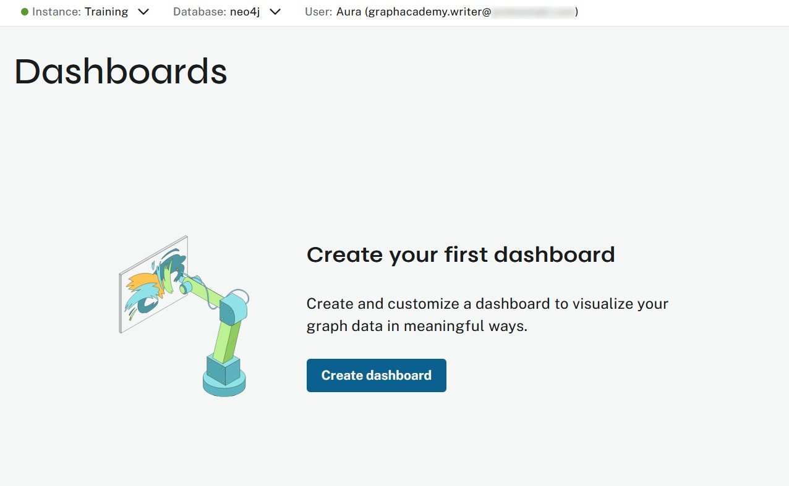
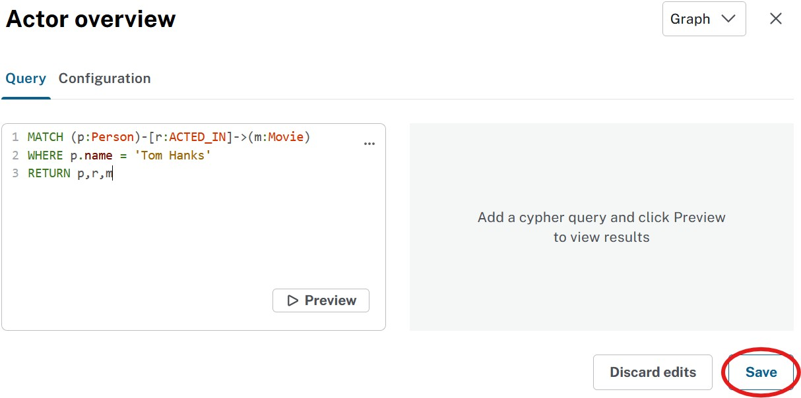
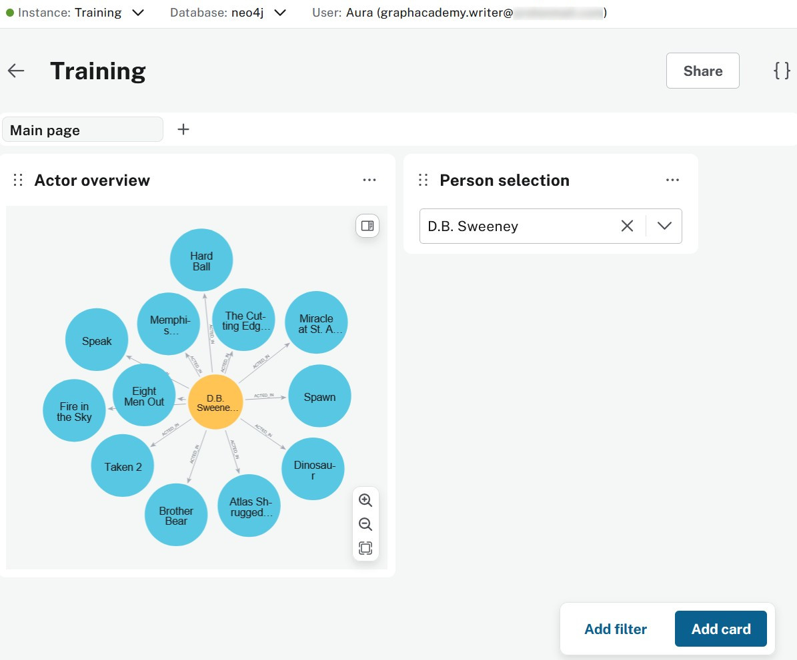

= Dashboards

Formerly known as **Neodash**(1).
Currently fully integrated into the Aura console.

[NOTE]
====
1. Isn't constant rebranding fun? 
====

== Old way (is better?)
Before diving into the integrated dashboard tool, note that you can also use link:https://neodash.graphapp.io/[neodash^]. Start a **new dashboard**, connect to the instance using your credentials and dive into it.

[NOTE]
====
At this time (early summer 2025) the dashboard integration into the Aura console is just a few days old. Some functionality that is in Neodash may still be limited or missing in the integration. 
====

== Connecting
It's really not hard to find:

Before you click on the **Dashboards** option, check that you've loaded the data.

Not a lot of options there, right? Hit the **Create dashboard**!

image::images/04_dashboard_tool_tour.jpg[dashboard_tour,width=500,align=center]

Still not a lot of options. We are getting of the beaten path here though. So fix that **New dashboard** text (just click on it and change) and then **Add a card**.

== Dashboarding
You get a **New card** pane. Make the following changes:

* Change **New card** to **Actor overview**

* Select **Graph** in the pull down

* Paste in the following in the **Query** field
[source,cypher]
----
MATCH (p:Person)-[r:ACTED_IN]->(m:Movie)
WHERE p.name = 'Tom Hanks'
RETURN p,r,m
----

And the result is this:

image::images/04_dashboard_tool_hanks.jpg[dashboard_hanks,width=500,align=center]

[NOTE]
====
You can shift the position of a card by picking it up on the six dots and dropping it where you like.
====

That's already all we did in the previous two lessons. We can do better though. **Add a filter**.

image::images/04_dashboard_tool_filter.jpg[dashboard_filter,width=300,align=center]

You can probably guess where the $person_name is going to go in a minute, but if not, **Save** and you'll see.

image::images/04_dashboard_tool_selection.jpg[dashboard_selection,width=500,align=center]

Edit the **Actor overview** card and fix the query as follows:
[source,cypher]
----
MATCH (p:Person)-[r:ACTED_IN]->(m:Movie)
WHERE p.name = $person_name
RETURN p,r,m
----

Save and now the **Actor overview** will react to your **Person selection**!

== Conclusion
As far as quick prototyping goes, it doesn't get better than that! And the full **neodash** experience goes a lot further still. Several organizations use it to create their production solutions instead of building a custom application.

[.quiz]
== Check your understanding
include::questions/1-purpose.adoc[leveloffset=+1]

[.summary]
== Summary
In this lesson you looked at building a dashboard on your Aura database.
