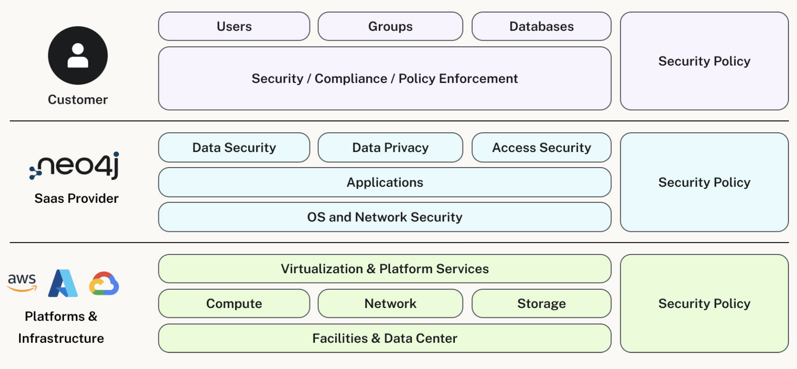

= Shared Responsibility
:table-caption!:

In the previous lesson, you learned about Aura and how it differs from self-managed databases.

In this lesson, you will learn about the different responsibilities of Aura and its users

Aura operates on a shared responsibility model, where Neo4j handles the operational aspects of the database while users focus on their applications and data. This model allows you to benefit from the power of Neo4j without worrying about the underlying infrastructure.

== Aura's Responsibilities

Aura is responsible for the following:

* **Infrastructure Management**: Aura manages the underlying infrastructure, including servers, storage, and networking.
* **Database Maintenance**: Aura handles database maintenance tasks such as backups, updates, and scaling.
* **Security**: Aura provides security features such as encryption, access control, and compliance with industry standards.

== User Responsibilities

Users are responsible for the following:

* **Data Modeling**: Users must design and implement their data models using Neo4j's graph data model.
* **Application Development**: Users are responsible for developing applications that interact with the Neo4j database.
* **Monitoring and Optimization**: Users should monitor their database performance and optimize queries as needed.

By understanding these shared responsibilities, you can effectively manage your Neo4j Aura instances and build successful applications.

[NOTE]
====
If you would like to learn more about the shared responsibility model, you can refer to the [Neo4j Aura Security Whitepaper](https://neo4j.com/books/neo4j-aura-security/) for a detailed overview of the security measures and responsibilities in Aura.
====

== Check your understanding
include::questions/1-choosing.adoc[leveloffset=+1]

include::questions/2-differences.adoc[leveloffset=+1]

[.summary]
== Summary
In this lesson, you learned about the different responsibilities of Neo4j Aura and its users, and how Aura simplifies the management of graph databases in the cloud.

In the next lesson, you will learn how to differentiate between the different tiers by examining their features and understanding which tier best fits different scenarios and requirements.
