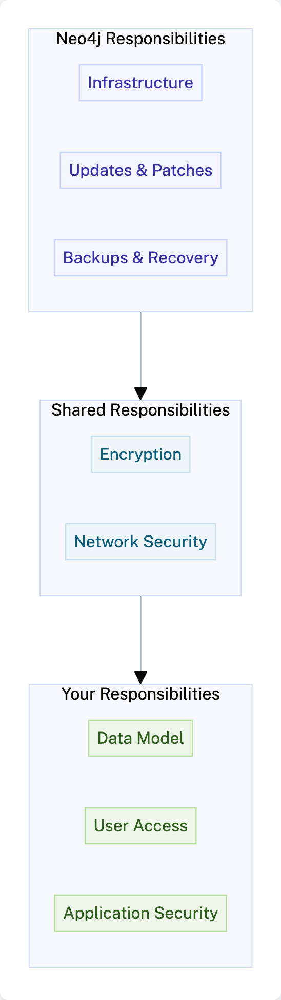

= Shared Responsibility
:type: lesson
:order: 1
:slides: true

[.slide.discrete]
== Shared Responsibility Model

In the previous module, you learned how to import data and use the Query, Explore, and Dashboards tools.

In this lesson, you will learn about the shared responsibility model between Aura and its users.

[.slide.col-2]
== Understanding shared responsibility

[.col]
====
Aura operates on a shared responsibility model, where Neo4j handles the operational aspects of the database while users focus on their applications and data.

The diagram shows which responsibilities belong to Neo4j, which belong to you, and which are shared.
====

[.col]
====

====

[.slide]

== Aura's Responsibilities

Aura is responsible for the following:

* **Infrastructure Management**: Aura manages the underlying infrastructure, including servers, storage, and networking.
* **Database Maintenance**: Aura handles database maintenance tasks such as backups, updates, and scaling.
* **Security**: Aura provides security features such as encryption, access control, and compliance with industry standards.

[.slide]

== User Responsibilities

Users are responsible for the following:

* **Data Modeling**: Users must understand Neo4j's graph data model and model their data accordingly.
* **Application Development**: Users are responsible for developing applications that interact with the Neo4j database.
* **Monitoring and Optimization**: Users should monitor their database performance and optimize queries as needed.

Understanding these shared responsibilities helps you effectively manage your Neo4j Aura instances and build successful applications.

[.slide]

== User roles

In addition to the shared responsibilities, it's important to understand the different user roles within an Aura organization:

image::images/1-users-roles.png[Project role drop down showing the different roles available]

[.slide]

== User roles explained

The available roles are:

* **Organisation Admin**: Has full access to all projects and instances within the organization. Can manage users, billing, and organization settings. You get this role when you create a new Aura account.
* **Project Admin**: Has full access to all instances within a specific project. Can manage users and project settings.
* **Project Member**: Has read and write access to instances within a specific project but cannot manage users or settings.
* **Project Viewer**: Has read-only access to instances within a specific project. Cannot make any changes to the database or settings.
* **Metrics Reader**: Has access to view performance metrics and monitoring data for instances within a specific project. Cannot make any changes to the database or settings.

[.slide]

[NOTE]
.Learn More About Shared Responsibility
====
To learn more about the shared responsibility model, refer to the link:https://neo4j.com/books/neo4j-aura-security/[Neo4j Aura Security Whitepaper^] for a detailed overview of security measures and responsibilities in Aura.
====

[.slide]

== Adding users to your project

To invite users to your project, follow these steps:

1. Go to the **Project Settings** page in the Aura console.
2. Click on the **Users** menu.

image::images/1-users.png[Project menu open, users is selected]
[.slide]

[start=3]
. Click on the **Invite Users** button.

image::images/1-invite-users-1.png[Project users menu with the invite users button highlighted]

[.slide]

[start=4]
. Enter the email addresses of the users you want to invite.

image::images/1-invite-users-2.png[Email address added to the invite users field]

[.slide]

[start=5]
. Select the appropriate roles for the invited users.

image::images/1-users-roles.png[Project role drop down showing the different roles available]
[.slide]

[start=6]
. Click **Send Invites** to send the invitations.

[start=7]
. To review the full list of project users, go to the **Users** menu in the **Project Settings** page to see their roles and statuses.

image::images/1-project-viewer.png[Projects users screen showing the new user added]
[.slide]

== Removing users from your project

To delete users from your project, follow these steps:

1. Go to the **Project Settings** page in the Aura console.
2. Click on the **Users** menu.
3. Find the user you want to delete and click on the **Delete** button next to their name.
4. Confirm the deletion when prompted.

[.slide]
== Deleting a user
image::images/1-delete-user.png[Delete user confirmation pop up]

[.quiz]
== Check your understanding

include::questions/1-choosing.adoc[leveloffset=+1]

[.summary]
== Summary
In this lesson, you learned about the different responsibilities of Neo4j Aura and its users, and how Aura simplifies the management of graph databases in the cloud.

In the next lesson, you will learn how to access security settings and logs in Neo4j Aura.

