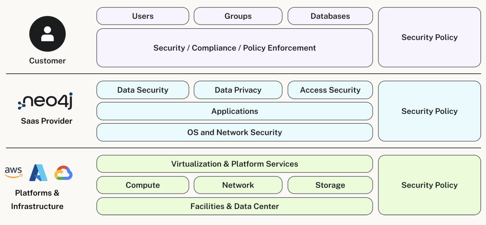
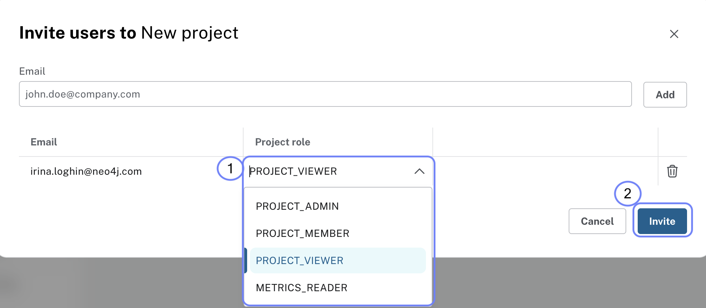
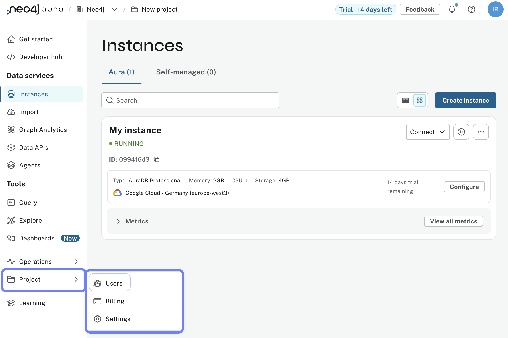
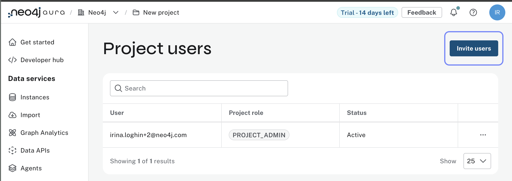
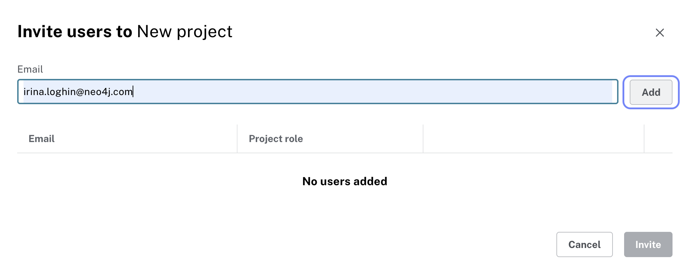
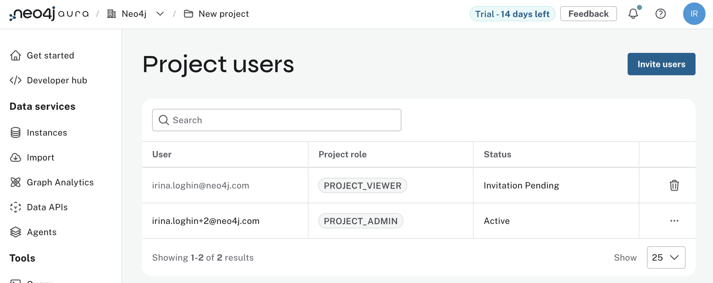
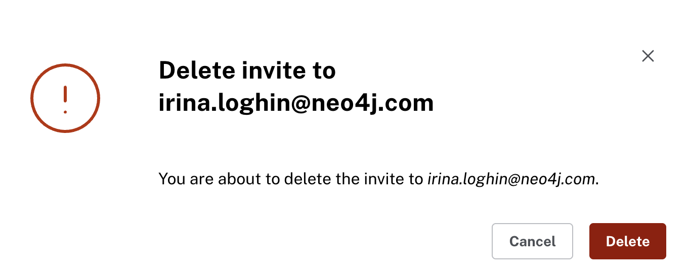

= Shared Responsibility
:type: lesson
:order: 1
:slides: true

In the previous lesson, you learned about Aura and how it differs from self-managed databases.

In this lesson, you will learn about the different responsibilities of Aura and its users.

Aura operates on a shared responsibility model, where Neo4j handles the operational aspects of the database while users focus on their applications and data. This model allows you to benefit from the power of Neo4j without worrying about the underlying infrastructure.

== Aura's Responsibilities

Aura is responsible for the following:

* **Infrastructure Management**: Aura manages the underlying infrastructure, including servers, storage, and networking.
* **Database Maintenance**: Aura handles database maintenance tasks such as backups, updates, and scaling.
* **Security**: Aura provides security features such as encryption, access control, and compliance with industry standards.

== User Responsibilities

Users are responsible for the following:

* **Data Modeling**: Users must understand Neo4j's graph data model and model their data accordingly.
* **Application Development**: Users are responsible for developing applications that interact with the Neo4j database.
* **Monitoring and Optimization**: Users should monitor their database performance and optimize queries as needed.

By understanding these shared responsibilities, you can effectively manage your Neo4j Aura instances and build successful applications.

== User roles

In addition to the shared responsibilities, it's important to understand the different user roles within an Aura organization:

* **Organisation Admin**: Has full access to all projects and instances within the organization. Can manage users, billing, and organization settings. You get this role when you create a new Aura account.
* **Project Admin**: Has full access to all instances within a specific project. Can manage users and project settings.
* **Project Member**: Has read and write access to instances within a specific project but cannot manage users or settings.
* **Project Viewer**: Has read-only access to instances within a specific project. Cannot make any changes to the database or settings.
* **Metrics Reader**: Has access to view performance metrics and monitoring data for instances within a specific project. Cannot make any changes to the database or settings.

[NOTE]
====
If you would like to learn more about the shared responsibility model, you can refer to the [Neo4j Aura Security Whitepaper](https://neo4j.com/books/neo4j-aura-security/) for a detailed overview of the security measures and responsibilities in Aura.
====

== Invite users to your project

To invite users to your project, follow these steps:

1. Go to the **Project Settings** page in the Aura console.
2. Click on the **Users** menu.

[start=3]
. Click on the **Invite Users** button.

[start=4]
. Enter the email addresses of the users you want to invite.

[start=5]
. Select the appropriate roles for the invited users.

[start=6]
Click **Send Invites** to send the invitations.

[start=7]
To review the full list of your project users, go to the **Users** menu in the **Project Settings** page, where you can see their roles and statuses.

== Delete users from your project

To delete users from your project, follow these steps:

1. Go to the **Project Settings** page in the Aura console.
2. Click on the **Users** menu.
3. Find the user you want to delete and click on the **Delete** button next to their name.
4. Confirm the deletion when prompted.

== Check your understanding
include::questions/1-choosing.adoc[leveloffset=+1]

[.summary]
== Summary
In this lesson, you learned about the different responsibilities of Neo4j Aura and its users, and how Aura simplifies the management of graph databases in the cloud.

In the next lesson, you will learn how to take your learning journey further with additional resources and learning paths on GraphAcademy.
