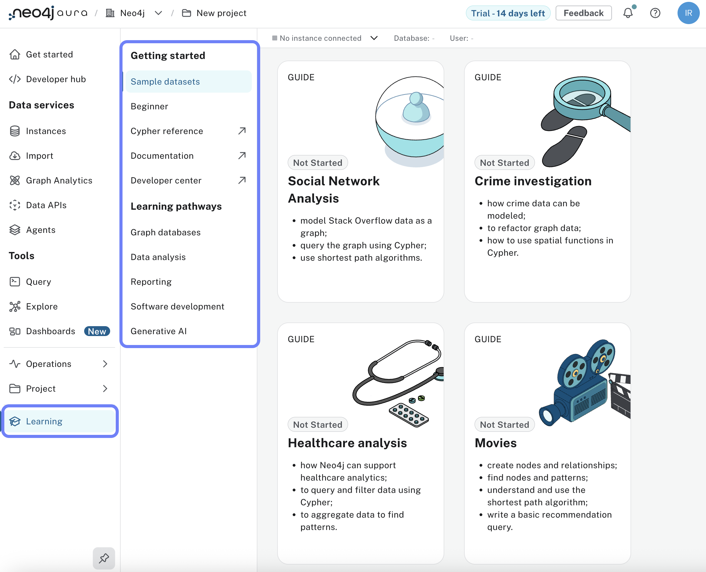

= Further Steps
:type: lesson
:order: 2
:slides: true

In the previous lessons, you learned how to manage your Aura instances and users.

In this section, you will learn about additional resources and next steps to continue your journey with Neo4j Aura.

== Continuing your learning journey

To continue your learning journey, you can explore the following resources:

* [Neo4j Documentation](https://neo4j.com/docs/)
* [Neo4j Community Forum](https://community.neo4j.com/)
* [GraphAcademy](https://neo4j.com/graphacademy/)

These resources provide a wealth of information to help you deepen your understanding of Neo4j Aura and graph databases in general.

== Accessing further learning paths

You can access further learning paths directly from your Aura console: 

[.summary]
== Summary
In this lesson, you learned about additional resources to continue your learning journey with Neo4j Aura.

You can explore the Neo4j documentation, community forum, and GraphAcademy for more information and learning materials.