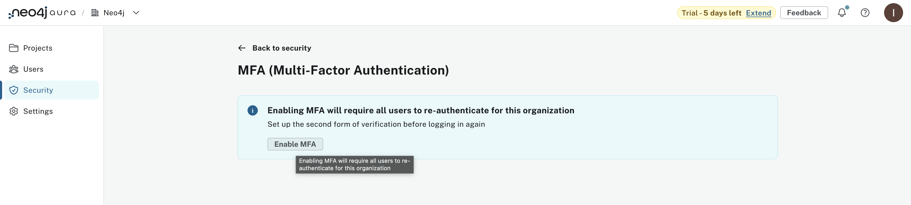
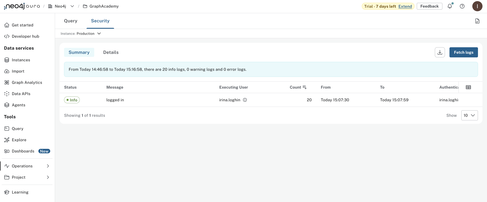

= Security and logs
:type: lesson
:order: 2

In the lesson, you learned about the different metrics available in Neo4j Aura and how to monitor the performance of your database instances.

In this lesson, you will learn how to:
* Implement basic security features available in Neo4j Aura.
* Access logs for monitoring and troubleshooting.

== Security features

Neo4j Aura provides several built-in security features to help protect your data:

* **Encryption**: Data is encrypted at rest and in transit using industry-standard protocols.
* **Access control**: Role-based access control (RBAC) allows you to define fine-grained permissions for users and applications.
* **Network isolation**: Aura instances are deployed in a private network, ensuring that your data is not accessible from the public internet.
* **Audit logs**: Detailed logs of all user activity are maintained for compliance and security monitoring.
* **Single Sign-On (SSO)**: Integration with identity providers for streamlined and secure user authentication.
* **IP filtering**: Restrict access to your Aura instance based on IP addresses or ranges.
* **Tool authentication with Aura user**: Use the Aura user for secure authentication when connecting tools and applications to your database.
* **MFA (Multi-Factor Authentication)**: Add an extra layer of security by requiring a second form of verification during the login process.

As part of your basic security strategy, implement Single Sign-On (SSO), MFA, and access logs for your Neo4j Aura instance: 

== Step 1: Enable Single Sign-On (SSO)

Neo4j Aura supports Single Sign-on (SSO) IdP providers: 
* Okta
* Microsoft Entra ID (formerly Azure AD)

To enable SSO for your Aura instance, follow these steps:

1. Navigate to your Organization settings in the Neo4j Aura console.
2. Select the **Security** tab.
3. Under the **Single Sign-On (SSO)** section, choose your IdP provider (Okta or Microsoft Entra ID).
4. Follow the prompts to complete the SSO configuration. 

== Step 2: Enable Multi-Factor Authentication (MFA)

To enable MFA for your Neo4j Aura instance, follow these steps:

1. Navigate to your Organization settings in the Neo4j Aura console.
2. Select the **Security** tab.
3. Under the **Multi-Factor Authentication (MFA)** section, toggle the MFA setting to **Enabled**.
4. Follow the prompts to configure your preferred MFA method (e.g., SMS, authenticator app).

5. After you have completed these steps, confirm again by clicking the **Enable MFA** button. 

== Accessing logs

To access logs for your Neo4j Aura instance, follow these steps:

1. Log in to the Neo4j Aura console.
2. Select your instance from the dashboard.
3. Navigate to the **Logs** menu from **Operations** to view real-time logs and historical log data.

Logs are categorized into different types, including:

* **Query logs**: Detailed information about all queries executed against your database.
* **Transaction logs**: Records of all transactions, including commits and rollbacks.
* **Audit logs**: Comprehensive logs of all user activity, including logins, data access, and configuration changes.

Access the logs to monitor authentication attempts, data access, and other critical events. 

You can also download logs for further analysis or compliance purposes.

[NOTE]
====
To learn more about enabling the security features in Neo4j Aura, you can refer to the [Neo4j Aura Security Whitepaper](https://neo4j.com/books/neo4j-aura-security/) for a detailed overview of the security measures and responsibilities in Aura.
====

[.summary]
== Summary

In this lesson, you learned about the security features available in Neo4j Aura and how to access logs for monitoring and troubleshooting.

You implemented basic security measures such as Single Sign-On (SSO) and Multi-Factor Authentication (MFA) to enhance the security of your Aura instance.

You also learned how to access and utilize logs to monitor user activity and database operations.

In the next lesson, you will explore additional resources and further steps to continue your learning journey with Neo4j Aura.

