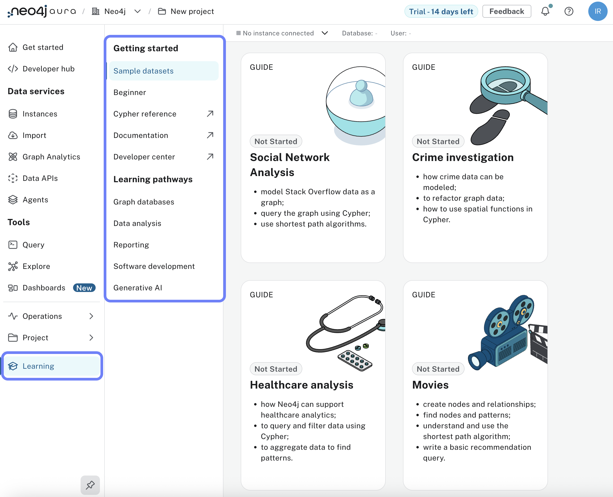
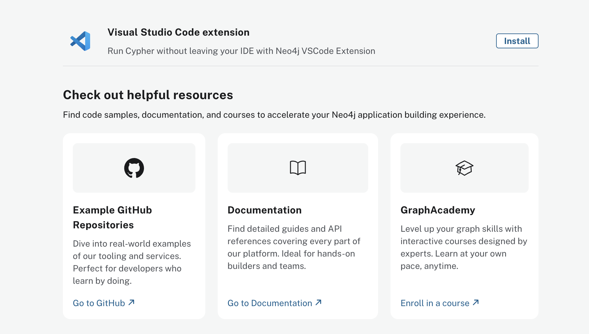

= Further Steps
:type: lesson
:order: 3
:slides: true

[.slide.discrete]
== Further steps with Neo4j Aura

So far in this course, you have learned how to enable basic security features and access logs in Neo4j Aura.

In this lesson, you will learn about:

* Getting support for Neo4j Aura
* Service Level Agreements (SLAs)
* Additional resources to continue your learning journey

[.slide]
== Accessing support

Neo4j provides several support channels depending on your Aura tier:

**Support options by tier:**

* **Aura Free**: Community-based support through the Neo4j Community Forum
* **Aura Professional**: Best-effort support (no formal SLA)
* **Aura Business Critical**: Enhanced support with faster response times
* **Aura Virtual Dedicated Cloud**: 24x7 premium support with one-hour response time for critical issues

[.slide]
=== Contacting support

To get help with your Aura instance:

1. **Support Portal**: Submit questions, report issues, and request features through the link:https://support.neo4j.com[Neo4j Customer Success Support Portal^]
2. **Email**: Send requests to aura-support@neo4j.com (automatically creates a support ticket)
3. **Community Forum**: Ask questions at link:https://community.neo4j.com/[community.neo4j.com^]
4. **Discord**: Join the link:https://discord.gg/neo4j[Neo4j Discord server^] for community discussions

[.slide]
== Service Level Agreements (SLAs)

SLAs define the availability guarantees for your Aura instance:

[cols="1,2,2"]
|===
|Tier |Availability Target |Service Credits

|**Free**
|No SLA
|None

|**Professional**
|No formal SLA
|None

|**Business Critical**
|99.95% uptime
|10% credit (99.0-99.95%), 25% credit (<99.0%)

|**Virtual Dedicated Cloud**
|99.95% uptime
|10% credit (99.0-99.95%), 25% credit (<99.0%)
|===

For full SLA details, see the link:https://neo4j.com/legal-terms/neo4j-sla/[Neo4j Service Level Agreement^].

[.slide]
== Continuing your learning

Explore the following resources to continue learning:

* Live learning workshops and webinars: https://neo4j.com/events/
* Recorded sessions and conferences: https://www.youtube.com/neo4j

[.slide]
== Additional resources

* Documentation:
** Secure your account by enabling MFA: https://neo4j.com/docs/aura/security/mfa/
** Learn about Encryption in Aura: https://neo4j.com/docs/aura/security/encryption/
** Migrate Self-Managed Neo4j Databases to Aura: https://neo4j.com/docs/aura/tutorials/migration/
* Neo4j Community Forum: https://community.neo4j.com/
* GraphAcademy: https://graphacademy.neo4j.com/
** Learn to design and build graph data models: https://graphacademy.neo4j.com/courses/modeling-fundamentals
** Learn Cypher, the query language for Neo4j: https://graphacademy.neo4j.com/courses/cypher-fundamentals
** Explore more advanced topics: https://graphacademy.neo4j.com/courses/

[.slide]
== Finding learning paths

Access the guided learning paths directly from your Aura console:

[.slide]
== Sample projects and resources
[.TIP]
After launching one of the available sample projects, use them to practice your GraphAcademy obtained skills.

[.slide]
== Neo4j GitHub and VS Code extension
[.TIP]
Check out the Neo4j GitHub repository for sample projects and additional resources: https://github.com/neo4j

Find the Visual Studio Code extension for Neo4j here:
https://marketplace.visualstudio.com/items?itemName=neo4j-extensions.neo4j-for-vscode 

[.slide]
== Getting started resources

After launching your Aura console, access these resources directly from the Get Started menu: 

[.quiz]
== Check your understanding

include::questions/1-learning.adoc[leveloffset=+1]

[.summary]
== Summary

In this lesson, you learned about:

* **Getting support** - Support channels vary by tier, from community support (Free) to 24x7 premium support (VDC)
* **Service Level Agreements** - Business Critical and VDC tiers offer 99.95% uptime guarantees with service credits
* **Learning resources** - Documentation, GraphAcademy courses, community forum, and sample projects

Congratulations on completing the Aura Fundamentals course!
