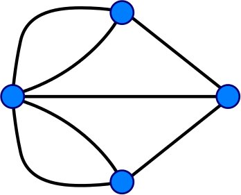

= 七桥问题
:type: video
:order: 1

[.video]
video::q0ODFxUrp1I[youtube,width=560,height=315]

[.transcript]
== 很久很久以前……
**要了解我们是如何到达这里的，我们首先需要回到过去。**

1736 年，普鲁士的柯尼斯堡。

image::images/konigsberg.jpg[An illustrated map of Königsberg, Prussia]

image::images/7-bridges.jpg[The Seven Bridges of Königsberg,role=right]

莱昂哈德·欧拉大概正坐在他的办公桌前，左右为难。

康斯贝格（今俄罗斯加里宁格勒）被普雷格尔河分为四个部分，由七座桥梁连接。

欧拉正在思考的问题是：我们能不能步行穿过这座城市，只穿过七座桥中的每一座桥一次？

=== Foundation for graph theory

He eventually solved the problem by reformulating it, and in doing so laid the foundations for graph theory.

// image::images/abstraction.jpg[An abstraction of the problem,role=right]

He realized that the land masses themselves weren’t an important factor.
In fact, it was the bridges that connected the land masses that were the most important thing.

His approach was to define the problem in abstract terms, taking each land mass and representing it as an abstract *vertex* or _node_, then connecting these land masses together with a set of seven *edges* that represent the bridges.
These elements formed a “graph”.

=== Applying the theory

Using this abstraction, Euler was able to definitively demonstrate that there was no solution to this problem.
Regardless of where you enter this graph, and in which order you take the bridges, you can’t travel to every land mass without taking one bridge at least twice.

But it wasn’t a completely wasted effort.
Although graphs originated in mathematics, they are also a very convenient way of modeling and analyzing data.
While there is certainly value in the data that we hold, it is the connections between data that can really add value.
Creating or inferring relationships between your records can yield real insights into a dataset.

Fast forward 300 years and these founding principles are used to solve complex problems including route finding, supply chain analytics, and real-time recommendations.

== Check your understanding

include::questions/1-euler.adoc[leveloffset=+1]

[.summary]
== Summary

In this lesson you learned how graph theory was invented.
Next, you will learn about the elements that make up a graph.
