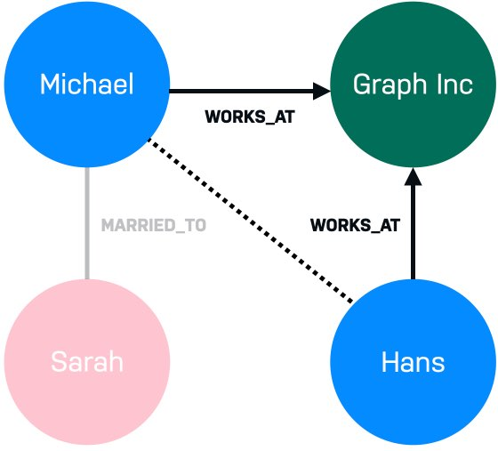

= 图的元素
:type: video
:order: 2

[.video]
video::0CHdIwuGZqI[youtube,width=560,height=315]

[.transcript]
== 图的元素
让我们仔细看看构成图的两个元素：

* 节点（也称作顶点）
* 关系（也称作边）

image::images/large-social-graph.jpg[表示节点和关系的图]

=== 节点

image::images/michael-sarah.jpg[两个表示 Michael 和 Sarah 的节点, role=right]

*节点* （或顶点）是图中的圆圈。
节点通常代表 _对象_、_实体_ ，或仅代表 _事物_。

在上一课的 link:../1-seven-bridges/[柯尼斯堡七桥问题^] 示例中，使用节点来表示陆地。

再看一个我们都可以联想到的例子：社交图。
人们相互交流并形成不同强度的关系。

右图有两个节点，代表两个人，**Michael** 和 **Sarah**。
就其本身而言，这些元素并不令人兴奋。
但是，当我们开始将这些圆圈连接在一起时，事情开始变得有趣起来。

==== 节点通常代表事物

通常可以表示为节点的实体示例有：人、产品、事件、书籍或地铁站。

=== 关系

image::images/michael-married-sarah.jpg[代表 Michael 和 Sarah 并通过 MARRIED_TO 关系连接的两个节点, role=left]

*关系* （或 _边_）用于连接节点。
我们可以使用关系来描述节点是如何相互连接的。
例如，*Michael* 与 *Graph Inc* 具有 *WORKS_AT* 关系，因为他在那里工作。
*Michael* 与 *Sarah* 有 *MARRIED_TO* 关系，因为他跟她结婚。

突然之间，我们知道我们正在寻找某种“社交图”的开端。

现在，让我们将第三个人 **Hans** 引入到我们的图中。

**Hans** 与 Michael 一起为 **Graph Inc** 工作。
根据公司的规模和关系的性质，我们或许可以推断出 Michael 和 Hans 彼此认识。

如果是这样，Sarah 和 Hans 认识的可能性有多大？

这些都是可以用图来回答的问题。

==== 关系通常是动词

我们可以使用关系来表示个人或职业联系（_Person *knows* Person，Person *married to* Person_），陈述事实（_Person *lives in* Location_，_Person *owns* Car_，_Person *rated* Movie_ ），甚至表示层次结构（_Parent *parent of* Child，Software *depends on* Library_）。

== 知识检查

include::questions/1-node.adoc[leveloffset=+1]

[.summary]
== 小结

在本课中，你学习了构成图的节点（顶点）和关系（边）。
接下来，你将了解关系可能具有方向或权重的图结构。
