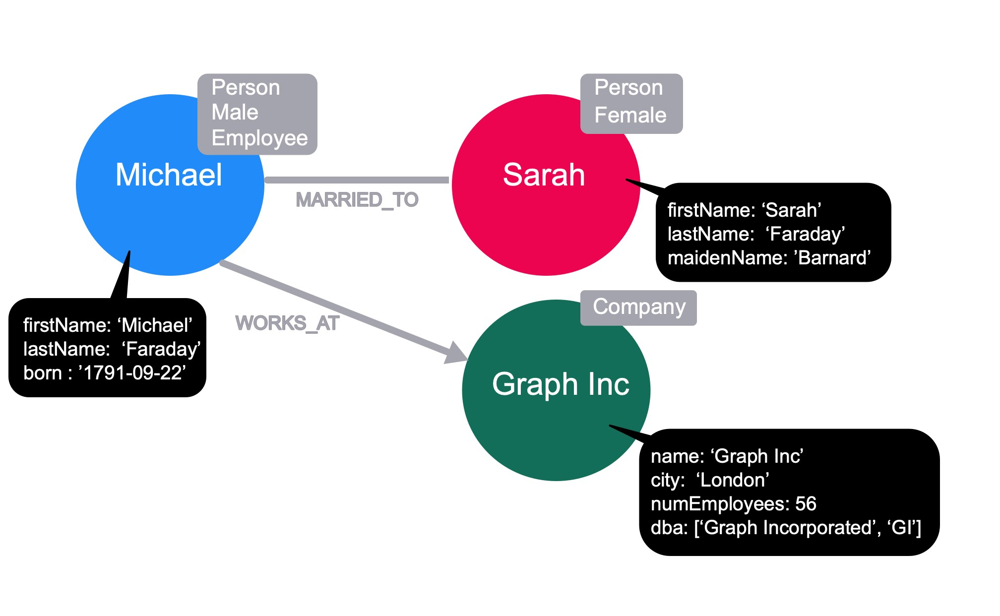
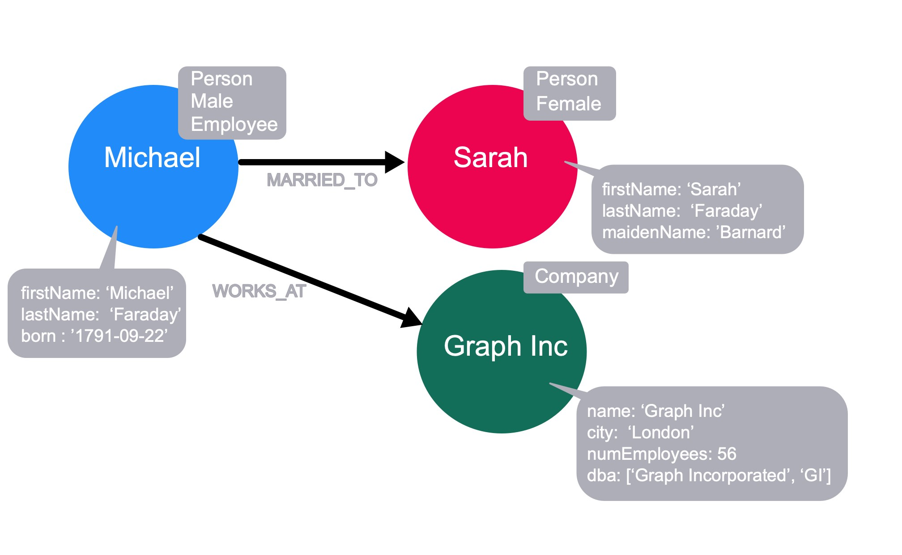

= 什么是属性图？
// :type: video
:type: quiz
:order: 1

// [.video]
// video::6UMYF44p9E4[youtube,width=560,height=315]

[.transcript]
== 属性图

在上一个模块中，我们将节点和关系称为图的基本构建元素。
在本课中，你将了解 Neo4j 支持构建 *属性图* 的其他元素。

=== 节点、标签和属性

回想一下，节点是表示我们数据中的 _事物_ 的图元素。
我们可以使用两个额外的元素来为数据提供一些附加的上下文。

让我们看看如何使用这些附加元素来改善我们的社交图。

==== 标签

image::images/node-labels.jpg[带标签的节点, role=right]

通过向节点添加标签，表示该节点属于图的子集。
标签在 Neo4j 中很重要，因为它们为 Cypher 语句提供了起点。

让我们以 **Michael** 和 **Sarah** 为例——在这种情况下，这两个节点都是 *Person*。

我们可以通过向这些节点添加更多标签来完善图； Michael 标记为 *Male*，Sarah 是 *Female*。
在这种情况下，Michael 是一家公司的 *雇员*，但我们没有任何关于 Sarah 的就业状况的信息。

Michael 在一家名为 Graph Inc 的 *Company* 工作，因此我们可以将该标签添加到代表公司的节点中。

[TIP]
在 Neo4j 中，一个节点可以有零个、一个或多个标签。

==== 节点属性

到目前为止，我们假设节点代表 Michael、Sarah 和 Graph Inc。
我们可以通过向节点添加属性来使其具体化。

属性是键值对，可以根据需要从节点中添加或删除。
属性值可以是单个值或 link:https://neo4j.com/docs/cypher-manual/current/syntax/values/[符合 Cypher 类型系统^]的值的列表。

通过添加 _firstName_ 和 _lastName_ 属性，我们可以看到 Michael 节点指的是 *Michael Faraday*，它以法拉第感应定律、法拉第笼而闻名，而较少被称为派对气球的发明者。
Michael 出生于 1791 年 9 月 22 日。

Sarah 的全名是 *Sarah Faraday*，她的 _maidenName_ 是 *Barnard*。

通过查看 Graph Inc 节点上的 _name_ 属性，我们可以看到它指的是公司 *Graph Inc*，其 _city_ 为 *London*，拥有 56 名员工 (_numEmployees_)，并以 Graph Incorporated 和 GI (_dba_) 为名。

[TIP]
不需要为具有特定标签的每个节点都指定属性。
如果节点的属性不存在，则将其视为 `null`。

=== 关系

Neo4j 中的关系是两个节点之间的连接。

==== 关系的方向

在 Neo4j 中，图的每个关系 *必须* 有方向。
尽管方向是必需的，但可以在任一方向查询关系，或在查询时完全忽略。

关系是在 *源节点* 和 *目标节点* 之间创建的，因此这些节点必须在创建关系之前存在。

如果我们考虑上一个模块中讨论过的有向图和无向图的概念，_MARRIED_TO_ 关系的方向必须存在，并且可能提供一些额外的上下文，但为了查询的目的可以忽略。
在 Neo4j 中，_MARRIED_TO_ 关系必须有一个方向。

当涉及到层次结构时，关系的方向可能很重要，尽管关系是向上还是向下指向树是一个任意决定。

==== 关系类型

image::images/relationship-types.jpg[有类型的关系, role=left]

Neo4j 图中的每个关系 *必须* 有一个类型。
这允许我们在查询时选择我们将遍历图的哪一部分。

例如，我们可以遍历 Michael 的 _每一个_ 关系，或者我们可以指定 _MARRIED_TO_ 关系，这样仅在 Sarah 节点处结束。

以下是这一点的示例 Cypher 语句：

[source,cypher,role=nocopy noplay]
----
// traverse the Michael node to return the Sarah node
MATCH (p:Person {firstName: 'Michael'})-[:MARRIED_TO]-(n) RETURN n;

// traverse the Michael node to return the Graph Inc node
MATCH (p:Person {firstName: 'Michael'})-[:WORKS_AT]-(n) RETURN n;

// traverse all relationships from the Michael node
// to return the Sarah node and the Graph Inc node
MATCH (p:Person {firstName: 'Michael'})--(n) RETURN n
----

==== 关系属性

与节点一样，关系也可以具有属性。这些可以指加权图中的成本或距离，或者只是为关系提供额外的上下文。

image::images/relationship-properties.jpg[带属性的关系]

在我们的图中，可以在 _MARRIED_TO_ 关系上放置一个属性来保存 Michael 和 Sarah 的结婚日期。
_WORKS_AT_ 关系有一个 _roles_ 属性来表示员工在公司担任的角色。
如果 Michael 也在另一家公司工作，那么他与另一家公司的 _WORKS_AT_ 关系对于 _roles_ 属性将具有不同的值。

== 知识检查

include::questions/1-nodes.adoc[leveloffset=+1]
include::questions/2-relationships.adoc[leveloffset=+1]

[.summary]
== 本课小结

在本课中，你了解到 Neo4j 的属性图实现包括节点标签以及节点和关系的属性。
接下来，你将了解为什么 Neo4j 的原生图实现提供了卓越的性能。