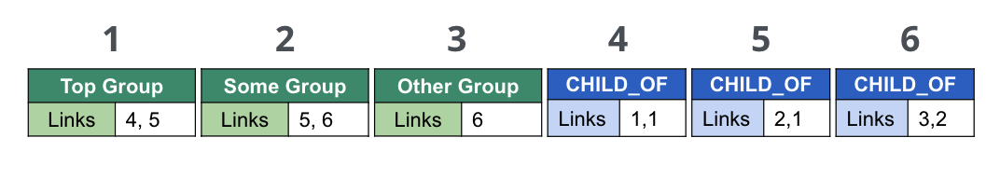
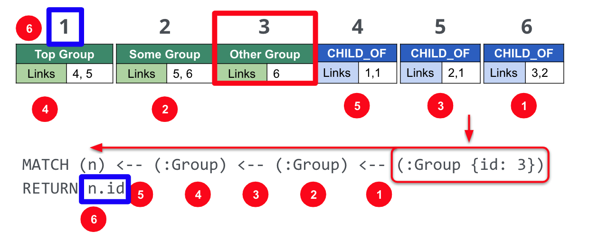

= 原生图的优势
// :type: video
:type: quiz
:order: 2

// [.video]
// video::uU_v4e9_qgE[youtube,width=560,height=315]

[.transcript]
== Neo4j 是一个原生图数据库

Neo4j 是一个原生图数据库，这意味着从数据存储到查询语言的所有内容都是专门为遍历而设计的。
就像任何其他企业数据库管理系统一样，Neo4j 符合 **ACID** 标准。 事务中的一组修改将全部提交或失败。

原生图数据库与其他数据库的区别在于**无索引邻接**的概念。
提交数据库事务时，对关系的引用与关系开始和结束处的节点一起存储。
由于每个节点都知道与其连接的每个传入和传出关系，底层图引擎将简单地查询内存中的指针——这是计算机非常擅长的。

=== 免索引邻接 (IFA)

使 Neo4j 图数据库不同于关系型数据库管理系统的关键特性之一是 Neo4j 实现了 *免索引邻接*。

==== 关系数据库的查询

image::images/RelationalTable1.png[关系型表格,height=100,role=right]

为了更好地理解无索引邻接的好处，让我们看一下 RDBMS 中的查询是如何执行的。

假设你在关系数据库中有这个表。

执行以下 SQL 查询以查找 ID 为 3 的组的三级父级：

[source,SQL,role=noplay nocopy]
----
SELECT PARENT_ID
FROM GROUPS
WHERE ID = (SELECT PARENT_ID
    FROM GROUPS
    WHERE ID = (SELECT PARENT_ID
        FROM GROUPS
        WHERE ID = 3))
----

这个查询的结果是 1，但是为了确定这个结果，关系数据库需要：

. 找到最里面的子句。
. 为子句构建查询计划。
. 执行子句的查询计划。
. 找到下一个最里面的子句。
. 重复步骤 2-4。

导致：

* 3个计划周期
* 3个索引查找
* 3 次数据库读取

==== Neo4j 的存储

借助免索引邻接，Neo4j 将节点和关系存储为通过指针相互链接的对象。
从概念上讲，该图如下所示：

image::images/IFA-1-new.png[IFA-1-new,width=500,align=center]

这些节点和关系存储为：

==== Neo4j Cypher 语句

假设我们在 Cypher 中有这个查询：

[source,Cypher,role=noplay nocopy]
----
MATCH (n) <-- (:Group) <-- (:Group) <-- (:Group {id: 3})
RETURN n.id
----

使用 IFA，Neo4j 图引擎从查询的锚点开始，即 ID 为 3 的 Group 节点。
然后它使用存储在关系和节点对象中的链接来遍历图模式。

为了执行这个查询，Neo4j 图引擎需要：

. 根据指定的锚点计划查询。
. 使用索引来检索锚节点。
. 按照指针检索所需的结果节点。

与关系数据库访问相比，IFA 的好处是：

* 更少的索引查找。
* 没有表扫描。
* 减少数据重复。

== 知识检查

include::questions/1-ifa.adoc[leveloffset=+1]

[.summary]
== 本课小结

在本课中，你了解了 Neo4j 的免索引邻接的实现如何使查询超级快。
接下来，你将了解如何将一些非图数据模型表示为图。