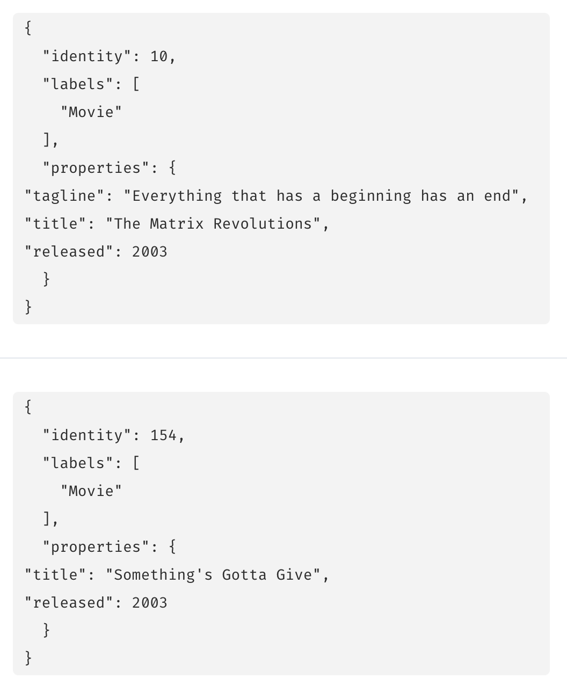
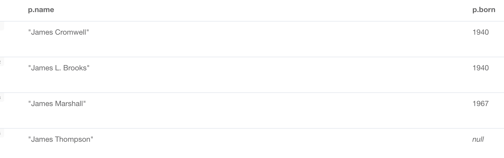
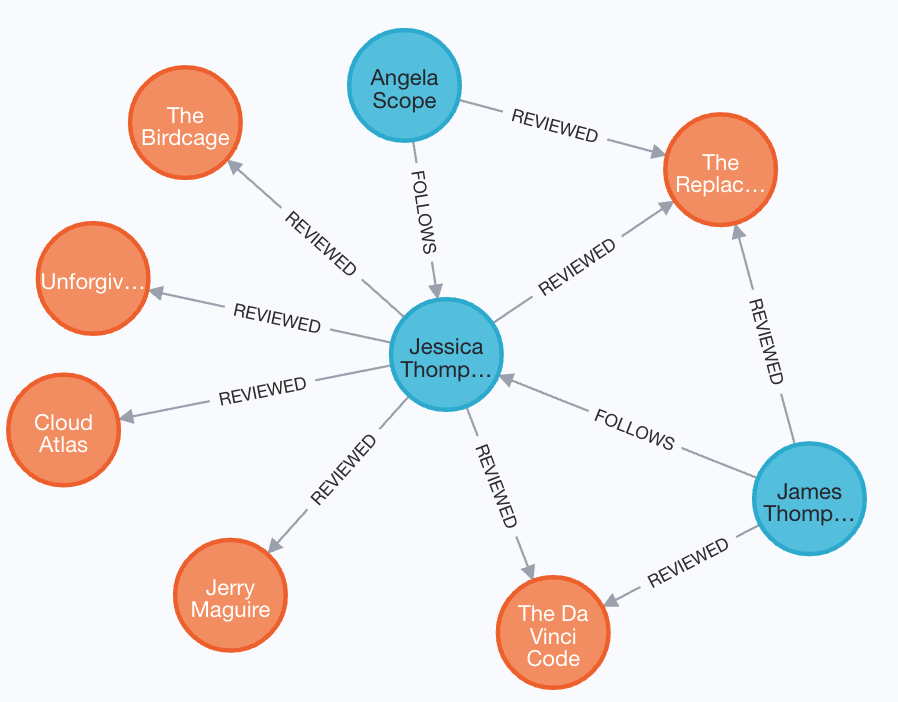

= 电影图数据
// :type: video
:type: quiz
:order: 1

// [.video]
// old video // video::FGFUX4ee9Fg[youtube,width=560,height=315]
// video::xP7T-fkJCFU[youtube,width=560,height=315]
[.transcript]
== 电影图数据

在 GraphAcademy 的很多课程中，你将通过不同版本的电影图数据来获得 Neo4j 的经验。
在本课中，你将了解第一次学习 Cypher 时使用的入门电影图数据中的数据。

=== 节点

电影图数据中的节点有人物、电影，在某些版本的数据中，还有电影的类型。

image::images/movie-nodes.png[电影图数据中的节点, role=left]

电影图数据的“入门”版本包含 171 个节点：

* 38 个 Movie 节点（即带有 Movie 标签的节点）
* 133 个 Person 节点（即带有 Person 标签的节点）

这是你第一次学习 Cypher 时使用的数据库。

==== 节点属性

所有 _Movie_ 节点都有一个属性 _title_ ，用于唯一标识一部电影。
此属性适用于所有 _Movie_ 节点。

_Movie_ 节点可能具有的其他属性包括：

* _released_ ：电影上映的年份。
* _tagline_ ：描述电影的一句话。

例如，我们在这两个 Movie 节点中看到，它们都具有 _title_ 和 _released_ 属性，但只有一个具有 _tagline_ 属性。

所有 _Person_ 节点都有一个属性 _name_，用于唯一标识一个人。
一些 _Person_ 节点有一个属性 _born_，但不是全部都有。

=== 关系

正如你所了解的，图数据库最重要的元素是关系。
关系具有类型和方向，表示两个特定节点之间的关系。

入门电影图数据中的一些关系包括：
////
* _ACTED_IN_: Used to represent that a specific person acted in a specific movie. (172 relationships)
* _DIRECTED_: Used to represent that a specific person directed a specific movie. (44 relationships)
* _WROTE_: Used to represent that a specific person wrote a specific movie. (10 relationships)
* _PRODUCED_: Used to represent that a specific person produced a specific movie. (15 relationships)
////

[cols="25,45,20", options="header"]
|====
|*关系类型*
|*描述*
|*数量*
|ACTED_IN
|A Person acted in a Movie
|172
|DIRECTED
|A Person directed a Movie
|44
|WROTE
|A Person wrote a Movie
|10
|PRODUCED
|A Person produced a Movie
|15
|====

一个人可以与一部电影有多种关系。例如，一个人既可以是某部电影的演员，也可以是导演。
在电影图中，鉴于这些关系，人们要么是演员、导演、作家和/或制片人。

image::images/hoffa.png[width=800,The movie Hoffa]

因此，例如电影图数据中的电影“Hoffa”具有这些关系。
它有四名演员和一名导演。 Danny DeVito 执导并出演了这部电影。
在我们的入门电影图数据中，这部电影没有定义作家或制片人。

图中的其他关系包括：
////
* _REVIEWED_: Used to represent that a specific person reviewed a specific movie. (9 relationships)
* _FOLLOWS_: Used to represent that a specific person follows another specific person. (3 relationships)
////

[cols="25,45,20", options="header"]
|====
|*关系类型*
|*描述*
|*数量*
|REVIEWED
|A Person reviewed a Movie
|9
|FOLLOWS
|A Person follows another Person
|3
|====

使用这些关系，人们可以成为评论者、关注者或被关注者。
在电影图数据中，评论电影或关注其他人的人 *不是* 演员、导演、作家或制片人。

以下是入门电影图数据中的评论者：

我们有三个 _Person_ 节点表示评论过电影的人。
所有这三位评论家都评论了电影《The Replacements》。
有两个人在关注 Jessica Thompson。

==== 关系属性

_ACTED_IN_ 关系可能具有 _roles_ 属性，该属性表示演员在特定电影中扮演的角色。

例如，在入门电影图数据中，演员 Hugo Weaving 的所有 _ACTED_IN_ 关系定义了以下属性：

image::images/hugo-weaving-roles.png[Hugo Weaving 的角色]

对于电影评论者，_REVIEWED_ 关系具有 _rating_ 和 _summary_ 属性：

image::images/reviewed-properties.png[Reviewed 属性]

== 知识检查

include::questions/1-nodes.adoc[leveloffset=+1]
include::questions/2-relationships.adoc[leveloffset=+1]

[.summary]
== 本课小结

在本课中，你了解了电影图数据中的数据模型和具体数据。
