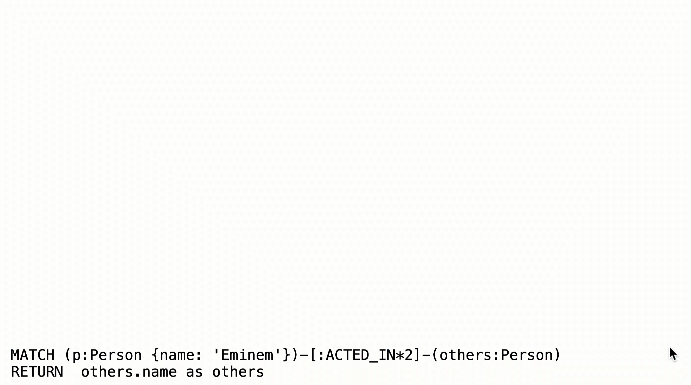

= Varying Length Traversal
:type: quiz
:sandbox: true

//[.video]
//video::ImKvXY72SA0[youtube,width=560,height=315]

//[.transcript]
== Varying length traversal

Any graph that represents social networking, hierarchies, transport, flow, or dependency networks will most likely have multiple paths of varying lengths.
Think of the _connected_ relationship in _LinkedIn_ and how connections are made by people connected to more people.

Here are two use cases for this type of traversal:

* Finding the shortest path between two nodes.
* Finding out how "close" nodes are to each other in the graph.

The link:https://neo4j.com/docs/graph-data-science/current/[Neo4j Graph Data Science Library^] has many methods you can call to discover these characteristics and patterns of the graph.
In this training, we cover the basic connectedness between nodes that you can query with Cypher.

[NOTE]
--
In Neo4j uniqueness of relationships is always adhered to. That is, there will never be two relationships of the same type and direction between two nodes.
This enables Neo4j to avoid cycles or infinite loops in graph traversal.
--

=== Shortest path

Cypher has a built-in function that returns the shortest path between any two nodes, if one exists.

[source,cypher]
----
MATCH p = shortestPath((p1:Person)-[*]-(p2:Person))
WHERE p1.name = "Eminem" AND
      p2.name = "Charlton Heston"
RETURN  p
----

This query calculates and returns the shortest path between the Eminem node and the Charlton Heston node in the graph.
Because  nothing is specified for the relationship type, it finds the shortest path regardless of the relationship type.
That is, Eminem is four hops away from Charlton Heston using the ACTED_IN and RATED relationships.

You can also limit the relationship types to a specific relationship:

[source,cypher]
----
MATCH p = shortestPath((p1:Person)-[:ACTED_IN*]-(p2:Person))
WHERE p1.name = "Eminem" AND
      p2.name = "Charlton Heston"
RETURN  p
----

This query returns a longer path because the relationship must be ACTED_IN.

[NOTE]
--
For `shortestPath()` and `allShortestPaths()` you can provide an upper bound on the length of the path(s), but not a lower bound.
--

=== Varying length traversal

Suppose you want to retrieve all Person nodes that are exactly two hops away from Eminem using the ACTED_IN relationship.

[source,cypher]
----
MATCH (p:Person {name: 'Eminem'})-[:ACTED_IN*2]-(others:Person)
RETURN  others.name
----

Here is what happens when this query executes:

The Eminem Person node is retrieved.
Then the two ACTED_IN relationship are traversed through the Movie node for 8 Mile to return the three Person nodes.
Then the two ACTED_IN relationships are traversed through the Movie node for Hip Hop Witch, Da to return the three Person nodes.

==== four hops away

Suppose you want to retrieve all Person nodes that are exactly four hops away from Eminem using the ACTED_IN relationship.

[source,cypher]
----
MATCH (p:Person {name: 'Eminem'})-[:ACTED_IN*4]-(others:Person)
RETURN  others.name
----

Here is what happens when this query executes:

image::images/4-hops-Eminem.gif[People 4 hops away from Eminem,width=400,align=center]

The Eminem Person node is retrieved.
Then the ACTED_IN relationships are traversed through the Movie node where Brittany Murphy for 8 Mile is retrieved  and Little Black Book to return the two Person nodes.
Then the four ACTED_IN relationships are traversed through the Movie node for 8 Mile and The Prophecy II to return the two Person nodes.
Only Person nodes that are exactly 4 hops from Eminem are returned.

====  Up to four hops away

Suppose you want to retrieve all Person nodes that are up to four hops away from Eminem using the ACTED_IN relationship.

[source,cypher]
----
MATCH (p:Person {name: 'Eminem'})-[:ACTED_IN*1..4]-(others:Person)
RETURN  others.name
----

Here is what happens when this query executes:

image::images/up-to-4-hops-Eminem.gif[People 4 hops away from Eminem,width=400,align=center]

The Eminem Person node is retrieved.
Then the ACTED_IN relationships are traversed through the Movie node for 8 Mile and for the Little Black Book.
During this traversal we retrieve the Person node two hops away and the two Person nodes that are four hops away.
Then the ACTED_IN relationships are traversed through the Movie node for 8 Mile and for The Prophecy II.
We have already retrieved Brittany Murphy who is four hops away, but we add two more Person nodes.
This depth-first traversal and retrieval continues until all Person nodes that are two hops away and four hops away are retrieved.

== Check your understanding

include::questions/1-complete-query.adoc[leveloffset=+1]
include::questions/2-select-answer.adoc[leveloffset=+1]

[.summary]
== Summary

In this lesson, you learned how varying length traversal works in Cypher.

In the next challenge, you will write a query that uses varying length paths.
