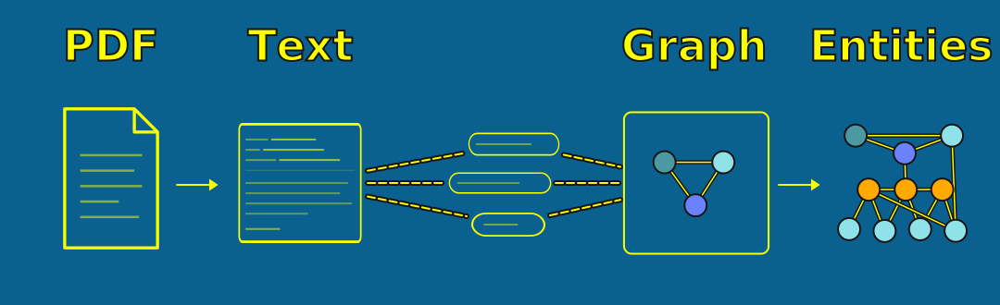
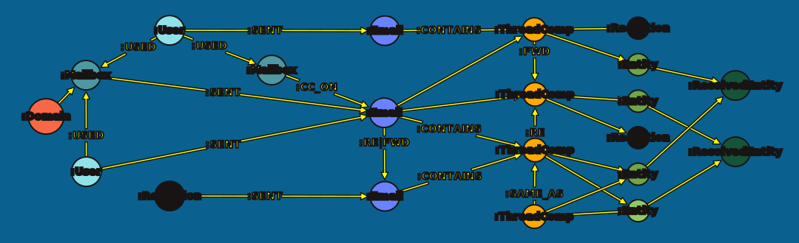
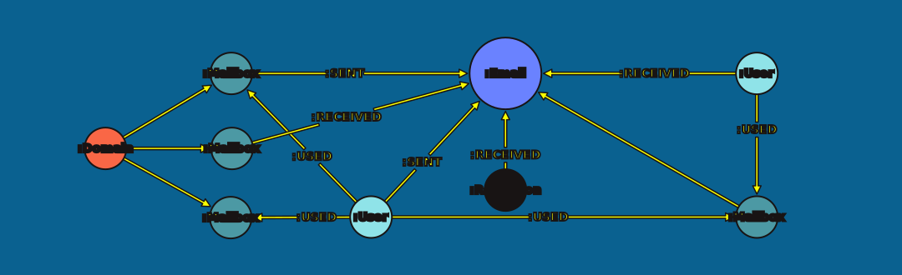

= Course Overview
:type: lesson
:order: 2

[.slide]

== What We're Building

In this course, you'll extract structured communication metadata from documents and build an entity network in Neo4j.

You'll extract text, parse it into structured records, and import the results -- producing a graph of people, mailboxes, domains, and emails ready for entity extraction in the next course.

[.slide]

== The Three-Course Series

This course is the first of three:

. **Entity Communication Networks** (this course): Extract and structure communication metadata into a graph
. link:/courses/entity-extraction-communication-networks/[Entity Extraction^]: Thread decomposition, chunking, and entity extraction
. link:/courses/entity-resolution-communication-networks/[Entity Resolution^]: Deduplicate and resolve entities

Each course can be taken independently. Courses 2 and 3 provide starter graphs if you haven't completed the prior course.

[.slide.col-2]

== The Dataset

We'll work with a collection of email PDFs — real-world documents with the typical challenges of scanned and digitized correspondence:

[.col]
====
* **OCR artifacts** — misread characters, merged words, corrupted email addresses
* **Inconsistent formatting** — different email clients produce different layouts
* **Embedded chains** — forwarded messages and reply threads nested within a single document
* **Boilerplate** — headers, footers, and classification markings mixed with content
====

[.col]
====
image::images/messy_email_example.png[an example email from the corpus.]
====

[.slide]

== Bring your own dataset

If you would prefer to use your own dataset, feel free to do so.

[TIP]
.Bring your own data
====
Throughout the course, you will receive extra standout tips and guidance on how to work with your own dataset.
====

[.slide]

== Setting Up Your Environment

Click the button below to open the workshop repository in a GitHub Codespace.

link:https://codespaces.new/neo4j-graphacademy/entity-communication-networks-notebooks[Open in GitHub Codespace^,role="btn"]

The Codespace takes approximately **10 minutes** to configure. While it sets up, continue through the next slides.

You will also need an AuraDB Free instance. Create one at https://console.neo4j.io[Neo4j Aura^] if you don't have one already.

[.slide]

== The End-state graph

By the end of all three courses, your Neo4j instance will contain a metadata graph that captures who sent what to whom, and through which domain. Every extraction and parsing decision you make in this course serves this model.

[.slide]

== Metadata graph

By the end of this course, you will have created the precursor to the previous graph, composed of email metadata and coarse thread relationships.

[.slide]

== Graph Model

The metadata graph separates people from their email addresses, and email addresses from their domains -- each separation unlocks a different class of query.

[source,cypher,role=noplay nocopy]
.Graph data model
----
(:User)-[:SENT]->(:Email)
(:Mailbox)-[:SENT]->(:Email)
(:User)-[:USED]->(:Mailbox)
(:Mailbox)-[:RECEIVED]->(:Email)
----

You may wonder why we are using both `(:User)` _and_ `(:Mailbox)` nodes.

In a company, multiple users may use the same mailbox. Multiple mailboxes may be used by the same user. Despite their 'sameness' in general, they are fundamentally _different_ entities -- and so, we should model them as such.

The impact of this will become clearer as you continue the course.

[.quiz]
== Check your understanding

include::questions/1-course-goal.adoc[leveloffset=+1]

read::Mark as read[]

[.summary]
== Summary

* You're building a communication network from raw documents -- Domain, Mailbox, User, and Email nodes
* This is part one of a three-course series
* Every extraction and parsing decision serves the graph model
* The dataset has real-world OCR and formatting challenges
* Your Codespace should be setting up in the background
