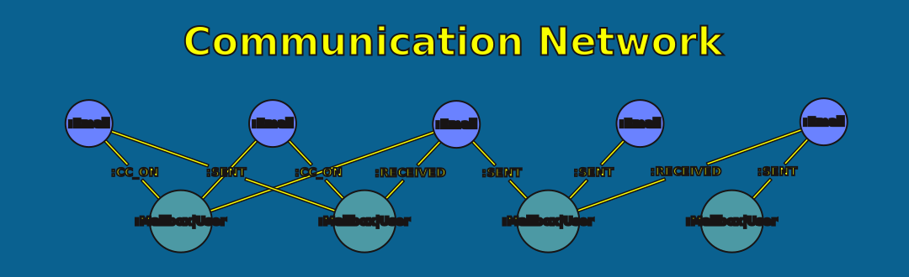
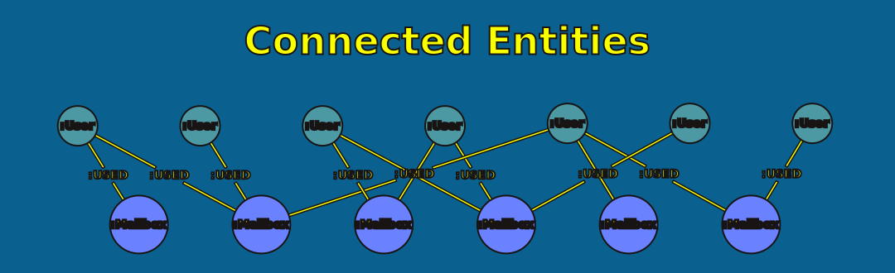
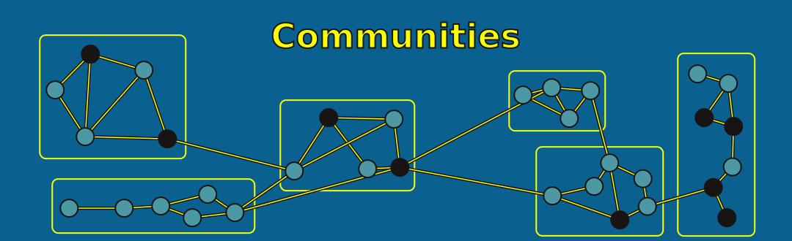

= What You Can Build
:type: lesson
:order: 3

[.slide]

== From PDFs to Insight

Once your knowledge graph is built, you can explore your email corpus in ways that flat text or spreadsheets simply can't support.

Here are some examples of what becomes possible.

image::images/metadata_graph.svg[A data model of the metadata graph: User, Mailbox, Domain, Email, with relationships USED, HAS_MAILBOX, SENT, RECEIVED.]

[.slide]

== Map Communication Networks

Visualize who communicated with whom, how often, and through which channels. Spot key connectors, isolated groups, and unexpected bridges between teams.

[.slide]

== Discover Connected Entities

Find the people, organizations, and places mentioned across your corpus and see how they connect — even when they appear in different emails, from different senders.

[.slide]

== Discover communication clusters

Use various algorithms like Louvain, Leiden, FastRP, Node Similarity and more to discover coherent communities of densely connected communicators.

[.slide]

== What Makes This Possible

None of these insights come from a single email. They emerge from the **connections** between emails, people, and entities -- exactly what a knowledge graph captures.

To get there, you need clean, structured data. That's what this course produces: extracted text, parsed into structured records, imported into a metadata graph that the later courses build on.

[.quiz]
== Check your understanding

include::questions/1-graph-advantage.adoc[leveloffset=+1]

read::Mark as read[]

[.summary]
== Summary

* A knowledge graph lets you map communication networks, trace threads, discover entities, and cluster by topic
* These insights emerge from connections — not from individual documents
* The extraction and parsing work in this course builds the metadata graph foundation
