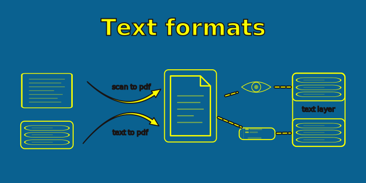
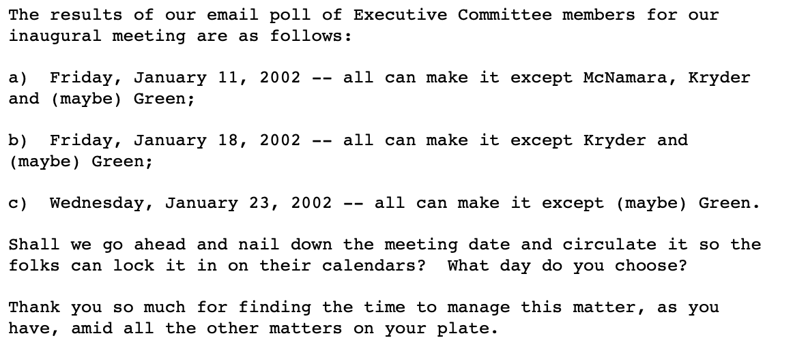
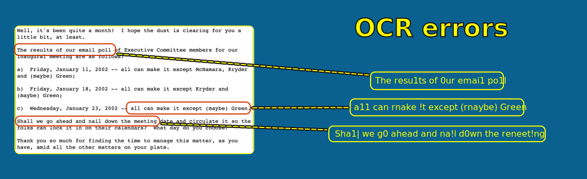

= Extraction Approaches
:type: lesson
:order: 4

[.slide.col-2]

== The Extraction Challenge

Before you can build a graph from text, you need text.

[.col]
====
Email PDFs aren't only containers for text — they're often rendered images of documents, and sometimes a mix of both.

Some have embedded text layers, others require OCR, and many have both -- with the text layer containing garbled text.
====

[.col]
====

====

[.slide]

== Approaches to extraction

There are many approaches you can take to extract text from PDFs and your choice depends on a few factors.

[.slide]

== Your toolset

You can extract text from PDFs using any of the following tools:

* Plain text extractors (fast, cheap)
* Optical Character Recognition (medium speed, cheap)
* LLM vision models (slow, expensive)

Which approach you choose depends on:

* **Dataset size** -- millions of files on a single machine favours the cheapest, fastest option
* **Error tolerance** -- if downstream entity resolution can merge duplicates, noisy OCR may be acceptable
* **Budget** -- vision models produce the best output but cost orders of magnitude more

[.slide]

== Example email pdf

For example, take this email pdf which was constructed from a `.eml` file -- its text layer comes directly from the original digital text:

[.slide]

== Plain text extraction

The simplest approach reads that embedded text layer in the PDF. 

Tools like **PyMuPDF**, **pdfplumber**, and **pdfminer** can do this quickly and cheaply. You should get relatively high-fidelity text like this:

.Result
[cols="1a", options="header"]
|===
| Result

|
The results of our email poll of Executive Committee members for our inaugural meeting are as follows:

a) Friday, January 11, 2002 -- all can make it except McNamara, Kryder and (maybe) Green;

b) Friday, January 18, 2002 -- all can make it except Kryder and (maybe) Green;

c) Wednesday, January 23, 2002 -- all can make it except (maybe) Green.

Shall we go ahead and nail down the meeting date and circulate it so the folks can lock it in on their calendars? What day do you choose?

Thank you so much for finding the time to manage this matter, as you have, amid all the other matters on your plate.
|===

[.transcript-only]
====
This works well when the PDF was generated digitally — from an email client export, a Word document, or a print-to-PDF workflow. The text is clean, correctly ordered, and ready to use.
====

[.slide]

== Optical Character Recognition

OCR tools like **Tesseract** and **EasyOCR** convert images of text into machine-readable characters. They work by rendering each page as an image and recognizing character shapes.

[.slide]

== Plain text from OCR layer

But when the PDF is a scanned image, or the text layer was generated by an earlier OCR pass, the embedded text can be garbled, incomplete, or missing entirely.

.Result
[cols="1a", options="header"]
|===
| Result

|
The resu1ts of 0ur emai1 po1l of Executlve Cornmittee mernber5 f0r our inaugura| rneeting are as fo11ow5:

a) Fr!day, Januarv 11, 2OO2 -- a1l can rnake !t except McNarnara, Kryder and (rnaybe) Green;

b) Fr|day, January l8, 2OO2 -- al1 can make lt except Kryder and (maybe) Greeen;

c) Wednesdav, Januarv 23, 2O0Z -- a11 can rnake !t except (rnaybe) Green.

Sha1| we g0 ahead and na!l d0wn the rneet!ng date and c|rcu1ate lt s0 the fo1ks can 1ock !t |n 0n the!r calendars? What dav d0 y0u choose?

Thank vou s0 rnuch f0r f!nd|ng the t!rne t0 rnanage th!s rnatter, as y0u have, arnid a1| the 0ther rnatters 0n y0ur p1ate.
|===

[.transcript-only]
====
Now, that example is quite extreme -- you're unlikely to encounter OCR that poor in the wild. 

We're including some examples of this degredation level to demonstrate how you can overcome it in your pipeline.
====

[.slide]

== OCR errors

OCR is essential for scanned documents, but it introduces errors — especially with low-resolution scans, unusual fonts, or dense formatting. Common mistakes include:

* Confusing similar characters (`l` and `1`, `O` and `0`)
* Merging or splitting words at column boundaries
* Dropping characters at page edges

There are a number of methods for fixing these mistakes, but you'll rarely eliminate all of them. 

[.slide]

== LLM vision models

Vision-capable LLMs -- like those from OpenAI, Anthropic and DeepSeek -- can interpret page images directly. They understand layout, tables, and context in ways that traditional OCR cannot.

The tradeoffs are cost, speed and determinism.

[.slide]

== LLMs: Expense

Processing thousands of pages through a vision model is orders of magnitude more expensive than PyMuPDF or Tesseract. 

This makes them impractical as a primary extraction tool for large corpora -- especially for independent researchers. They are a valuable fallback for pages where other methods fail.

[.slide]

== LLMs: Time

LLMs, especially those of the reasoning variety, could take multiple seconds to process a single page of text. On smaller datasets this might work out.

However, on datasets containing multiple millions of PDFs, this is almost intractable -- with one caveat.

In this course, you will learn how to speed this up -- and lower the cost -- using Batch APIs. LLMs are, however, fundamentally slower than the other available methods.

[.slide]

== LLMs: Determinism

LLMs have come a long way, and they are generally less prone to hallucination than ever. Regardless, at scale, it is impossible to vet every single output, and hallucinations can still occur.

Targeted LLM use can reduce the impact of hallucinations and help to fill in the gaps when traceability is important to your project.

[.slide]

== Data quality

In many cases, PDFs will already contain a layer of text that has been either faithfully added to the file, or extracted via OCR.

The challenge is that you often can't tell which. A PDF might have a text layer that *looks* correct but contains systematic errors from an earlier OCR pass — transposed characters, merged words, or missing punctuation.

This is why a tiered extraction strategy matters. 

1. Start with the cheapest, fastest method.

2. You can accept a degree of noise — OCR errors create duplicates that entity resolution can merge later. 

3. Fall back to more expensive methods only when the cheap one produces output too noisy to resolve.

.Data Quality Spectrum
[cols="1,1,1,1", options="header"]
|===
| | Tier 1: Direct text extraction | Tier 2: OCR | Tier 3: LLM-based extraction

| Cost
| Cheapest & fastest
| Moderate
| Most expensive

| Quality
| High if text layer is clean; unreliable if prior OCR was poor
| Acceptable noise — duplicates can be merged by entity resolution
| Highest quality, but risk of hallucination at scale

| When to use
| Always start here
| When direct extraction returns no text or obvious garbage
| When OCR output is too noisy to resolve
|===

[.quiz]
== Check your understanding

include::questions/1-extraction-tiers.adoc[leveloffset=+1]

read::Mark as read[]

[.summary]
== Summary

* PDF text extraction has three main approaches: plain text, OCR, and vision models
* Each trades off speed and cost against accuracy
* Pre-existing text layers aren't always trustworthy — they may contain earlier OCR errors
* A tiered strategy starts cheap and fast, falling back only when needed
