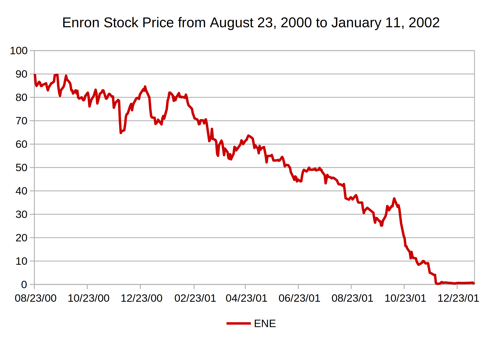
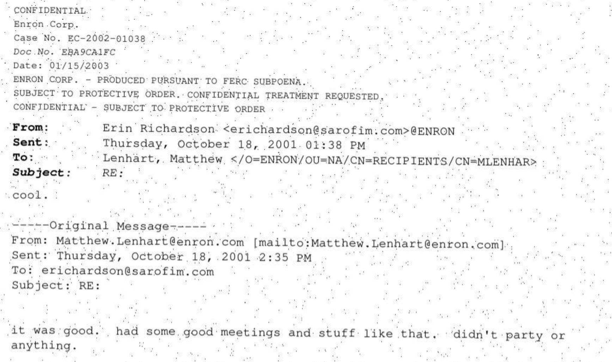

= The Enron Dataset
:type: lesson
:order: 5

[.slide]

== The Enron Dataset

You've chosen a tiered extraction strategy -- fast and cheap first, expensive fallback only when needed. Now you need a dataset to test it on.

Throughout this course, you'll work with a synthetic PDF version of the Enron email corpus -- one of the most widely studied communication datasets.

[.slide.col-2]

== Background

[.col]
====
Enron was an American energy company that collapsed in 2001 in one of the largest corporate fraud scandals in history.

During the subsequent investigation by the SEC, DOJ and the Federal Energy Regulatory Commission (FERC), roughly half a million internal emails were released into the public domain — creating an unprecedented record of day-to-day business communication inside a large corporation.
====

[.col]
====

====

[.slide]

== The dataset

The original dataset was prepared and released by researchers at Carnegie Mellon University. It contains emails from approximately 150 senior Enron employees, spanning several years of correspondence.

The corpus includes routine scheduling, project discussions, legal negotiations, and personal messages — and has been cited in hundreds of academic publications across NLP, social network analysis, and information retrieval.

[.slide.col-2]

== Why Enron?

Most email data is private by nature, making it nearly impossible to obtain for research. The Enron corpus is one of very few large-scale, real-world email datasets that is publicly available.

[.col]
====
This makes it an ideal testbed for building knowledge graph pipelines:

* **Real-world structure** — authentic headers, forwarding chains, CC lists, and attachments
* **Messy data** — OCR artifacts, inconsistent formatting, and missing fields
* **Rich relationships** — a genuine communication network between real people and organizations
* **Scale** — large enough to surface real pipeline challenges, small enough to process on a single machine
* **Well-studied** — extensive prior work to benchmark against
====

[.col]
====
.Dataset statistics (link:https://snap.stanford.edu/data/email-Enron.html[SNAP^])
[cols="2,1", options="header"]
|===
| Metric | Value

| Nodes | 36692
| Edges | 183831
| Nodes in largest WCC | 33696 (0.918)
| Edges in largest WCC | 180811 (0.984)
| Average clustering coefficient | 0.4970
| Number of triangles | 727044
| Fraction of closed triangles | 0.03015
| Diameter (longest shortest path) | 11
| 90-percentile effective diameter | 4.8
|===

====

[.transcript-only]
====
The statistics above describe the communication graph derived from the corpus by SNAP. 
====

[.slide.col-2]

== Our version of the dataset

[.col]
====
For this course, the original plaintext emails have been converted into PDF format to simulate a common real-world scenario: receiving a document dump as scanned or exported PDFs rather than structured data.

We have even added FOIA-style redactions to simulate the kinds of documents you might see in the wild.

This introduces the extraction challenges you'll solve over the coming lessons — some pages have clean text layers, others require OCR, and a few need more advanced techniques.

The original plaintext Enron corpus is available at https://www.cs.cmu.edu/~enron/[Carnegie Mellon^].
====

[.col]
====

====

[.transcript-only]
====
[TIP]
.Prepare your own dataset
If you want to follow along with your own PDF email dump, now would be the time to prepare that dataset. The techniques in this course apply to any collection of email PDFs.
====

[.quiz]
== Check your understanding

include::questions/1-dataset-structure.adoc[leveloffset=+1]

read::Mark as read[]

[.summary]
== Summary

* The Enron corpus is a publicly available dataset of ~500,000 real corporate emails
* It was released during a federal investigation and is one of the most studied datasets in NLP and network analysis
* Our version converts the original emails to PDFs, introducing realistic extraction challenges
* The dataset contains authentic communication patterns — headers, chains, CC lists — that make it ideal for building a knowledge graph
