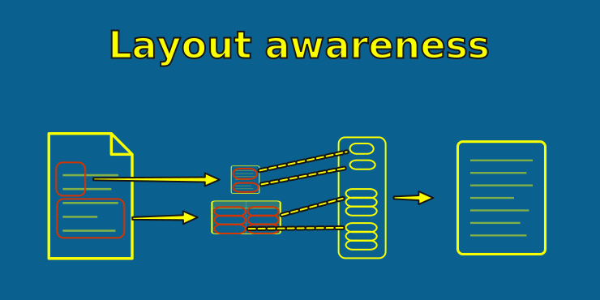

= Combined extraction packages
:type: lesson
:order: 8

[.slide]

== Beyond modular extraction

So far we've assembled our own extraction pipeline from separate tools -- PyMuPDF for text layers, Tesseract for OCR, and custom logic to decide which to use.

An alternative approach is to use a **combined extraction package** that handles all of this in one tool: text extraction, OCR, and layout analysis in a single pipeline.

Open `1.3_extracting_with_docling.ipynb` in your notebook environment to follow along.

[.slide.col-2]

== The landscape

[.col]
====
Several packages take this all-in-one approach:

* link:https://github.com/docling-project/docling[**Docling**^] -- IBM's open-source document understanding library
* link:https://github.com/Unstructured-IO/unstructured[**Unstructured**^] -- open-source document processing with cloud and local modes
* link:https://github.com/VikParuchuri/marker[**Marker**^] -- converts PDFs to markdown using deep learning models
* **Cloud APIs** -- Azure Document Intelligence, Google Document AI, AWS Textract

They differ in speed, accuracy, and cost -- but share the same core idea: you hand the package a PDF, and it figures out the best way to extract text.
====

[.col]
====

We'll use **Docling** as our example. It's open-source, runs locally, and on macOS uses the native Vision framework for OCR -- no Tesseract install needed.
====

[.slide.col-2]

== Docling setup

In your notebook, run the first four cells to install Docling, configure the imports, set up the converter, and pre-load the models.

[.col]
====
[source,python,role=noplay nocopy]
.Converter configuration
----
pipeline_options = PdfPipelineOptions()
pipeline_options.do_ocr = True  # <1>
pipeline_options.do_table_structure = False  # <2>
pipeline_options.generate_picture_images = False

converter = DocumentConverter(
    format_options={
        InputFormat.PDF: PdfFormatOption(
            pipeline_options=pipeline_options
        )
    }
)
----
====

[.col]
====
<1> Enable OCR -- Docling will OCR pages that have no text layer
<2> Disable table structure and picture generation -- our email PDFs don't need them

Model loading takes 30-60 seconds on first run. You'll see "Models loaded" when it's done.
====

[.slide.col-2]

== Default extraction

In your notebook, run the next cell to extract `E61D04918.pdf` -- a scanned file with moderate OCR errors in its text layer.

[.col]
====
[source,python,role=noplay nocopy]
----
result = converter.convert(str(SAMPLE_PDF))
default_text = html.unescape(  # <1>
    result.document.export_to_text()
)

print(default_text[:1000])
----

By default, Docling trusts the existing text layer. Since `E61D04918.pdf` has a noisy OCR layer (`Bate:` for `Date:`, `ENRON CORE.` for `ENRON CORP.`), the output carries those same errors.
====

[.col]
====
<1> Docling's `export_to_text()` internally uses its markdown exporter, which HTML-encodes angle brackets (`<` becomes `&lt;`). Since our email headers contain `Name <email>` format, `html.unescape()` restores the original characters.

This is the same behavior as PyMuPDF's `get_text()` -- the existing text layer is used as-is. To get better text, we need to tell Docling to ignore the text layer and re-OCR the page image.
====

[.slide.col-2]

== Forcing full-page OCR

In your notebook, run the next two cells to configure a second converter with forced OCR and extract the same file.

[.col]
====
[source,python,role=noplay nocopy]
----
pipeline_options_ocr = PdfPipelineOptions()
pipeline_options_ocr.do_ocr = True
pipeline_options_ocr.ocr_options = OcrMacOptions(
    force_full_page_ocr=True  # <1>
)
# The notebook detects your platform
# and uses EasyOcrOptions on Linux

converter_ocr = DocumentConverter(...)
----

[source,python,role=noplay nocopy]
----
result = converter_ocr.convert(str(SAMPLE_PDF))
ocr_text = html.unescape(
    result.document.export_to_text()
)
print(ocr_text[:1000])
----
====

[.col]
====
<1> Ignores the existing text layer and re-OCRs the page image using macOS Vision (or EasyOCR on Linux)

Compare the output to the default extraction. In our dataset, the underlying page images are clean -- the garbled text layer came from an earlier, lower-quality OCR pass. Forced OCR re-reads the clean image and produces dramatically better results.
====

[.slide.col-2]

== OCR on image-only PDFs

In your notebook, run the next cell to extract an image-only file.

[.col]
====
[source,python,role=noplay nocopy]
----
result = converter.convert(str(EMPTY_PDF))
empty_text = html.unescape(
    result.document.export_to_text()
)

print(empty_text[:1000])
----

Docling detects there's no text layer and OCRs automatically -- no special configuration needed.
====

[.col]
====
This is where combined packages shine. With our modular approach, we needed a tiered strategy to route image-only files to Tesseract. Docling handles it automatically in a single code path.
====

[.slide]

== One tool for any PDF

In your notebook, run the next cell to extract a clean digital PDF with the same converter.

The default converter reads the text layer on clean files and OCRs image-only files -- no file-size heuristic, no switching tools. One call for any PDF:

[source,python,role=noplay nocopy]
----
result = converter.convert("any_pdf.pdf")
text = html.unescape(result.document.export_to_text())
----

The limitation: it trusts existing text layers, so files with OCR errors carry those errors through. For those, you need `force_full_page_ocr`.

[.slide.col-2]

== Quality comparison

In your notebook, run the next cell to compare PyMuPDF, Tesseract CLI, and Docling's forced OCR on the same file.

[.col]
====
Each OCR engine has its own error profile. The existing text layer, a fresh Tesseract re-OCR, and Docling's Vision OCR will each produce slightly different results on the same image.

Compare the header fields in the output -- Case No, Doc No, Date, From, Subject -- to see where the engines agree and disagree.
====

[.col]
====
For our dataset, re-OCR from any engine produces much better results than the existing text layer, because the underlying images are clean. The garbled text came from an earlier OCR pass, not from a degraded image.

In other datasets, the image itself may be the limiting factor. The quality ceiling is always the source image.
====

[.slide.col-2]

== Speed comparison

In your notebook, run the speed comparison cell to benchmark all three approaches on a mixed sample.

[.col]
====
The modular strategy (PyMuPDF + Tesseract) is fastest because `get_text()` is nearly instant on files with a text layer. Docling runs layout analysis on every file, even when simple text extraction would suffice.
====

[.col]
====
In your notebook, run the next cell to test Docling with OCR disabled on clean files. Even in text-only mode, the layout analysis overhead means it can't match PyMuPDF's raw speed.
====

[.slide]

== Modular vs combined: when to use each

**Choose a combined package (Docling, Unstructured, etc.) when:**

* You want a single tool for the entire extraction process -- no tiered strategy
* Your documents have complex layouts (multi-column, tables, mixed content)
* Your dataset is small enough that speed doesn't matter
* You want layout-aware extraction and are willing to pay the speed cost

**Choose modular tools (PyMuPDF + Tesseract) when:**

* You're processing hundreds of thousands or millions of documents and speed matters
* Your documents are simple (single-column emails like ours)
* You need fine-grained control over each step
* You need cross-platform consistency

For this workshop, we'll use PyMuPDF + Tesseract for the full corpus extraction -- speed matters at 5,000 files. But if you're working with your own PDFs and starting fresh, a combined package like Docling could be the better first choice: one tool, one code path, and layout awareness without needing to build a tiered strategy yourself.

[TIP]
.Consider layout-aware tools for complex documents
====
Our email PDFs are simple single-column text, so modular tools win on speed. If your documents have tables, multi-column layouts, forms, or mixed content (e.g. invoices, contracts, medical records), a combined package like Docling may be worth the speed cost -- layout analysis is precisely what those documents need. Try both on a sample and compare the output quality before deciding.
====

[.quiz]
== Check your understanding

include::questions/1-speed-tradeoff.adoc[leveloffset=+1]

read::Mark as read[]

[.summary]
== Summary

* **Combined extraction packages** handle text extraction, OCR, and layout analysis in a single pipeline -- no tiered strategy needed
* Docling, Unstructured, Marker, and cloud APIs are popular options
* In **default mode**, Docling reads text layers or OCRs as needed -- one tool, one code path
* Use `force_full_page_ocr=True` when you don't trust existing text layers
* Combined packages add **layout analysis** on top of extraction, but are slower than modular tools -- quality depends on the document and OCR engine
* The speed gap comes from **layout analysis** -- these packages interpret every page, even when simple text extraction would suffice
* Best suited for smaller datasets, complex layouts, or when you want one simple code path

**Next:** We'll look at vision models -- the most capable extraction method, and the most expensive -- to understand when they're worth the cost.
