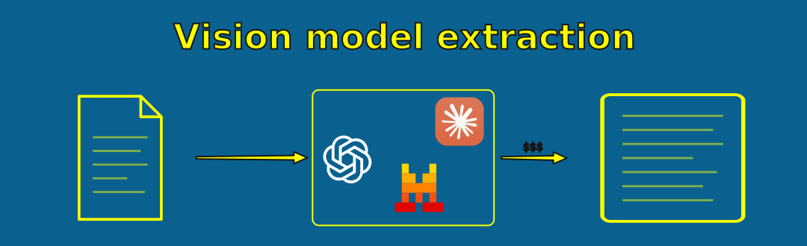

= Extracting with a vision model
:type: lesson
:order: 9

[.slide]

== Vision LLMs for extraction

You've now seen modular tools (PyMuPDF + Tesseract) and combined packages (Docling). Both work at the character level -- reading shapes and matching patterns. Vision-capable LLMs take a fundamentally different approach: they interpret page images directly, understanding layout, context, abbreviations, and even handwriting.

This is the most capable extraction method available -- and also the most expensive and slowest.

Open `1.4_extracting_with_vision.ipynb` in your notebook environment to follow along.

[.transcript-only]
====
[TIP]
.No API key? Skip ahead
If you don't have an OpenAI API key, you can skip this lesson's notebook. The email dataset extracts well with PyMuPDF and OCR alone.
====

[.slide.col-2]

== Sending a page to a vision model

The process is straightforward: render the PDF page to an image, encode it as base64, and send it to the model with a prompt asking for the text content. In your notebook, run the first three cells to install dependencies, configure the API client, and define the helper function.

[.col]
====
[source,python,role=noplay nocopy]
.Render and send
----
doc = pymupdf.open("email.pdf")
pix = doc[0].get_pixmap(dpi=200)
img_bytes = pix.tobytes("png")
img_b64 = base64.b64encode(
    img_bytes).decode()  # <1>

response = client.chat.completions.create(
    model="gpt-4.1-mini-2025-04-14",
    messages=[{
        "role": "user",
        "content": [
            {"type": "text",
             "text": "Extract all text..."},  # <2>
            {"type": "image_url",
             "image_url": {"url":
                 f"data:image/png;base64,"
                 f"{img_b64}"}},
        ],
    }],
)
text = response.choices[0].message.content
----
====

[.col]
====
<1> Render at 200 DPI and base64-encode for the API
<2> A simple prompt asking for the text content -- the model interprets the image directly

Any vision-capable model works -- OpenAI, Anthropic, Google, or open-source alternatives. We use `gpt-4.1-mini` here because we already have the API key configured.
====

[.slide.col-2]

== Vision on a degraded scan

In your notebook, run the next cell to send `E61D04918.pdf` to the vision model. This is the file where the existing OCR layer has errors like `Bate:` for `Date:` and `ENRON CORE.` for `ENRON CORP.`.

[.col]
====
Compare the vision model output to the other methods on this file:

* **PyMuPDF `get_text()`** returned the garbled text layer: `Bate:`, `ENRON CORE.`, `EROTECTIVE`
* **Tesseract re-OCR** on the clean underlying image corrected most errors: `Date:`, `ENRON CORP.`, `PROTECTIVE`
* **Docling forced OCR** also produced clean output from the same image
====

[.col]
====
The vision model reads the page as a human would -- interpreting the image directly rather than recognising individual characters. On this file, re-OCR already corrects the errors. The vision model's advantage is more apparent on truly degraded images where even re-OCR struggles.

Check the header fields in the output to see where the methods agree and where they differ.
====

[.slide]

== Image-only PDFs

In your notebook, run the next cell to send an image-only PDF to the vision model. Vision models don't care whether a text layer exists -- the page image is all they need.

[.slide.col-2]

== Quality comparison

In your notebook, run the next cell to compare PyMuPDF, Tesseract, and the vision model side-by-side on the same file.

[.col]
====
In our dataset, the underlying page images are clean — the garbled text came from an earlier OCR pass. Re-OCR (Tesseract or Docling) already corrects most errors. The vision model produces similar quality on these files.

Where vision models pull ahead is on truly degraded images where character shapes are ambiguous — the model uses context to infer what the text should say.
====

[.col]
====
Check for hallucinations too — the vision model may "correct" something that was actually right in the original, or invent text that isn't on the page.

This is a fundamentally different kind of error to OCR. OCR garbles characters in predictable ways. Vision models make plausible but wrong substitutions that are harder to detect.
====

[.slide.col-2]

== Tradeoff 1: cost and speed

[.col]
====
[cols="1,1,1"]
|===
|**Method** |**Cost per 1K pages** |**Speed**

|PyMuPDF
|~$0
|~300 pages/sec

|Tesseract OCR
|~$0
|~1 page/sec

|Docling
|~$0
|~1-3 pages/sec

|Vision LLM (gpt-4.1-mini)
|~$1-5
|<1 page/sec
|===
====

[.col]
====
At 5,000 pages, that's the difference between free and $5-25.

At scale, vision extraction is a targeted tool, not a bulk processing strategy. In your notebook, run the speed comparison cell to see the actual difference on your machine.
====

[.slide.col-2]

== Tradeoff 2: hallucination

[.col]
====
Vision models can confidently produce text that **isn't on the page** -- "correcting" unusual spellings, filling in words they can't read, or reformatting content.

OCR engines make character-level errors (`Bate:` for `Date:`, `CORE.` for `CORP.`). Vision models make plausible but wrong substitutions that are harder to detect.
====

[.col]
====
Always verify critical fields (document IDs, dates, names) against the source image when accuracy matters.

Model size doesn't guarantee accuracy -- a larger model may introduce different hallucinations than a smaller one.
====

[.slide]

== Tradeoff 3: non-determinism

Run the same page twice and you may get different output -- different line breaks, whitespace, or word choices.

For body text, this is usually fine. For identifiers and exact values, non-determinism is a problem -- two runs could produce two different document IDs for the same page.

[.slide]

== When to use vision models

Vision models make sense as a **targeted fallback** -- not a primary extraction tool:

* Run PyMuPDF first (covers files with existing text layers -- 84% of our dataset)
* Run Tesseract on image-only pages (covers the 16% with no text)
* Send only the truly unreadable pages to a vision model

This keeps costs low while ensuring you don't lose data from the hardest documents.

For this workshop, the Enron emails extract well with PyMuPDF + Tesseract. We won't use vision models for the full corpus -- but they're the quality ceiling when other methods fall short.

[.slide]

== Corrections instead of regeneration

The process above sends the entire page to the model and asks it to return all the text. That works, but it's expensive — the model regenerates every word, including the ones that were already correct.

A more efficient approach: send the model the existing OCR text alongside the page image, and ask it to return only the lines that need correcting. In your notebook, run the encoding, prompt, correction, and token comparison cells.

[.slide.col-2]

== How it works

[.col]
====
. Number each line of the existing OCR text
. Send the numbered text and the page image to the model
. Ask it to return only the line numbers that need correcting, with the corrected text
. Apply the corrections to the original
====

[.col]
====
Input cost increases slightly -- you're sending the numbered OCR text alongside the page image. But output drops significantly because the model returns only the lines that need correcting, not the entire document. In the notebook, the corrections approach used 24% fewer output tokens than full regeneration on the same file.

At scale, across thousands of documents where most lines are correct, the output savings add up. The tradeoff: hallucinated corrections are harder to detect when the model only returns changed lines.
====

[.quiz]
== Check your understanding

include::questions/1-hallucination-risk.adoc[leveloffset=+1]

read::Mark as read[]

[.summary]
== Summary

* Vision LLMs **understand** page content, not just character shapes -- the highest quality extraction available
* They handle handwriting, complex layouts, degraded scans, and context recovery that no OCR engine can match
* The tradeoffs are real: **cost** (~$1-5 per 1,000 pages with gpt-4.1-mini), **speed** (<1 page/sec), **hallucination risk**, and **non-determinism**
* Hallucination means the model can confidently produce wrong text -- a different kind of error than OCR's character-level mistakes
* Best used as a **targeted fallback** -- not a primary extraction tool
* A practical tiered strategy: PyMuPDF -> Tesseract -> vision model (only for the hardest cases)
* Asking the model for **corrections only** instead of full regeneration reduces output tokens and cost

**Next:** You've seen all four extraction approaches. Now you'll run the tiered pipeline on the full dataset and produce the text files that Module 2 will parse.
