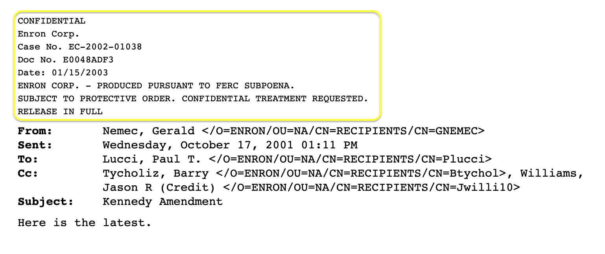
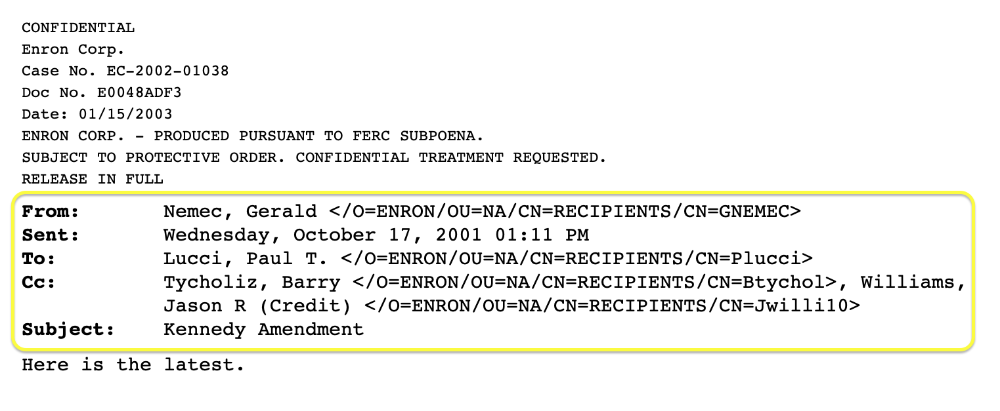
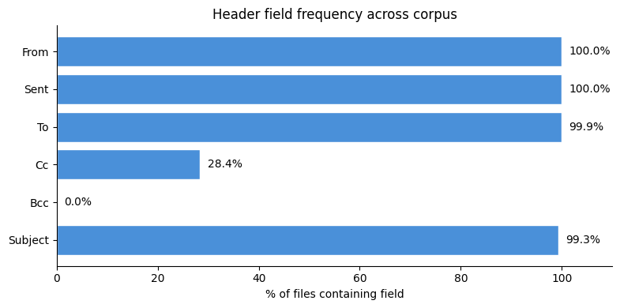
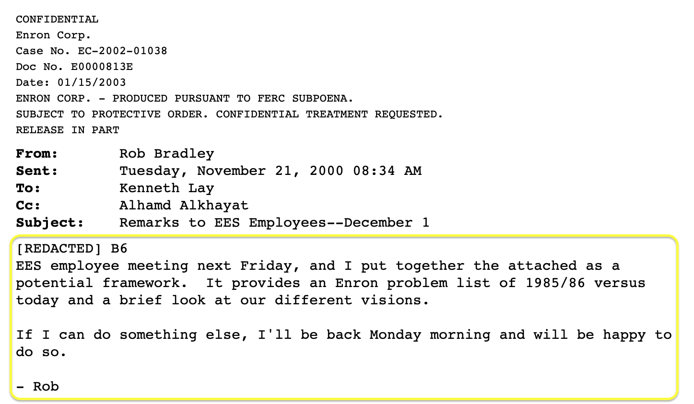
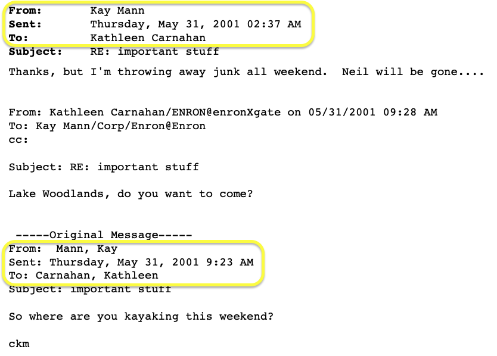
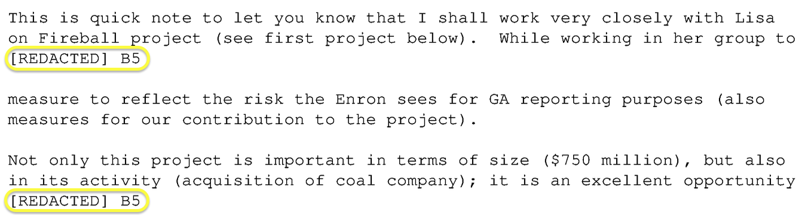

= What's in your documents?
:type: lesson
:order: 1

[.slide]

== Before you parse

Module 1 gave you 4,911 plain text files -- one per email PDF. Before writing a single line of parsing code, it helps to understand what's inside them. Every document corpus has its own structure, noise, and quirks.

Open `2.1_whats_in_your_documents.ipynb` and follow along -- you'll investigate the data hands-on as we go.

[.slide]

== What you'll learn

By the end of this lesson, you'll be able to:

* Identify the structural layers in an extracted email document
* Distinguish between metadata, content, and noise
* Recognise patterns that a parser can exploit
* Assess the quality of your extracted text before committing to a parsing strategy

[.slide.col-2]

== Four layers

Every extracted email contains up to four layers. Learning to see them is the first step to parsing. In your notebook, run the first few cells to load the text files and inspect a few.

[.col]
====
[source,text,role=noplay nocopy]
.Extracted text from E0058489E.pdf
----
CONFIDENTIAL                        // <1>
Enron Corp.
Case No. EC-2002-01038
Doc No. E0058489E
ENRON CORP. - PRODUCED PURSUANT TO FERC SUBPOENA.
RELEASE IN PART
From:                               // <2>
Kay Mann <kay.mann@enron.com>
Sent:
Thu, 31 May 2001 02:37:00 -0700 (PDT)
To:
Kathleen Carnahan <kathleen.carnahan@enron.com>
Subject:
RE: important stuff
Thanks, but I'm throwing away        // <3>
junk all weekend.
 -----Original Message-----          // <4>
From:  Mann, Kay
Subject: important stuff
So where are you kayaking
this weekend?
----
====

[.col]
====
<1> **Boilerplate** -- classification markings, case numbers, document IDs. Repeats on every page.
<2> **Email headers** -- structured fields: who sent it, when, to whom, about what.
<3> **Body text** -- the actual message content. Unstructured, variable length.
<4> **Embedded chain** -- a forwarded or replied-to message with its own headers and body.
====

[.slide.col-2]

== Layer 1: boilerplate

Boilerplate repeats across documents but carries no per-email meaning. In your notebook, run section 3 to see how consistently these patterns appear across the corpus.

[.col]
====

====

[.col]
====
[source,text,role=noplay nocopy]
.Boilerplate from E0048ADF3.pdf
----
CONFIDENTIAL // <1>
Enron Corp. // <2>
Case No. EC-2002-01038 // <3>
Doc No. E0048ADF3 // <4>
Date: 01/15/2003
ENRON CORP. - PRODUCED PURSUANT TO FERC SUBPOENA. // <5>
SUBJECT TO PROTECTIVE ORDER.
CONFIDENTIAL TREATMENT REQUESTED.
RELEASE IN FULL // <6>
----

<1> Classification marking
<2> Producing entity
<3> Case identifier
<4> Document number
<5> Production stamp
<6> Release status (FULL, PART, or withheld)
====

[.transcript-only]
====
[TIP]
.Consider whether your boilerplate is valuable
In our demo dataset, we have added those boilerplate elements. However, in your dataset, they might constitute valuable information.
====

[.slide.col-2]

== Layer 2: email headers

The structured metadata -- **who**, **when**, and **what**. These are your primary parsing targets for a metadata graph.

[.col]
====

====

[.col]
====
[source,text,role=noplay nocopy]
.Headers from E0048ADF3.pdf
----
From: // <1>
Nemec, Gerald <gerald.nemec@enron.com>
Sent: // <2>
Wed, 17 Oct 2001 13:11:22 -0700 (PDT)
To: // <3>
Lucci, Paul T. <t..lucci@enron.com>
Cc: // <4>
Tycholiz, Barry <barry.tycholiz@enron.com>,
Williams, Jason R <.williams@enron.com>
Subject: // <5>
Kennedy Amendment
----

<1> **From** -- the sender
<2> **Sent** -- date and time
<3> **To** -- primary recipients
<4> **Cc** -- copied recipients
<5> **Subject** -- the topic

Every field you extract becomes a node or property in your graph.
====

[.slide]

== Finding metadata elsewhere

Not all metadata lives in the document text. PDF files have their own metadata fields -- title, author, creation date -- that may contain useful information.

In real document dumps, PDF metadata often includes the OCR software used, the scan date, and sometimes the document ID. Our synthetic PDFs have minimal metadata, but it's always worth checking. In your notebook, run section 3b to inspect the PDF metadata.

[.slide]

== Header patterns

In your notebook, run section 4 to extract the field combinations from every file. Each email has a `From:` label on its own line, followed by the sender on the next line, then `Sent:`, `To:`, optionally `Cc:`, and `Subject:`. Long recipient lists wrap across multiple lines.

The output shows the field combinations found in the corpus and how many recipients each To and Cc field contains. About 72% have From/Sent/To/Subject. About 28% also include Cc. A handful are missing Subject or To -- edge cases the parser will need to handle.

The parsing complexity lives in the To and Cc fields: splitting multi-recipient lists that wrap across lines into individual names and email addresses.

[.slide]

== Field frequency

Not every email has all header fields. In your notebook, run section 5 to check which fields appear most often across the corpus -- this tells you what you can reliably extract and what might be missing.

[.slide.col-2]

== Layer 3: body text

The unstructured content -- where entities, topics, and intent are buried. In your notebook, run section 6 to extract and examine body text across the corpus.

[.col]
====

====

[.col]
====
[source,text,role=noplay nocopy]
.Body from E0000813E.pdf
----
Subject:
Remarks to EES Employees--December 1
[REDACTED] B6 // <1>
EES employee meeting next Friday, and
I put together the attached as a
potential framework. It provides an
Enron problem list of 1985/86 versus
today and a brief look at our
different visions. // <2>
If I can do something else, I'll be
back Monday morning and will be happy
to do so.

- Rob // <3>
----

<1> Redaction marker -- withheld content
<2> The body text itself -- unstructured, variable length
<3> Sign-off
====

Bear in mind, many of these emails consist of nested threads. Here, we are naively defining the 'body' as 'anything below the subject line'.

In course 2, you'll work on decomposing these threads and resolving duplicate thread components across the graph.

[.slide.col-2]

== Layer 4: embedded chains

Many email PDFs contain entire conversation threads -- replies and forwards nested within the body. In your notebook, run section 7 to count how many emails contain chains.

[.col]
====

====

[.col]
====
[source,text,role=noplay nocopy]
.Chain from E0058489E.pdf
----
From: Kay Mann // <1>
Subject: RE: important stuff

Thanks, but I'm throwing away
junk all weekend. // <2>

 -----Original Message----- // <3>
From:  Mann, Kay // <4>
Sent: Thursday, May 31, 2001
Subject: important stuff

So where are you kayaking
this weekend? // <5>
----

<1> Outer email's headers
<2> Outer email's body
<3> Chain marker
<4> Embedded email's headers
<5> Embedded email's body
====

[.slide.col-2]

== Redacted content

Some emails have content that was redacted before release -- names, amounts, or other details replaced with markers. In your notebook, run section 8b to check how many files contain redaction markers.

[.col]
====

====

[.col]
====
[source,text,role=noplay nocopy]
.Redactions from E00CF8AE9.pdf
----
From:
Amr Ibrahim <amr.ibrahim@enron.com>
Sent:
Thu, 5 Jul 2001 01:02:00 -0700 (PDT)
To:
Richard Shapiro <richard.shapiro@enron.com>,
Lisa Yoho <lisa.yoho@enron.com>,
[REDACTED] Bé6 // <1>
Subject:
Fireball Coal Project - RAC Meeting June 29

While working in her group to
[REDACTED] B5 // <2>
measure to reflect the risk...
----

<1> Redacted recipient -- name withheld before release
<2> Redaction in body text -- details removed

Redactions are meaningful signals. A `[REDACTED]` marker tells you that a relationship existed even though the details were withheld.
====

[.slide.col-2]

== OCR noise in headers

About 3% of files have noticeable OCR errors from lower-quality scans. In your notebook, run section 9 to find these files and see the patterns.

[.col]
====
[source,text,role=noplay nocopy]
.OCR errors from E61D04918.pdf
----
CONFIDENTIAL
Enron Corp.
Case No. EC-26002-016038 // <1>
Doc No. Es6lbo4918 // <2>
Bate: O1/15/2003 // <3>
ENRON CORE. // <4>
SUBJECT TO EROTECTIVE ORDER. // <5>
----

<1> Extra digits in case number
<2> `E61D04918` -> `Es6lbo4918`
<3> `Date` -> `Bate`
<4> `CORP.` -> `CORE.`
<5> `PROTECTIVE` -> `EROTECTIVE`

Most of the corpus (96%) has clean text. The parser needs to handle these variants, but they follow predictable patterns.
====

[.slide]

== What you've found

You've now investigated the raw data and confirmed the challenges ahead: different field combinations, multi-line recipient lists, embedded chains, and OCR noise on a small subset. Every parsing decision in the next lessons flows from what you've just seen.

[.quiz]
== Check your understanding

include::questions/1-document-layers.adoc[leveloffset=+1]
include::questions/2-field-combinations.adoc[leveloffset=+1]
read::Mark as read[]

[.summary]
== Summary

* Investigate your documents before writing parsing code -- what you find shapes every decision that follows
* Email PDFs contain four layers: boilerplate, headers, body, and embedded chains
* About 72% have From/Sent/To/Subject; about 28% also have Cc; a few are missing fields
* To and Cc fields can contain many recipients across multiple lines -- this is where parsing complexity lives
* Redacted content (`[REDACTED]` markers) should be tracked as entities -- they signal that information was withheld
* About 3% of files have OCR noise in headers (`Bate:` for `Date:`, `ENRON CORE.` for `ENRON CORP.`) -- predictable patterns the parser can handle
* Understanding the structure drives your parsing strategy and modeling choices

**Next:** We'll look at the different types of graph you can build from these documents -- and how each answers different questions.
