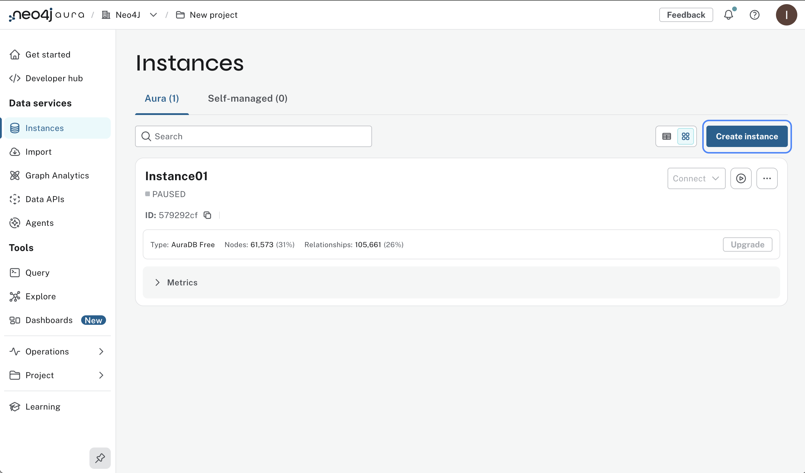
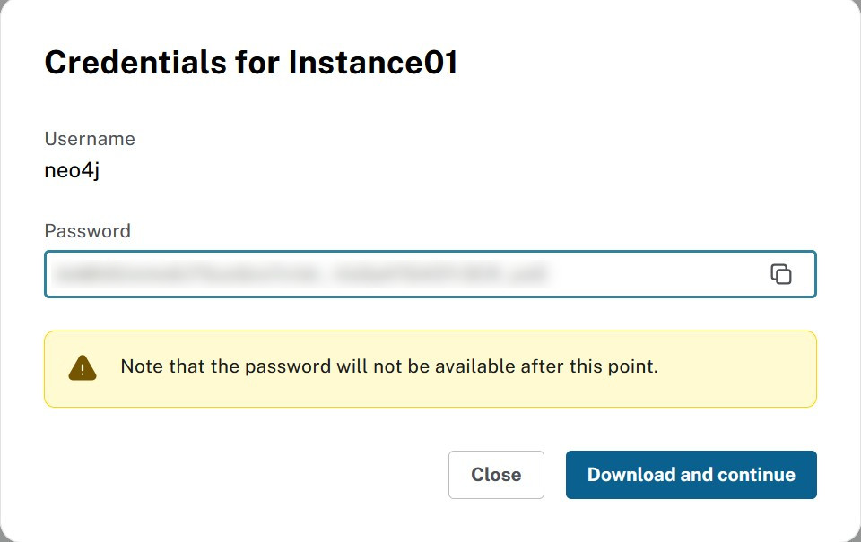
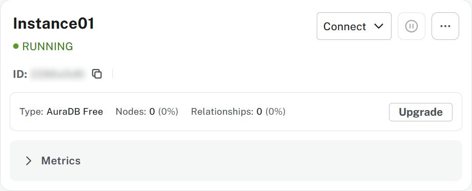

= Import to Neo4j
:type: lesson
:order: 12

[.slide]

== Your graph awaits

The normalized CSV files are ready. This lesson walks through creating a Neo4j Aura Free instance, connecting to it from Python, and importing the data as a graph.

[.transcript-only]
====
Open `2.9_import_to_neo4j.ipynb` in your Codespace to follow along.
====

[.slide]

== What you'll learn

By the end of this lesson, you'll be able to:

* Create a Neo4j Aura Free instance
* Connect to it from Python using the Neo4j driver
* Create constraints for correct `MERGE` behavior
* Import node and relationship CSVs in batches
* Query the resulting metadata graph

[.slide]

== Create an Aura Free instance

Go to link:https://console.neo4j.io[console.neo4j.io] and sign up or sign in. Click **Create Instance**.

[.slide]

== Select AuraDB Free

Select **AuraDB Free** from the tier options. No credit card required.

[.slide]

== Save your credentials

A modal will appear with your username and generated password. Click **Download and continue** to save the credentials file.

Keep this file safe -- you'll need the URI, username, and password in the next step.

[.slide]

== Wait for the instance to start

The instance status will change from *Creating* to *Running*. This usually takes under a minute.

[.slide]

== Add credentials to your environment

Add the connection details to a `.env` file in the project root:

[source,text,role=noplay nocopy]
----
NEO4J_URI=neo4j+s://xxxxxxxx.databases.neo4j.io
NEO4J_USERNAME=neo4j
NEO4J_PASSWORD=your-generated-password
----

The `.env` file is in `.gitignore` -- your credentials won't be committed.

[.slide.col-2]

== Connect from Python

In your notebook, run the setup cells to install the driver and connect.

[.col]
====
[source,python,role=noplay nocopy]
.Connecting to Aura
----
from neo4j import GraphDatabase

driver = GraphDatabase.driver(
    URI, auth=(USERNAME, PASSWORD)
)
driver.verify_connectivity()  // <1>
----
====

[.col]
====
<1> `verify_connectivity()` confirms that the driver can reach the instance and authenticate. If it fails, check your URI and password in the `.env` file.
====

[.slide]

== Constraints

Constraints ensure that `MERGE` matches existing nodes rather than creating duplicates. Each constraint creates a uniqueness requirement and a backing index.

In your notebook, run the constraints cell. The four constraints match on `doc_id` for emails and `_norm` properties for users, mailboxes, and domains.

[.slide]

== Import

Each CSV is imported in batches using `UNWIND`. Nodes `MERGE` on the normalized value. The raw value is stored as a property via `ON CREATE SET`.

In your notebook, run the import cells in order: emails, senders, recipients, CC, USED, HAS_MAILBOX.

[.slide]

== Verify

Run the verification cell to check node and relationship counts. You should see:

* ~4,900 Email nodes
* ~5,400+ User nodes
* ~5,500+ Mailbox nodes
* ~1,000+ Domain nodes
* SENT, RECEIVED, CC_ON, USED, and HAS_MAILBOX relationships

[.slide.col-2]

== Investigate

The graph is live. These queries demonstrate what the metadata model makes possible.

[.col]
====
[source,cypher,role=noplay nocopy]
.Top senders
----
MATCH (m:Mailbox)-[:SENT]->(e:Email)
RETURN m.address AS sender,
       count(e) AS emails
ORDER BY emails DESC LIMIT 10
----
====

[.col]
====
[source,cypher,role=noplay nocopy]
.Cross-domain communication
----
MATCH (d1:Domain)-[:HAS_MAILBOX]->
      (m1:Mailbox)-[:SENT]->(e:Email)
      <-[:RECEIVED]-(m2:Mailbox)
      <-[:HAS_MAILBOX]-(d2:Domain)
WHERE d1 <> d2
RETURN d1.name AS from_domain,
       d2.name AS to_domain,
       count(e) AS emails
ORDER BY emails DESC LIMIT 10
----
====

[.slide]

== What the metadata graph can answer

[TIP]
.Adapt the schema to your own data
====
The schema here -- Email, User, Mailbox, Domain -- is designed for the Enron email corpus. If your data is different (legal documents, customer support tickets, research papers), your node labels and relationships will be different too. The import pattern is the same: define constraints on unique identifiers, MERGE on normalised values, store raw values as properties. Design your schema around the questions you want to answer, then adapt the Cypher queries accordingly.
====

The graph captures **who** sent **what** to **whom** and **when**:

* Who are the most connected people in the network?
* Which domains communicate most with Enron?
* Who bridges between different groups?
* What's the communication pattern around a specific date or event?

What it can't answer: **what they talked about**. The body text is still unstructured -- names, organizations, topics, and locations mentioned in the content haven't been extracted. That's the next course, link:/courses/entity-extraction-communication-networks/[Entity Extraction: Communication Networks^].

[.quiz]
== Check your understanding

include::questions/1-constraints.adoc[leveloffset=+1]
include::questions/2-merge-on-norm.adoc[leveloffset=+1]
read::Mark as read[]

[.summary]
== Summary

* Created an Aura Free instance at link:https://console.neo4j.io[console.neo4j.io] -- no credit card required
* Connected via the Python driver using credentials stored in `.env`
* Constraints on `_norm` properties ensure `MERGE` matches correctly
* Each CSV imported in batches using `UNWIND` -- nodes merged on normalized values, raw values stored as properties
* The graph contains Email, User, Mailbox, and Domain nodes connected by SENT, RECEIVED, CC_ON, USED, and HAS_MAILBOX relationships
* Metadata queries traverse relationships that would require complex joins in a flat database

**Course complete.** The next course, link:/courses/entity-extraction-communication-networks/[Entity Extraction: Communication Networks^], extracts entities and topics from the document body text.

**Companion notebook:** `2.9_import_to_neo4j.ipynb`
