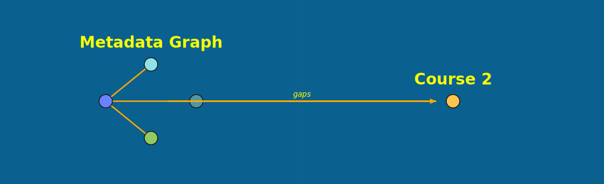
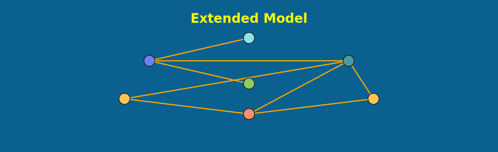

= Investigate your graph
:type: lesson
:order: 13
:sandbox: false

[.slide]

== Your graph is live

The metadata graph is in Neo4j -- now you'll explore what the modeling choices you made have actually enabled.

[.slide]

== What you'll learn

By the end of this lesson, you'll be able to:

* Visualize the graph schema
* Query communication patterns between people and domains
* Identify the most connected mailboxes and domains
* Understand how the graph structure enables traversal queries

[.slide.col-2]

== Parsing coverage

Before exploring communication patterns, confirm how the hybrid pipeline distributed work.

[.col]
====
[source,cypher]
.Parsing method breakdown
----
MATCH (e:Email)
RETURN e.method AS method,
       count(e) AS emails
ORDER BY emails DESC
----
====

[.col]
====
The result shows how many emails were handled by templates+NER vs the LLM -- and gives you a baseline for investigating whether LLM-parsed records look different from template-parsed ones.

If LLM-parsed emails show unusual field values, `method` lets you filter and inspect them directly.
====

[.slide.col-2]

== The schema

Start by visualizing the schema to confirm the model matches your design.

[.col]
====
[source,cypher]
.Visualize the schema
----
CALL db.schema.visualization()
----
====

[.col]
====
You should see: `Domain`, `Mailbox`, `User`, `Email` with `HAS_MAILBOX`, `USED`, `SENT`, `RECEIVED`, and `CC_ON` relationships.
====

[.slide.col-2]

== Who sends the most email?

[.col]
====
[source,cypher]
.Top senders
----
MATCH (m:Mailbox)-[:SENT]->(e:Email)
RETURN m.address AS sender,
       count(e) AS emails_sent
ORDER BY emails_sent DESC
LIMIT 10
----
====

[.col]
====
This is a simple aggregation -- but notice we're querying the **Mailbox**, not the User. A user may have multiple mailboxes, which we'll resolve in link:/courses/entity-resolution-communication-networks/[Entity Resolution: Communication Networks^].
====

[.slide.col-2]

== All emails from one person across mailboxes

The User/Mailbox separation pays off here. A person may use multiple email addresses -- the User node connects them all.

[.col]
====
[source,cypher]
.Emails sent by a person across all mailboxes
----
MATCH (u:User)-[:USED]->(m:Mailbox)
      -[:SENT]->(e:Email)
WHERE u.name_norm = 'kay mann'
RETURN m.address AS mailbox,
       count(e) AS emails
ORDER BY emails DESC
----
====

[.col]
====
This traverses User -> USED -> Mailbox -> SENT -> Email. Without the User/Mailbox split from the Types of Graph lesson, you'd need string matching across every sender field.

Try replacing `'kay mann'` with other names from your dataset.
====

[.slide.col-2]

== Which domains talk to each other?

This is where the graph model shines. A domain-to-domain communication query requires traversing through Mailbox and Email nodes.

[.col]
====
[source,cypher]
.Cross-domain communication
----
MATCH (d1:Domain)-[:HAS_MAILBOX]->
      (m1:Mailbox)-[:SENT]->(e:Email)
      <-[:RECEIVED]-(m2:Mailbox)
      <-[:HAS_MAILBOX]-(d2:Domain)
WHERE d1 <> d2
RETURN d1.name AS from_domain,
       d2.name AS to_domain,
       count(e) AS emails
ORDER BY emails DESC
LIMIT 10
----
====

[.col]
====
Exclude same-domain communication to focus on cross-organizational patterns.

Try this query with flat data -- you'd need to parse domain names from every sender and recipient, then join. The graph does it in one traversal.
====

[.slide.col-2]

== Who received email from the most domains?

[.col]
====
[source,cypher]
.Most cross-domain recipients
----
MATCH (d:Domain)-[:HAS_MAILBOX]->
      (:Mailbox)-[:SENT]->(e:Email)
      <-[:RECEIVED]-(m:Mailbox)
WHERE NOT (d)-[:HAS_MAILBOX]->(m)
RETURN m.address AS recipient,
       count(DISTINCT d) AS domains
ORDER BY domains DESC
LIMIT 10
----
====

[.col]
====
Only count emails from **external** domains -- not the recipient's own domain.

This identifies people who receive communication from the widest range of organizations.
====

[.slide.col-2]

== Find shared contacts

Who connects two people? This is a friend-of-friend traversal that would require multiple self-joins in SQL.

[.col]
====
[source,cypher]
.Shared contacts between two mailboxes
----
MATCH (m1:Mailbox)-[:SENT]->
      (:Email)<-[:RECEIVED]-(shared)
MATCH (m2:Mailbox)-[:SENT]->
      (:Email)<-[:RECEIVED]-(shared)
WHERE m1.address =
        'kay.mann@enron.com'
  AND m2.address =
        'vince.kaminski@enron.com'
  AND m1 <> m2
RETURN shared.address,
       count(*) AS interactions
ORDER BY interactions DESC
LIMIT 10
----
====

[.col]
====
Find mailboxes that both people have sent email to.

This is a natural graph query -- two hops from each starting point, meeting in the middle. Replace the addresses with any two mailboxes from your dataset.
====

[.slide]

== What the graph can't answer yet

The metadata graph captures **who communicated with whom** -- but not what they talked about, which entities appeared, or how threads connect.

* What did they talk about?
* Which entities (people, organizations, topics) were discussed?
* How do conversation threads connect across emails?

[.slide]

== What's next

The next course, link:/courses/entity-extraction-communication-networks/[Entity Extraction: Communication Networks^], adds thread decomposition, chunking, and entity extraction -- the layers that turn your metadata graph into a full knowledge graph.

* Decompose email threads into individual messages
* Chunk text for downstream NLP
* Extract entities and relationships from those chunks

read::Mark as read[]

[.summary]
== Summary

* The metadata graph enables communication pattern queries: who sends, who receives, which domains interact
* The User/Mailbox separation lets you query across all of a person's email addresses in one traversal
* Graph traversals (domain-to-domain, shared contacts) would require complex joins in flat data
* The graph model separates User, Mailbox, and Domain -- enabling resolution and aggregation at different levels
* The metadata graph is the foundation -- the next course adds thread decomposition and entity extraction on top
* The `method` property is your audit trail -- use it to investigate LLM-parsed records if results look unexpected

**Next course:** link:/courses/entity-extraction-communication-networks/[Entity Extraction: Communication Networks^] -- thread decomposition, chunking, and entity extraction.
