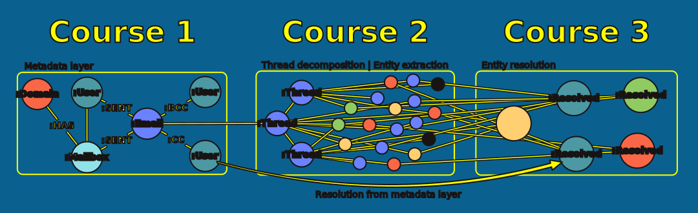
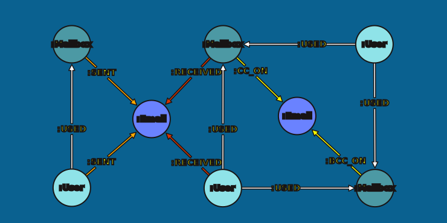
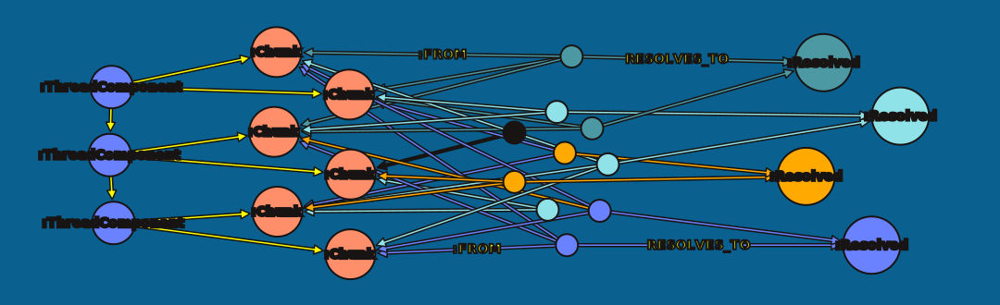
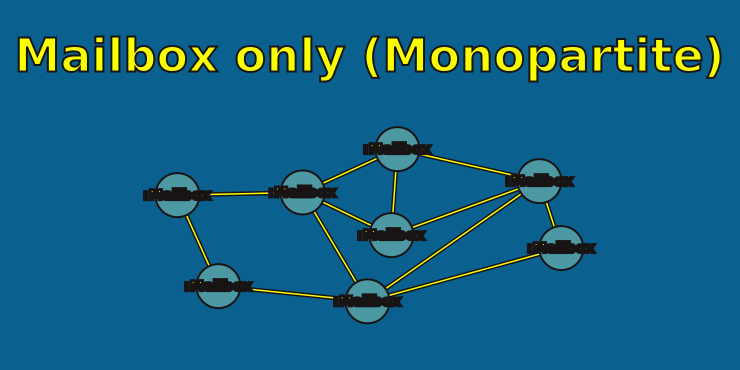
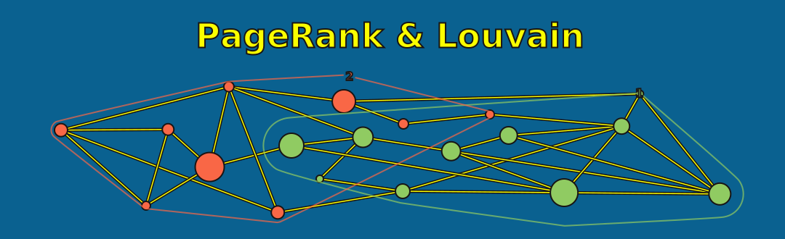
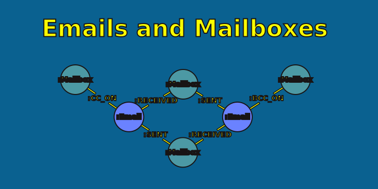
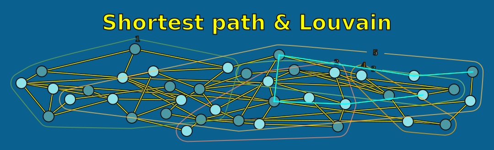
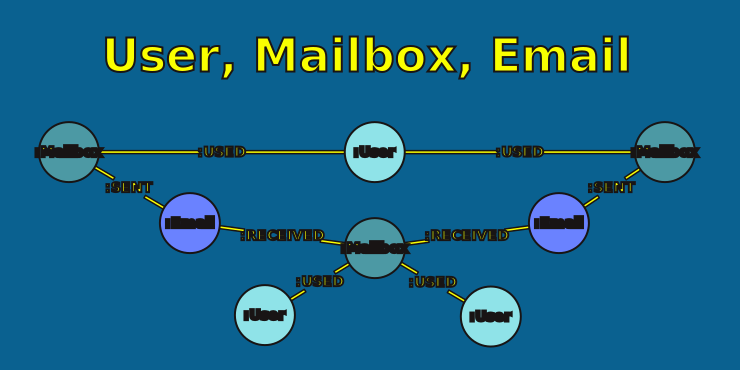
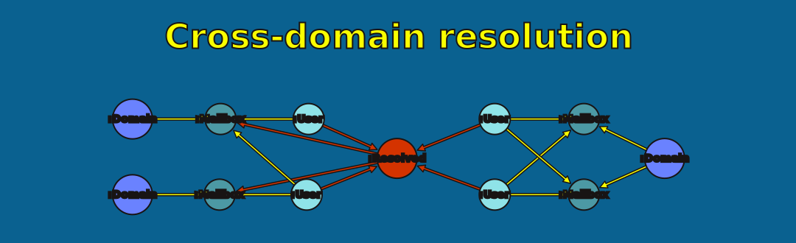

= Types of Graph
:type: lesson
:order: 2

[.slide]

== What Are You Parsing Toward?

In the course overview, you saw the graph you're building -- Domain, Mailbox, User, Email. In the previous lesson, you found layers of content inside your text files. The question now is: why is the graph shaped the way it is, and how does that shape determine what you need to parse?

[.slide]

== What You'll Learn

By the end of this lesson, you'll understand:

* Three types of graph you can build from email data
* What questions each type can answer -- and what it can't
* How your target graph type determines what you need to parse
* Why the model you choose shapes every parsing decision ahead

[.slide.col-2]

== The Metadata Graph

A metadata graph might capture the **structured fields** found in email headers: who sent what to whom, and when.

[.col]
====
[source,cypher,role=noplay nocopy]
.Metadata graph pattern
----
(:User|Mailbox)-[:USED]->(:Mailbox)
(:User|Mailbox)-[:SENT|RECEIVED|CC_ON|BCC_ON]->(:Email)
(:Domain)-[:HAS_MAILBOX]->(:Mailbox)
----
====

[.col]
====
**Questions it answers:**

* Who communicates with whom?
* Which domains exchange the most email?
* Who are the most active senders?
* What's the communication pattern over time?
====

[.slide]

== The Entity Graph

An entity graph captures **people, organizations, locations, and topics** mentioned in the email body — not just the header fields.

**Questions it answers:**

* What topics connect different people?
* Which organizations are mentioned most frequently?
* What entities appear together across multiple emails?

[.slide]

== The Hybrid Graph

If you continue with this course, bear in mind that we will be constructing a hybrid of both graphs. This will allow us to:

- Resolve mentioned entities to users and mailboxes
- Use successful resolutions in the metadata layer to resolve downstream entities
- Cluster topics by email networks, and vice versa
- Cluster redactions in the entity and metadata layers by the email networks they come from

[.slide]

== You have options

Think of this course as a jumping off point. You can choose to continue with the model we demonstrate here -- but you can also follow your own model.

Sometimes, the data you're working with, and the questions you want to answer, suggest a different kind of model. That is perfectly fine.

For example, most use-cases will not require you to decompose email threads. We're showing you some strategies to achieve that, just in case you need it.

[.transcript-only]
====
Now let's take a look at how you can develop the most appropriate model for your data.
====

[.slide]

== Start With the Questions

Your target graph type determines what you need to extract — which determines how you parse.

[.slide.col-2]

== Model 1: Just Mailboxes

The simplest model: one node per mailbox, everything stored as properties.

[.col]
====
[source,cypher,role=noplay nocopy]
.A mailbox-only data model
----
(:Mailbox {
  mailbox: "matthew.lenhart@enron.com",
  active_from: 1996-04-15T09:30:00Z,
  active_to: 2003-01-19T12:45:42Z
})
----
====

[.col]
====

====

[.slide]

== Model 1: What It Enables

Even a flat mailbox model is a graph. Linking mailboxes with a simple set of `:EMAILED` relationships gives you a monopartite network of communication patterns. You could use:

* **PageRank** -> to find the most referenced or replied-to mailboxes in the corpus
* **Betweenness centrality** -> to identify bridging mailboxes that connect otherwise separate components
* **Community detection** -> To cluster communication groups

[.slide]

== Model 1: Where It Stops

With everything flattened into single `:Mailbox` nodes, we lose the semantics contained within each email. We also lose the individual threads within emails.

* "Which groups talk about the same kinds of things?" -> have to look up elsewhere
* "Who is mentioned most across the corpus?" -> lost to us
* "When did X become aware of Y?" -> not answerable without the body content

[.slide.col-2]

== Model 2: Mailbox + Email

Separating the mailbox into its own node turns email addresses into first-class entities.

[.col]
====

====

[.col]
====
[source,cypher,role=noplay nocopy]
.A mailbox-email data model
----
(:Mailbox {address: "matthew.lenhart@enron.com"})
  -[:SENT]->(:Email)

(:Mailbox {address: "val.generes@ac.com"})
  -[:RECEIVED]->(:Email)

(:Domain {name: "enron.com"})
  -[:HAS_MAILBOX]->(:Mailbox)
----
====

[.slide]

== Model 2: What It Enables

With mailboxes as nodes, the graph becomes a communication network. Project mailbox-to-mailbox and you have a social graph. You could use:

* **Community detection** -> to discover teams and working groups from communication patterns
* **PageRank on mailboxes** -> to find the most central communicators
* **Shortest path** -> to trace how information flows between any two addresses
* **Domain-level analysis** -> to reveal which organizations communicate most, and through whom

[.slide.col-2]

== Model 2: Where It Stops

A mailbox is not a person. Matthew Lenhart might use `matthew.lenhart@enron.com` at work and `matt.lenhart@gmail.com` at home. In this model, those are two unconnected nodes.

* "How many emails did Matthew send in total?" -> you'd need to know all his addresses and sum them manually
* "Who are the most prolific senders?" -> you get mailboxes, not people
* "Who bridges two departments?" -> you might count the same person twice

If your questions are about *people* rather than *addresses*, you need another layer.

[.transcript-only]
====
Similarly, `enron.comms@enron.com` may be used by multiple individuals from the same marketing team. That team might change over many years. Separating `Mailbox` from `:User` allows you to track how many distinct people use the same ':Mailbox'.
====

[.slide.col-2]

== Model 3: User + Mailbox + Email

Adding a User node links multiple mailboxes to the same individual.

[.col]
====

====

[.col]
====
[source,cypher,role=noplay nocopy]
.A user-mailbox-email data model
----
(:User {name: "Matthew Lenhart"})
  -[:USED]->(:Mailbox
    {address: "matthew.lenhart@enron.com"})

(:User {name: "Matthew Lenhart"})
  -[:USED]->(:Mailbox
    {address: "matt.lenhart@gmail.com"})
----
====

[.slide]

== Model 3: What It Enables

With users as first-class nodes, every metric collapses across all of a person's addresses. Centrality, community membership, and communication volume are now about *individuals*, not inboxes. You could perform:

* **Entity resolution** -> to match multiple addresses to the same person -- or vice versa
* **Cross-domain analysis** -> to see a person's communication across enron.com, gmail.com, and yahoo.com in one view
* **Cross-layer entity resolution** -> to link `User` nodes to entities extracted from body text

[.slide]

== Choosing Your Depth

Each model adds a layer of separation — and a new class of analysis it unlocks.

* **Mailbox only** -> community detection, anomaly detection, centrality, node embeddings
* **Mailbox + Email** -> semantic similarity, topic clustering, thread structure
* **User + Mailbox + Email** -> true social network, entity resolution, cross-domain analysis

The deeper your model, the more you need to parse, resolve, and maintain. If you only want to find the most 'influential' mailboxes in the network, you could happily skip the more detailed extraction layers.

[.slide]

== This Module's Target

Now you know what you're parsing toward: a metadata graph with User, Mailbox, Domain, and Email as separate nodes. Every parsing decision in the lessons ahead -- which fields to extract, how to handle OCR noise, when to use an LLM -- serves this model. By the end of this module, you'll import the parsed records and see the graph come to life.

[.quiz]
== Check your understanding

include::questions/1-user-mailbox-separation.adoc[leveloffset=+1]
include::questions/2-relationship-direction.adoc[leveloffset=+1]
read::Mark as read[]

[.summary]
== Summary

* A **metadata graph** captures who, when, and what from header fields
* An **entity graph** captures people, places, and topics from body text
* A **hybrid graph** combines both -- built across all three courses
* Your questions determine your model: if you'll query on a value, make it a node
* The metadata graph is this module's target -- every parsing decision ahead serves it

**Next:** We'll look at the different approaches you can use to parse email headers.
