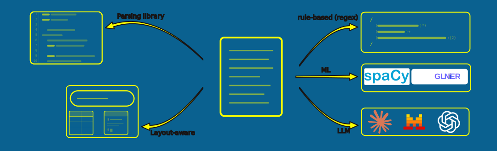
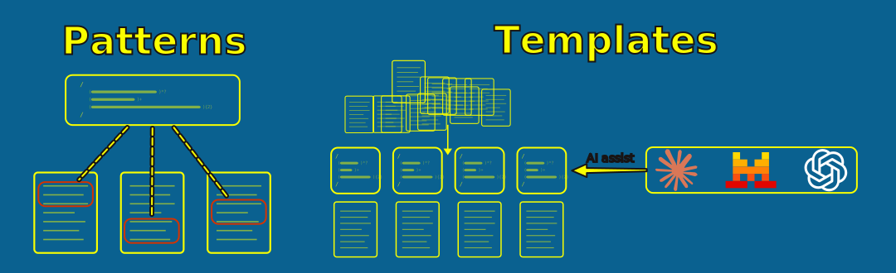

= Parsing Approaches
:type: lesson
:order: 3

[.slide]

== From Text to Structure

You've decided to build a metadata graph — your task now is to extract sender, recipient, date, and subject from 5,000 text files.

[.slide]

== What You'll Learn

By the end of this lesson, you'll be able to:

* Describe five approaches to email parsing — including layout-aware extraction
* Consider when each approach might suit your dataset
* Assess the tradeoffs between speed, cost, training data, and maintenance

[.slide]

== Approach 1: Parsing Libraries

Standard email formats are well-specified. Python's `email.parser` handles RFC 2822 and MIME email completely — headers, body, attachments, encoding — with no pattern writing required.

[source,python,role=noplay nocopy]
.Standard library email parsing
----
import email
from email import policy

msg = email.message_from_file(
    f, policy=policy.default
)
sender = msg["From"]    # <1>
subject = msg["Subject"]
body = msg.get_body().get_content()
----

<1> Direct field access — no parsing, no patterns, no models. The structure is already there.

This works well when the format is standard. It faces limitations the moment the structure is gone — which happens as soon as you convert emails to PDFs.

[.slide]

== Approach 2: Layout-Aware Extraction

When emails live in PDFs, the original structure (columns, tables, font sizes, bounding boxes) is encoded in the file but usually discarded during plain text extraction. 

Layout-aware tools read both the text and the visual structure simultaneously — producing structured fields in a single pass rather than requiring a separate parsing step.

* **Docling** -> to extract sections, tables, and headers from PDFs using layout analysis, with no training required
* **LayoutLM / LayoutLMv3** -> to classify each text token as a specific field using both text and bounding box position — requires fine-tuning on annotated examples
* **Cloud Document AI** -> to combine OCR and layout understanding in a managed API (Google, Azure, AWS)

For email PDFs with consistent table layouts, this approach can eliminate most of the parsing challenge before it begins.

You'd do it at the same time as the extraction from PDF.

[.slide]

== Why we didn't show you this earlier

The most important consideration in any graph project is the graph itself -- specifically, its data model.

A common first approach with many of these processes is to:

- Find a cool package that promises to extract data
- Naively extract that data to a graph
- Wonder why the graph isn't working
- Start again

It is important to understand that Docling and other, similar packages are combining multiple jobs into a single process, and limiting some of the control you could have over them. They are easier to manage when you already understand every job they are doing.

[.slide]

== Approach 3: Rule-Based Parsing

When the structure isn't standard — PDF-extracted text, exported archives, proprietary formats — you encode what you know as rules. This covers a wide spectrum of sophistication:

* **Simple patterns** -> to match a label and capture the value
* **Structural templates** -> to define the expected sequence of labels and values across a whole document
* **AI-assisted development** -> to use an LLM to help write and test patterns for edge cases

The more structure you encode, the more your parser handles. The cost is maintenance — every new layout pattern means more rules.

This approach will only really work when your data contains predictable, repeating patterns. In such cases, you could run parsing and extraction on millions of files within a couple of hours for free.

[.slide]

== Approach 4: ML-Based Extraction

Trained models learn to extract fields from labelled examples, rather than matching patterns you write by hand. Two approaches are relevant here:

* **spaCy NER and spancat** — train a model to classify which spans of text belong to which fields. Generalises well across layout variations once trained, but requires annotated examples.
* **GLiNER** — zero-shot entity extraction using a pre-trained transformer encoder. Provide labels at inference time and it finds matching spans — no annotation required.

These sit between rule-based parsing and LLMs: free at inference time, deterministic, and capable of generalising to unseen layouts.

[.slide]

== Approach 5: LLM-Based Parsing

LLM-based parsing sends the extracted text to a language model and asks it to return structured fields. The model reads the text and infers the structure from meaning rather than patterns.

* **Flexible** -> to handle layouts and noise that no template covers
* **No training data** -> to require only a well-written prompt
* **Expensive** -> at ~$1-5 per 1,000 emails compared to free alternatives
* **Non-deterministic** -> the same email may parse differently on different runs

LLMs add genuine value on the hard cases — badly garbled text, unusual layouts, novel formats. 

On clean, well-structured text they add cost and time but little to no improvement over cheaper alternatives.

[.slide]

== Comparing the Approaches

[cols="1,1,1,1,1,1,1"]
|===
|  |**Libraries** |**Layout-aware** |**Rule-based** |**ML models** |**LLM** |**LLM (Batch API)**

|**Speed**
|~10K/sec
|~10-100/sec
|~1K/sec
|~100-500/sec
|~1-5/sec
|~10-50/sec (async)

|**Cost**
|Free
|Free-$$
|Free
|Free (inference)
|~$.50-5/1K
|~$0.25-2.50/1K

|**Training needed**
|No
|Sometimes
|No
|Yes (examples)
|No
|No

|**Determinism**
|Yes
|Yes
|Yes
|Yes
|No
|No

|**Generalisation**
|RFC only
|Layout-dependent
|Pattern-dependent
|Learns from data
|High
|High
|===

[.slide]

== Hybrid pipeline

Generally, you might opt for a **hybrid pipeline** that categorizes your data and reroutes each subset to the most suitable approach.

* Libraries for well-formed RFC email
* Layout-aware tools for complex documents (tables, charts, etc.)
* Rules for predictable text layouts
* ML models for less predictable patterns but predictable spans
* LLMs for edge cases or near-recoverable corruption

[.slide]

== What's Next

Over the next lessons, you'll work through each approach in turn:

. **Layout-aware extraction** — use Docling and understand LayoutLM for structured PDF extraction
. **Parsing libraries** — use `email.parser` on the Enron plaintext corpus and see where it breaks
. **Rule-based parsing** — build patterns and structural templates
. **ML-based parsing** — explore spaCy and GLiNER for email extraction
. **LLM parsing** — direct API calls for the cases that need them

Then you'll combine them into a hybrid pipeline, prepare the records for import, and explore the graph.

[.quiz]
== Check your understanding

include::questions/1-parsing-tradeoffs.adoc[leveloffset=+1]

read::Mark as read[]

[.summary]
== Summary

* **Parsing libraries** — well-suited to standard RFC email. Free, instant, complete. Faces limitations on PDF-extracted text.
* **Layout-aware extraction** — reads visual structure alongside text. Eliminates the parsing step for consistent PDF layouts. Requires model or service setup.
* **Rule-based parsing** — encodes what you know as patterns. Free, deterministic, maintainable. Performance depends on effort invested.
* **ML-based extraction** — trained or zero-shot models that learn to find fields. Free at inference time, generalizes beyond your patterns.
* **LLM-based parsing** — comprehension-based extraction. Handles anything, but costs money and introduces non-determinism.
* A hybrid pipeline uses the right tool for each subset of your data

**Next:** We'll explore layout-aware extraction with Docling and LayoutLM.
