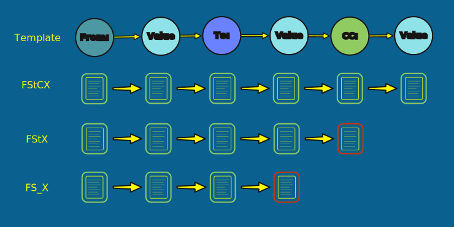

= Rule-based parsing
:type: lesson
:order: 6

[.slide]

== The problem with `email.parser`

`email.parser` returned empty records the moment it touched PDF-extracted text — because the RFC structure the library expects is gone.

[.transcript-only]
====
Open `2.4_rule_based_parsing.ipynb` in your Codespace to follow along.
====

[.slide]

== What you'll learn

By the end of this lesson, you'll be able to:

* Use regex anchors and quantifiers to match email header patterns
* Strip boilerplate from PDF-extracted text using regex
* Build a greedy extractor and see where it silently fails
* Encode role sequences as templates that match exactly or reject cleanly
* Use an AI assistant to generate templates for edge cases
* Run the template system on the full corpus and measure coverage

[.slide]

== Regex in 60 seconds

A regular expression (regex) is a pattern string that matches text. You don't need to memorize regex syntax -- LLMs generate patterns on the fly, and you'll use that approach in the next lesson. For now, five patterns are enough.

If you want a full regex reference, link:https://www.w3schools.com/python/python_regex.asp[W3Schools has a good one].

[.slide.col-2]

== Five patterns you'll use

[.col]
====
[source,python,role=noplay nocopy]
.Five patterns you'll use in this lesson
----
import re

re.match(r'^From', 'From: Matthew')   # match        # <1>
re.match(r'^From', '  From: ...')     # None

re.match(r'^From:\s*$', 'From:')      # match        # <2>
re.match(r'^From:\s*$', 'From: Matt') # None

m = re.match(r'^From:\s+(.+)', 'From:   Matthew Lenhart')  # <3>
m.group(1)                            # 'Matthew Lenhart'

m = re.search(r'\S+@\S+', 'vapte@yahoo.com @ ENRON')  # <4>
m.group(0)                            # 'vapte@yahoo.com'

re.match(r'^from:', 'FROM:', re.IGNORECASE) # match   # <5>
----
====

[.col]
====
<1> `^` anchors the pattern to the start of the line. `'From: Matthew'` starts with `From` so it matches, but `'  From: ...'` starts with spaces so it does not.
<2> `\s*$` means "zero or more whitespace characters followed by the end of the line." If the line is just `From:` with nothing after it, the pattern matches. If there is a value after the colon, it does not. This is how you detect a bare label line.
<3> `(.+)` is a capture group. The parentheses tell the engine to extract whatever the `.+` matched, and you retrieve it with `m.group(1)`. Here it captures `'Matthew Lenhart'`.
<4> `\S+` matches one or more non-whitespace characters. The pattern `\S+@\S+` grabs everything on both sides of the `@` until it hits a space, which is useful for pulling email addresses out of noisy text.
<5> By default, regex is case-sensitive -- `^from:` would not match `'FROM:'`. Passing `re.IGNORECASE` makes the match case-insensitive, so `from:`, `From:`, and `FROM:` all match the same pattern.
====

[.slide]

== The Enron corpus has boilerplate

Every PDF-extracted text file in our corpus starts with government processing stamps that must be removed before field extraction begins.

[NOTE]
.Real-world boilerplate may be worth keeping
====
We added those stamps for the purposes of this course -- however, many document dumps you might deal with contain similar boilerplate which you may want to keep.
====

[.slide.col-2]

== Stripping boilerplate with regex

In your notebook, run the next cell to define the boilerplate patterns and strip them from a sample file.

[.col]
====
[source,python,role=noplay nocopy]
.Boilerplate removal
----
BOILERPLATE = [                     # <1>
    r"^'?CONFIDENTIAL.*$",         # <2>
    r"^Enron\s*Corp.*$",
    r"^Case\s*No[,\.].*$",         # <3>
    r"^Doc\s*No[,\.].*$",
    r"^Date:?\s*\d",               # <4>
    r"^ENRON\s*CORP.*$",
    r"^SUBJECT TO PROTECTIVE.*$",
    r"^RELEASE IN.*$",
    r"^ENRON[-=]\d+.*$",           # <5>
]

def strip_boilerplate(text):       # <6>
    lines = text.split("\n")
    cleaned = [
        line for line in lines
        if not any(
            re.match(p, line.strip(),
                     re.IGNORECASE)
            for p in BOILERPLATE
        )
    ]
    return "\n".join(cleaned).strip()
----
====

[.col]
====
<1> `BOILERPLATE` is a list of regex patterns, one per boilerplate line type. Each pattern describes the shape of a line that should be removed.
<2> `^'?CONFIDENTIAL.*$` matches lines starting with `CONFIDENTIAL`, with an optional leading apostrophe (`'?`) that OCR sometimes introduces. `.*$` matches the rest of the line, whatever it contains.
<3> `[,\.]` matches either a comma or a period. OCR sometimes reads `Case No.` as `Case No,` -- this character class handles both.
<4> `Date:?\s*\d` matches the boilerplate date stamp (e.g. `Date: 01/15/2003`). The `:?` makes the colon optional, and `\d` requires that a digit follows -- this prevents matching the email's `Date:` header, which would have a day name after the colon, not a digit.
<5> `[-=]` matches either a hyphen or an equals sign. OCR sometimes reads the document separator `ENRON-819...` as `ENRON=819...`.
<6> `strip_boilerplate` splits the text into lines, tests each line against every pattern in the list, and keeps only the lines that match none of them. `re.IGNORECASE` makes all matches case-insensitive.
====

[.slide.col-2]

== Before and after

[.col]
====
[source,text,role=noplay nocopy]
.Before stripping
----
CONFIDENTIAL
Enron Corp.
Case No. EC-2002-01038
Doc No. E0048ADF3
Date: 01/15/2003
ENRON CORP. - PRODUCED ...
RELEASE IN PART
From:
EDIS Email Service <edismail@incident.com>
Sent:
Fri, 5 Apr 2002 00:07:00 -0800 (PST)
To:
Motley, Matt <matt.motley@enron.com>
Subject:
[EDIS] EQ 4 2 SAN BERNARDINO COUNTY
Please check the following...
----
====

[.col]
====
[source,text,role=noplay nocopy]
.After stripping
----
From:
EDIS Email Service <edismail@incident.com>
Sent:
Fri, 5 Apr 2002 00:07:00 -0800 (PST)
To:
Motley, Matt <matt.motley@enron.com>
Subject:
[EDIS] EQ 4 2 SAN BERNARDINO COUNTY
Please check the following...
----

The email header is now at a predictable position — no scanning for "where does the real content start?"
====

[.transcript-only]
====
[NOTE]
.Retain boilerplate for real document dumps
If you were running this on real government documents, you would likely retain at least some of this boilerplate.
====

[.slide]

== Header structure and field variations

In your notebook, run the next cell to inspect the header structure and count field combinations across the corpus.

After stripping boilerplate, the email headers follow a consistent **alternating** pattern: each label sits on its own line (`From:`, `Sent:`, `To:`, `Subject:`), with the value on the next line.

The variation is in **which fields are present** — most emails have `From/Sent/To/Subject`, some also include `Cc:`, and some have empty fields or missing `Subject:`.

[.slide.col-2]

== Field combinations

In your notebook, the output shows the top field combinations across the corpus.

[.col]
====
[source,text,role=noplay nocopy]
.Field combinations (approximate)
----
From/Sent/To/Subject       ~64%
From/Sent/To/Cc/Subject     ~9%  // <1>
From/Sent/To/Subject/Cc     ~6%  // <2>
From/Sent/To                ~1%  // <3>
----
====

[.col]
====
<1> About 9% of emails include Cc recipients before the Subject line
<2> Another 6% have Cc appearing after Subject — a variation in the PDF layout
<3> No `Subject:` line — the email body starts immediately after `To:`

The pattern is always alternating; the variation is in which fields appear and in what order.
====

[.slide]

== Greedy extraction

The alternating pattern is predictable enough to write a simple extractor: walk the lines top to bottom, and whenever you see a label you recognize (`From:`, `Sent:`, etc.), record the next non-empty line as that field's value. Everything between one label and the next gets absorbed into the current field.

This approach is **greedy** -- it always produces a result. It never says "I don't know" or "this doesn't look right." It just keeps absorbing lines until the next recognized label appears.

[.slide.col-2]

== The greedy extractor in code

In your notebook, run the next cell to define the extractor and test it on three files.

[.col]
====
[source,python,role=noplay nocopy]
.Simple alternating extractor
----
def parse_alternating(text):
    fields = {}
    lines = text.split("\n")
    current_label = None
    in_body = False

    for line in lines:
        stripped = line.strip()
        if in_body:
            break

        m = re.match(
            r'^(From|Sent|To|Cc|Subject)'
            r':\s*$',
            stripped, re.IGNORECASE
        )
        if m:
            current_label = (    # <1>
                m.group(1).lower()
            )
            fields[current_label] = ""
        elif current_label and stripped:
            fields[current_label] += (  # <2>
                (" " if fields[current_label]
                 else "") + stripped
            )
            if current_label == "subject":
                in_body = True   # <3>

    return fields
----
====

[.col]
====
<1> A label-only line (e.g. `From:`) sets `current_label`
<2> The next non-empty line is the value — it accumulates until the next label
<3> After capturing the subject value, everything that follows is body text

On 50 digital emails, the extractor finds `from`, `sent`, `to`, and `subject` on nearly all of them.
====

[.slide.col-2]

== Where it produces wrong data

In your notebook, run the next cell to see what happens when OCR corrupts a label. The greedy extractor silently absorbs the corrupted text into the wrong field — and there is no indication that anything went wrong.

[.col]
====
[source,text,role=noplay nocopy]
.OCR-corrupted header (Ce: for Cc:)
----
From:
Hitchcock, Dorie <dorie.hitchcock@enron.com>
Sent:
Fri, 20 Jul 2001 11:13:22 -0700 (PDT)
To:
Kitchen, Louise <louise.kitchen@enron.com>,
Lavorato, John <john.lavorato@enron.com>
Ce:                              // <1>
Schoppe, Tammie <tammie.schoppe@enron.com>
Subject:
EA EVENT MASTER SCHEDULE
----
====

[.col]
====
<1> `Ce:` is OCR's reading of `Cc:`. The greedy extractor doesn't recognize it as a label, so it appends `Ce:` and the Cc recipients to the `To` field. The `Cc` field is missing entirely.

The problem isn't that the extractor crashes — it's that it **returns a result that looks plausible but is wrong**.
====

[.slide]

== So what can we rely on?

The greedy extractor fails because it's permissive -- it always produces a result, even when that result is wrong. To build something stricter, we first need to understand what's actually consistent in the data.

In your notebook, run the next cell to see role sequences side by side. Every email with the same field combination produces the **identical** role sequence — not approximately the same, but identical.

[source,python,role=noplay nocopy]
.Finding consistent patterns
----
HEADER_LABELS = {"from", "sent", "to", "cc", "subject", "attachments"}

def classify_line(line):
    """Assign a role to a single (non-empty) line."""
    stripped = line.strip()

    # Label-only line
    if re.match(
        r'^(From|Sent|To|Cc|Subject|Attachments?):\s*$', stripped, re.IGNORECASE
    ):
        label = re.match(r'^(\w+):', stripped).group(1).lower()
        return ("LABEL", label)

    # Same-line (label + value)
    m = re.match(
        r'^(From|Sent|To|Cc|Subject|Attachments?):\s+(\S.+)', stripped, re.IGNORECASE
    )
    if m:
        label = m.group(1).lower()
        return ("LABEL_VALUE", label)

    return ("VALUE", None)

def role_sequence(text, max_lines=12):
    """Return the sequence of roles for the first few non-empty header lines."""
    seq = []
    for line in text.split("\n"):
        if not line.strip():
            continue
        role, label = classify_line(line)
        tag = f"{role}({label})" if label else role
        seq.append(tag)
        if len(seq) >= max_lines:
            break
        if label == "subject" and role in ("LABEL_VALUE",):
            break
    return seq
----

[.slide]

== A different field combination, a different sequence

An email with `Cc:` produces a different role sequence — `LABEL(cc) → VALUE` is inserted between `To` and `Subject`. A template built for no-`Cc` will correctly reject this, and vice versa.

[.transcript-only]
====
You can use a template to encode the exact role sequence of one field combination -- refusing to extract from anything that deviates even slightly.
====

[.slide]

== Rejection in action

In your notebook, run the next cell to see rejection in action. A no-Cc email is tried against the Cc template (rejected), then the correct no-Cc template (succeeds). A Cc email gets the opposite treatment.

[source,text,role=noplay nocopy]
.Template rejection
----
# Email 1 — no Cc field
alt_FStCX (Cc template)    →  None
alt_FStX  (no-Cc template) →  {from, sent, to, subject}

# Email 2 — with Cc field
alt_FStX  (no-Cc template) →  None
alt_FStCX (Cc template)    →  {from, sent, to, cc, subject}
----

[.slide.col-2]

== Templates encode repeating sequences

In your notebook, run the next two cells to define templates and the generic matcher.

[.col]
====
[source,python,role=noplay nocopy]
.Template definitions
----
from enum import Enum, auto

class Role(Enum):
    LABEL = auto()       # bare 'From:'
    VALUE = auto()       # data line
    LABEL_VALUE = auto() # 'From: Matthew'
    BODY = auto()        # body starts here

L, V, LV, B = (Role.LABEL, Role.VALUE,
               Role.LABEL_VALUE, Role.BODY)

TEMPLATE_ALT_FSTX = {    # <1>
    "name": "alt_FStX",
    "structure": [
        (L, "from"),    (V, "from"),
        (L, "sent"),    (V, "sent"),
        (L, "to"),      (V, "to"),
        (L, "subject"), (V, "subject"),
        (B, None),
    ],
}

TEMPLATE_ALT_FSTCX = {   # <2>
    "name": "alt_FStCX",
    "structure": [
        (L, "from"),    (V, "from"),
        (L, "sent"),    (V, "sent"),
        (L, "to"),      (V, "to"),
        (L, "cc"),      (V, "cc"),
        (L, "subject"), (V, "subject"),
        (B, None),
    ],
}
----
====

[.col]
====
<1> `alt_FStX`: alternating From/Sent/To/Subject — the most common field combination (~72% of parsed emails)
<2> `alt_FStCX`: alternating From/Sent/To/Cc/Subject — the second most common (~25%)

A template is just data — the matching engine is a single generic function that walks any template against any text.
====

[.slide.col-2]

== The generic matcher

[.col]
====
[source,python,role=noplay nocopy]
.Template matcher (core logic)
----
def match_template(template, text):
    lines = text.split("\n")
    start = _find_from_line(lines)
    if start is None:
        return None    # <1>

    extracted = {}
    i = start
    structure = template["structure"]

    for step_idx, (role, field) in (
        enumerate(structure)
    ):
        while (i < len(lines) and
               not lines[i].strip()):
            i += 1
        if i >= len(lines):
            return None

        if role == Role.LABEL:
            m = _LABEL_RE.match(
                lines[i].strip()
            )
            if not m or (
                m.group(1).lower() != field
            ):
                return None  # <2>
            i += 1

        elif role == Role.VALUE:
            if _ANY_LABEL_RE.match(
                lines[i].strip()
            ):
                return None  # <3>
            extracted[field] = (
                lines[i].strip()
            )
            i += 1

        elif role == Role.BODY:
            extracted["_body_start_idx"] = i
            break

    extracted["_template"] = (
        template["name"]
    )
    return extracted
----
====

[.col]
====
<1> No `From:` line found in the first 30 lines — return `None` immediately, don't guess
<2> Wrong label or label has an inline value where this step expected a bare label — fail the whole template
<3> A label line appeared where a value was expected — the structure doesn't match, fail immediately

Every failure is explicit and immediate — the matcher never produces a partial result.
====

[.slide]

== Three starter templates

`helpers/enron_templates.py` ships with three templates -- the most common field combinations. They were built by the process you just saw: classify lines, encode the sequence, test it.

The file also contains additional template definitions (commented examples for reference), but only the three most common are active. In the next lesson, you'll build your own templates to cover the ~70 edge cases these three miss.

[.slide.col-2]

== Running the system

In your notebook, run the next cells to import and run the system on the full corpus.

[.col]
====
[source,python,role=noplay nocopy]
.Importing and running
----
from helpers.enron_templates import (
    extract_enron_headers
)

parsed = []
failures = []
for f in txt_files:
    text = f.read_text(encoding="utf-8")
    result = extract_enron_headers(text)  # <1>
    if result is not None:
        parsed.append({
            "doc_id":    f.stem,
            "from":      result.get("from",""),
            "sent":      result.get("sent",""),
            "to":        result.get("to",""),
            "subject":   result.get("subject",""),
            "_template": result["_template"],
        })
    else:
        failures.append(f.stem)
----
====

[.col]
====
<1> `extract_enron_headers` strips boilerplate internally, then tries each template in order — the caller sees a single function call

At ~2,500 emails/second, the full 5,000-file corpus runs in under two seconds.
====

[.slide]

== Coverage: ~98.6%

In your notebook, run the next cells to see coverage on the full corpus.

[source,text,role=noplay nocopy]
.Coverage output
----
Parsed:  4,841 / 4,911  (98.6%)
Failed:     70 / 4,911   (1.4%)

Top templates:
  alt_FStX       3,542  (72.1%)
  alt_FStCX      1,213  (24.7%)
  alt_Fs_X          86   (1.8%)
----

Three templates, 98.5% coverage. The ~70 failures are emails with layouts these templates reject — missing Subject lines, empty Cc fields, unusual field orderings, or severely garbled headers.

[.slide]

== Next steps

70 edge cases from a dataset of thousands. In the next lesson, you'll work with an LLM to build additional templates that cover these failures — then rerun the same test to measure the improvement.

[TIP]
.Build templates from your own data
====
The three templates here are built for the Enron corpus's specific field combinations. For your own data, the methodology is the same but the templates will be different. Start by classifying lines in 20-30 sample documents to identify your most common role sequences, then encode each as a template. You'll likely find that 2-4 templates cover the vast majority of your corpus too -- the long tail of edge cases is where the next lesson's LLM-assisted approach helps most.
====

[.quiz]
== Check your understanding

include::questions/1-greedy-vs-template.adoc[leveloffset=+1]
include::questions/2-template-coverage.adoc[leveloffset=+1]
read::Mark as read[]

[.summary]
== Summary

* Regex anchors (`^`, `$`) and quantifiers (`\s*`, `\S+`) are the building blocks for header matching in PDF-extracted text
* Boilerplate is stripped with a list of regex patterns before field extraction begins
* The corpus follows a consistent alternating layout (label on one line, value on the next) with variation in which fields are present
* A greedy extractor works well on clean files but silently produces wrong data when OCR corrupts labels (`Ce:` for `Cc:`, `Toa:` for `To:`)
* Emails with the same field combination share an exact role sequence — that precision is the foundation for templates
* A template encodes the exact role sequence of one field combination and refuses to extract from anything that deviates — no partial matches, no guessing
* Building a template: read the stripped text, assign a role to each line, write the sequence as `(Role, field)` tuples
* Three starter templates cover ~98.6% of the corpus — the ~70 failures are edge cases for the next lessons
* `extract_enron_headers` on ~5,000 emails runs at ~2,500 emails/second

**Next:** You'll build your own templates by working with an LLM to classify email lines and generate template definitions.

**Companion notebook:** `2.4_rule_based_parsing.ipynb`
