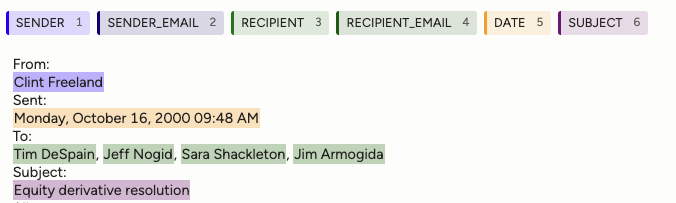

= ML-based parsing
:type: lesson
:order: 8

[.slide]

== Beyond rules

Templates and regex work well when the layout is predictable. When it varies — different header orders, OCR corruption, mixed formats — a model that learns from examples can generalize where rules cannot.

[.transcript-only]
====
Open `2.5_ml_based_parsing.ipynb` in your Codespace to follow along.
====

[.slide]

== What you'll learn

By the end of this lesson, you'll be able to:

* Run default spaCy NER on email headers and understand its limitations
* Explain why email-specific labels (SENDER, RECIPIENT, DATE, SUBJECT) require finetuning
* Train and evaluate a finetuned NER model
* Read training metrics (precision, recall, F1) and understand what they tell you
* Compare finetuned NER to zero-shot extraction with GLiNER2

[.slide]

== Named entity recognition

Named entity recognition (NER) is the task of finding and classifying spans of text — identifying that "Kay Mann" is a person, "Thursday, May 31" is a date, or "enron.com" is part of an email address.

spaCy ships with models trained on news and web text. These models recognize general entity types like PERSON, DATE, and ORG, but they've never seen email headers. They don't know anything about senders, recipients, or subject lines.

In your notebook, run the first few cells to load spaCy's smallest English model and see what it finds in the email headers.

[.slide]

== What the default model finds

The default model identifies names and dates reliably — but it has no way to tell a sender from a recipient. Every name is PERSON. There's no concept of a subject line or an email address.

For our graph, we need labels that map to specific fields: SENDER, RECIPIENT, CC_RECIPIENT, DATE, SUBJECT, and email addresses. To teach a model these labels, we need to **finetune** it — take a model that already understands English and train it further on labelled email examples.

[.slide]

== Email-specific labels

The finetuned model uses labels designed for email header extraction:

[cols="1,2",options="header"]
|===
|Label |What it identifies

|**SENDER** / **SENDER_EMAIL**
|The sender's name and email address

|**RECIPIENT** / **RECIPIENT_EMAIL**
|Each To recipient's name and email

|**CC_RECIPIENT** / **CC_RECIPIENT_EMAIL**
|Each Cc recipient's name and email

|**DATE**
|The sent date

|**SUBJECT**
|The subject line
|===

[.slide]

== Finetuned on 20 examples

In your notebook, load the undertrained model — finetuned on just 20 annotated email headers — and run it on the same emails.

The model finds entities in roughly the right places — names, email addresses, dates. But look at the labels: sender names get tagged as SUBJECT, every email address becomes SENDER_EMAIL regardless of who it belongs to, and the sender is labelled RECIPIENT.

20 examples is enough to teach the model *where* entities are, but not *which label* to assign. More training data fixes this, and the next section shows by how much.

[.slide]

== Training data

NER training data pairs each text with a set of annotations — character offsets marking where each entity starts and ends, and which label it belongs to.

Each span is one entity: the sender name in blue, individual recipient names in green, the date in orange, the subject in purple. When multiple recipients appear on the same line, each name is labelled separately.

The annotations are stored as JSONL (one JSON object per line). The training data contains ~1,000 annotated email headers: 150 hand-labelled in Label Studio, and the remainder annotated by an LLM using the hand-labelled examples as few-shot context. In your notebook, run the next cell to see what one annotated example looks like.

[.slide]

== Annotation tools

The annotations for this course were created in link:https://labelstud.io/[Label Studio], an open-source tool you can self-host for free. link:https://prodi.gy/[Prodigy], built by the spaCy team, is a paid alternative that integrates directly with spaCy — annotation, format conversion, and training all happen within a single workflow.

Each tool has its own export format, and converting between annotation formats and spaCy's binary `.spacy` training format is a common friction point. For this course, the `.spacy` files are pre-built so you can focus on training.

[.slide.col-2]

== Training

spaCy training requires two things: a config file and the `.spacy` data files. In your notebook, run the config generation cell and then the training cell.

[.col]
====
[source,bash,role=noplay nocopy]
.Generate config and train
----
python -m spacy init config \       # <1>
    config_blank.cfg \
    --pipeline ner \
    --lang en \
    --optimize efficiency

python -m spacy train \             # <2>
    config_blank.cfg \
    --paths.train train.spacy \     # <3>
    --paths.dev dev.spacy \         # <4>
    --output ner_blank
----
====

[.col]
====
<1> `init config` generates a complete training configuration. The `efficiency` preset uses a lightweight tok2vec encoder that runs on CPU.
<2> `spacy train` runs the training loop. It evaluates against the dev set after each step and saves the best model automatically.
<3> Training data — the examples the model learns from.
<4> Dev data — held-out examples the model is evaluated against during training, but never learns from.
====

[.slide]

== Reading the training output

The training log shows a table of metrics at each evaluation step. The columns that matter most:

* **ENTS_P** (precision) — of the entities the model predicted, what percentage were correct?
* **ENTS_R** (recall) — of the entities that actually exist in the data, what percentage did the model find?
* **ENTS_F** (F1 score) — the harmonic mean of precision and recall. This single number balances both: a model that finds everything but gets half wrong scores poorly, and so does a model that's always right but misses most entities.

An F1 of 89 means the model finds most entities and gets most of them right. The 20-example model achieved ~53 — it finds entities but assigns the wrong labels half the time.

[.slide]

== Trained on 1,000+ examples

In your notebook, load the model you just trained and run the side-by-side comparison — default NER, undertrained (20 examples), and trained (1,000+ examples) on the same five emails.

The difference is visible immediately. The trained model reliably distinguishes senders from recipients, finds subjects, and handles multi-name lines. The undertrained model finds spans but confuses which label to assign.

[.slide]

== Model comparison

The model you trained uses spaCy's smallest architecture — a tok2vec encoder that runs on CPU. We also benchmarked a transformer model (RoBERTa) on the same data.

The tok2vec model was trained from blank (no pretrained word vectors). The transformer uses a pretrained RoBERTa encoder — the language model's existing knowledge of English gives it a significant head start.

[cols="1,1,1",options="header"]
|===
|Model |F1 |Notes

|tok2vec (blank, 20 examples)
|52.6
|Finds spans, wrong labels

|tok2vec (blank, 1,000 examples)
|89.4
|Reliable on most labels

|transformer (RoBERTa, 1,000 examples)
|**96.3**
|Near-perfect, requires GPU
|===

The tok2vec model at 89.4 is strong for a CPU model. The transformer reaches 96.3 — the gap is largest on context-dependent labels like CC_RECIPIENT and email addresses, where a pretrained language model excels.

The Colab training notebook is at `data/ner_training/colab_trf_benchmark.ipynb`.

[.slide]

== GLiNER2: zero-shot extraction

GLiNER2 takes a completely different approach. Instead of training on labelled examples, you describe the entities you want in natural language — "sender name", "recipient email address", "email subject" — and the model finds matching spans at inference time. No annotation, no training, no config files.

In your notebook, run the GLiNER2 section and compare the results to the finetuned model.

GLiNER2 correctly distinguishes sender from recipient, finds subjects, and handles multi-recipient lists — with no annotation and no training. The main errors come from long multi-line recipient lists and OCR noise rather than model limitations.

[.slide]

== Other approaches

[TIP]
.Start with zero-shot if you have no labelled data
====
The finetuned NER model in this lesson was trained on 1,000 annotated Enron email headers. If you're working with your own data and don't have labelled examples, start with GLiNER2's zero-shot extraction -- it requires no annotation and works well on structured text. If you need higher accuracy, use GLiNER2 or LLM-generated annotations to bootstrap a training set, then finetune. Only invest in hand-labelling if you need production-grade precision on a specific document type.
====

**spaCy spancat** classifies overlapping zones in a document. Where NER finds individual entities (a name, a date), you can train spancat to identify longer and overlapping spans (the full `To:` zone, the body section, etc.). You can train a spancat model to do everything in one pass, or use spancat to identify zones and use regex or NER to extract values from those zones.

**Prodigy** is an annotation tool from the spaCy team. It provides an efficient interface for creating NER and spancat training data, with active learning to prioritise the most informative examples.

**Label Studio** is an open-source annotation alternative. It supports NER, span labeling, and many other annotation types. Free to self-host.

[.quiz]
== Check your understanding

include::questions/1-undertrained-model.adoc[leveloffset=+1]
include::questions/2-training-data-source.adoc[leveloffset=+1]
read::Mark as read[]

[.summary]
== Summary

* Named entity recognition (NER) finds and classifies spans of text. Default spaCy models identify general entities but can't distinguish email-specific fields like sender vs recipient.
* Finetuning teaches a model new labels from annotated examples. 20 examples show the model where entities are; 1,000+ teach it which labels to assign.
* Training from blank works well on this structural task -- the annotations alone teach the encoder what it needs.
* The transformer model reaches 96.3 F1, compared to 89.4 for tok2vec, but requires a GPU to train.
* GLiNER2 achieves strong results with no training data — describe the entities you want in natural language and the model finds them.
* Label Studio (free) and Prodigy (paid, spaCy-integrated) are the standard tools for creating annotation data.

**Next:** LLM parsing for the cases that need comprehension.

**Companion notebook:** `2.5_ml_based_parsing.ipynb`
