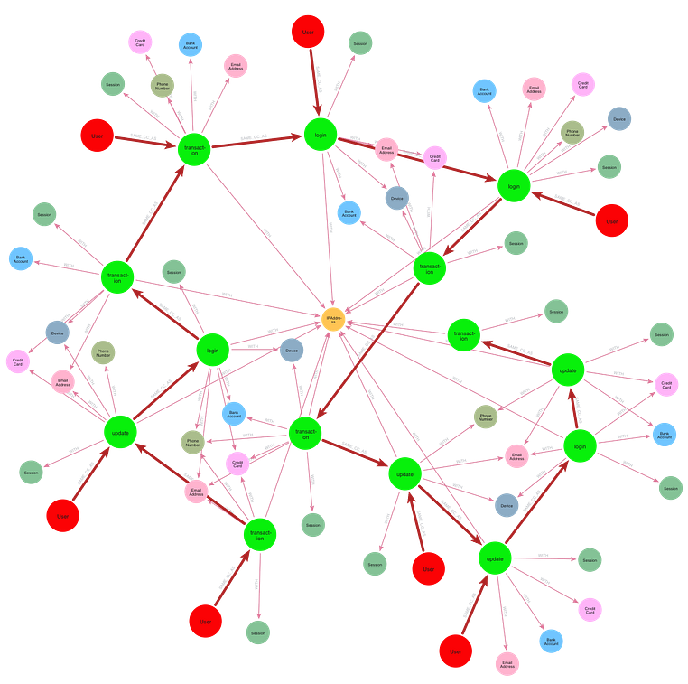

= GDS orientation
:type: lesson
:order: 1

Graph data science can refer to both the discipline 'graph data science', and 'Graph Data Science' or 'GDS', the Neo4j plugin. By the end of this lesson, you will understand:

* The difference between GDS the product, and 'graph data science' the discipline
* The difference between GDS the product and Aura Graph Analytics

== The discipline of graph data science

Graph data science, the discipline, applies data science methods to graph data. Graph-specific methods support analyses and insights that would be unfeasible or impossible to achieve with tabular data. 

For example, traditional data science may detect fraud by flagging individual accounts and monitoring known suspicious activities. Such approaches do not consider coordinated networks as single components.

Graph data science allows you to analyze entire networks of coordinated fraud that would be invisible to traditional methods. The image below demonstrates such an activity in action.

The network shown in the image represents a single connected component of transaction data within a graph of financial transactions. By isolating connected components in this way, the graph data analyst can reveal networks of fraudulent behavior that would otherwise remain inaccessible.

== Graph Data Science (GDS)

https://neo4j.com/docs/graph-data-science/current/[Graph Data Science], or GDS, is a Neo4j plugin. 

You can use GDS with https://neo4j.com/docs/aura/classic/aurads/[Neo4j’s AuraDS cloud] and self managed Neo4j installations. It is also available as a plugin for Neo4j Desktop.

GDS allows you to run the algorithms, build the pipelines and create the predictive models used by graph data scientists. It is optimized for speed and ease-of-use.

Throughout this course, we will use 'Graph Data Science' or 'GDS' to refer to the Neo4j product and 'graph data science' when referring to the discipline.

Later, you will learn how to access and use GDS. 

== Aura Graph Analytics

https://neo4j.com/docs/aura/graph-analytics/[Aura Graph Analytics] is an on-demand service that allows you to use the Graph Data Science library regardless of where your source data is stored. 

It runs in Aura as a dedicated service optimized for analytics workloads, with no memory or compute resources shared with your data store. While functionally similar to GDS, Aura Graph Analytics is a different product.

While this course may reference Aura Graph Analytics from time to time for context, it will always use GDS for demonstration.

However, even if you intend to use Aura Graph Analytics, this course will still provide you with the prerequisites necessary for any subsequent Aura Graph Analytics course.

[.quiz]
== Check your understanding

include::questions/1-graph-database-vs-tabular.adoc[leveloffset=+1]

include::questions/2-gds-vs-aura-analytics.adoc[leveloffset=+1]

[.summary]
== Summary

You've learned the distinction between graph data science as a discipline and GDS as a Neo4j product. Graph data science applies specialized methods to reveal insights impossible with traditional data science—like detecting coordinated fraud networks.

GDS is a Neo4j plugin available across multiple platforms, while Aura Graph Analytics is a dedicated cloud service. Both enable graph data science workflows.

In the next lesson, you'll see these concepts in action as you explore what makes graph data science different from traditional approaches.
