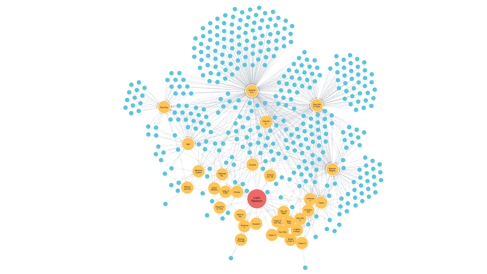

= Understanding graph data science
:type: lesson
:order: 2

Now that you understand what graph data science is, let's explore what makes it different from traditional data science approaches.

== How graph databases differ from traditional databases

Most data science workflows store and analyze tabular data. 

In a tabular database, entities live in rows and their properties live in columns. If you want to access relationships between entities, you need explicit joins or reformatted tables. This refactoring isn't fast, and it's not computationally efficient either.

Graph databases take a different approach: they store relationships with the same level of importance as entities.

image::images/lesson_2_basic_graph_explainer.png[Displaying a WORKS_AT relationship between Michael and Neo4j and a FOUNDED_IN relationship between Neo4j and Sweden]

A graph lets you view, understand, and analyze relationships between every data point in your database. This provides context for analyses that would be impossible in a tabular format.

Graph databases are optimized for efficient relationship traversal—and it's much easier to see this than describe it.

You'll work with a dataset of movies, actors, directors, users, and genres. Run the query below to see its data model.

[source,cypher,role=nocopy]
.Visualize the database schema
----
CALL db.schema.visualization()
----

If you have taken any other courses in the GraphAcademy catalog, you should already be familiar with this dataset. It's essentially a pared down version of IMDb.

This Cypher query searches for the top ten shortest paths between Charlie Chaplin and Kevin Bacon. Click 'Run' to see what happens.

[source,cypher,role=nocopy]
.Find shortest paths between Charlie Chaplin and Kevin Bacon
----
MATCH path = SHORTEST 10 (chaz:Person {name: 'Charlie Chaplin'})
    -[:ACTED_IN*..8]- 
        (kevin:Person {name:'Kevin Bacon'})
RETURN [n IN nodes(path) | COALESCE(n.title, n.name)] 
    AS worked_with
ORDER BY size(worked_with) ASC
----
The query returns a table with ten rows. The first row shows the shortest path between Charlie Chaplin and Kevin Bacon in the movies network. The full table returns the top ten shortest paths between them, ordered from shortest to longest.

This query returns the same results as a graph visualization.

[source,cypher,role=nocopy]
.Visualize paths between Charlie Chaplin and Kevin Bacon
----
MATCH path = SHORTEST 10 (chaz:Person {name: 'Charlie Chaplin'})
    -[:ACTED_IN]-+ 
        (kevin:Person {name:'Kevin Bacon'})
RETURN path
----

Both queries finish in well under a second. Even for something this simple, a tabular approach would require serious refactoring or a series of joins to get the same data.

When you analyze the structure of information—not just properties alone—you can gain insights about user behaviors, identify supply chain bottlenecks, predict service failures, and more.

== How graph data science differs from data science

In the previous example, you searched for paths between actors using Cypher. GDS takes this many steps further. 

Imagine you want to create a recommendation engine for a content platform, but all your transactional data is tabular.

[opts="header",cols="1,1,1"]
|===
| user_id      | item_id         | user_rating
| user_01      | item_422437     | 4
| user_01      | item_752639     | 5
| user_01      | item_782392     | 3
| user_01      | item_125565     | 2
|===

Just because a user enjoyed three Liam Neeson action films doesn't mean they love Liam Neeson -- or even action movies in general. Recommending movies based only on metadata similarities and user ratings is both naive and extremely common. 

An effective recommendation engine would analyze user behaviors alongside user and movie metadata. It would also account for how those data interact -- but let's not get ahead of ourselves.

To assess behavioral similarities between users in a tabular format, you'd need to reshape the dataset into multiple tables, each with a specific purpose.

[opts="header",cols="1,1,1,1,1,1"]
|===
| user_id | item_422437 | item_752639 | item_782392 | item_125565 | ...
| user_01 | 4           | 5           | 3           | 2           |
| user_02 | 3           | 5           | 1           | 1           |
| user_03 | 4           | 4           | 4           | 3           |
| user_04 | 1           | 1           | 2           | 1           |
|===

Then, to account for various patterns, you would need to use expensive JOIN operations, which can only get you so far.

Graph data represents relationships explicitly. You don't need one table to connect users to actors, another to connect actors to movies, and another to relate metadata to user journeys. You need only one dataset to store and retrieve all of these perspectives at once.

The image below shows Liam Neeson's node in the movie graph—he's the large red one. The mid-sized orange nodes are movies he appeared in. The smaller blue nodes are users who rated those movies. 

Run this query to explore the graph yourself.

[source,cypher,role=nocopy]
.Users who rated movies starring Liam Neeson
----
MATCH path = (a:Actor {name: 'Liam Neeson'}) // <1>
    -[:ACTED_IN]->(m:Movie) // <2>
    <-[:RATED]-(u:User) // <3>
RETURN path // <4>
----

[TIP]
.Query breakdown
====
1. Find the Actor node for Liam Neeson
2. Follow ACTED_IN relationships to Movie nodes
3. Follow RATED relationships from User nodes back to those movies
4. Return the complete path showing all connections
====

You can click on any node in the returned graph to see its properties.

The data format is powerful alone, even using pure Cypher for analysis. However, GDS gives you the ability to analyse your data at various levels of granularity and from a wide range of approaches.

Let's see that in action.

The following GDS procedures will:

* Create a subgraph of Users, Movies, and Genres
* Group Users and Movies into communities
* Return groups of users with similar watching habits

Run them in sequence and check out the results.

This first query creates a new subgraph (an in-memory projection) from the larger main graph, containing only Users, Movies, Genres, and their relationships.

[source,cypher,role=nocopy]
.Create a subgraph of Users, Movies, and Genres
----
MATCH (source) // <1>
WHERE source:User OR source:Movie OR source:Genre // <2>
OPTIONAL MATCH (source)-[r]->(target) // <3>
WHERE target:User OR target:Movie OR target:Genre // <4>
WITH gds.graph.project( // <5>
  'rec-simple',
  source,
  target,
  {},
  {
    undirectedRelationshipTypes: ['*']
  }
) AS g
RETURN g.graphName, g.nodeCount, g.relationshipCount // <6>
----

[TIP]
.Projection breakdown
====
1. Match all nodes in the database
2. Filter to only User, Movie, or Genre nodes
3. Optionally match relationships from these nodes
4. Filter targets to only User, Movie, or Genre nodes
5. Project an in-memory graph with undirected relationships
6. Return the projection details
====

This second query runs an algorithm called Leiden, which analyzes how nodes connect and clusters them into meaningful groups.

[source,cypher,role=nocopy]
.Run the Leiden community detection algorithm
----
CALL gds.leiden.mutate('rec-simple', { // <1>
    mutateProperty: 'communityId', // <2>
    maxLevels: 10, // <3>
    gamma: 1, // <4>
    theta: 0.05}) // <5>
----

[TIP]
.Algorithm breakdown
====
1. Run Leiden algorithm on the 'rec-simple' projection
2. Store community assignments as 'communityId' property
3. Allow up to 10 hierarchical levels of community detection
4. Resolution parameter controlling community size
5. Threshold for community quality improvement
====

This final query retrieves nodes in the same group and presents them as a table. The results show groups of users whose watching behaviors are more similar to each other than to users outside their group.

[source,cypher,role=nocopy]
.Retrieve and display community members
----
CALL gds.graph.nodeProperties.stream('rec-simple', 'communityId') // <1>
    YIELD nodeId, propertyValue // <2>
WITH gds.util.asNode(nodeId).name AS node, propertyValue AS communityId // <3>
WITH communityId, collect(node) AS members // <4>
WITH communityId, members, size(members) AS communitySize // <5>
RETURN communityId, communitySize, members // <6>
ORDER BY communitySize DESC // <7>
----

[TIP]
.Query breakdown
====
1. Stream the communityId property from the projection
2. Get each node's ID and community assignment
3. Convert node IDs to names and rename the property
4. Group nodes by community and collect their names
5. Calculate the size of each community
6. Return community details
7. Order by largest communities first
====

Right now, you might not fully understand what you just did. That's okay. By the end of this course, you'll be able to use Graph Data Science to solve a variety of problems.

[.summary]
== Summary

Graph databases store relationships with the same level of importance as entities, enabling analyses that would be impossible in a tabular format. When you analyze the structure of your data—not just individual properties—you can reveal insights about behaviors, patterns, and connections.

GDS extends this power by providing algorithms that can detect communities, measure influence, find optimal paths, and much more.

In the next lesson, you'll learn how to set up your own GDS environment so you can explore these concepts hands-on.

[.quiz]
== Check your understanding

include::questions/1-why-graphs-for-relationships.adoc[leveloffset=+1]

include::questions/2-gds-advantage.adoc[leveloffset=+1]
