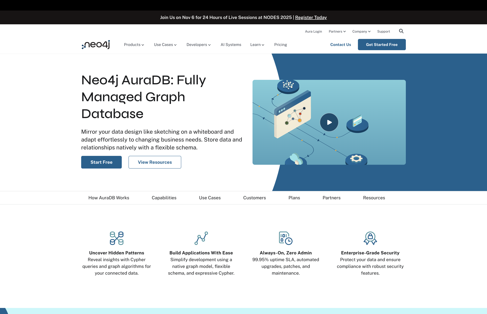
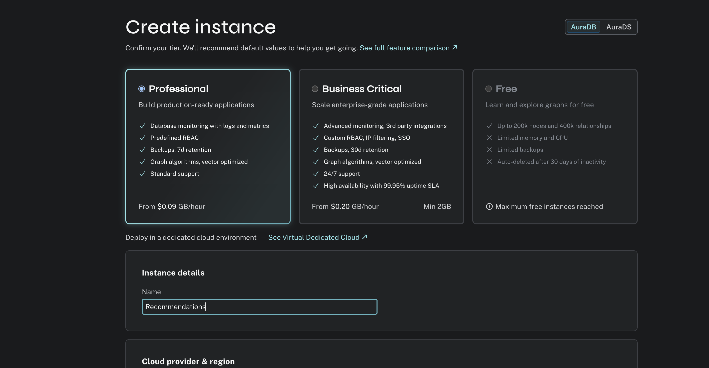
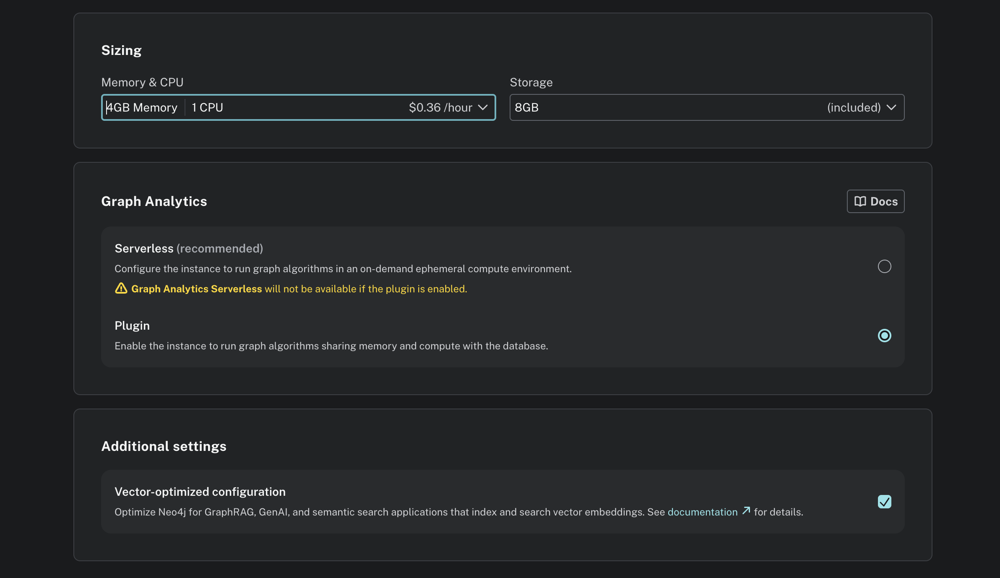
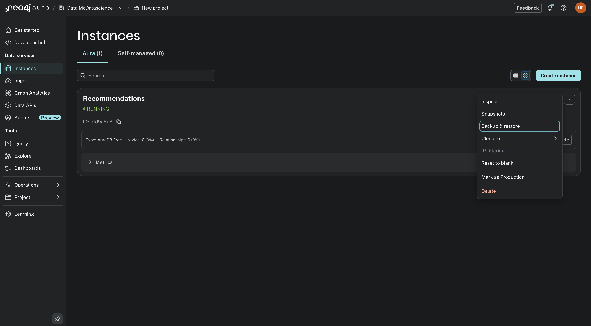

= Set up your GDS environment
:type: lesson
:order: 3

[NOTE]
.Optional
====
You do not have to setup an environment to continue the course.

You will however get the most out of the course if you have the opportunity to experiment and explore the concepts covered.
====

You do not require your own Neo4j instance to complete this course. However, you will benefit from having access to one for freedom, flexibility and exploration.

Throughout this course, you have access to a browser-based sandbox environment with pre-loaded data. This sandbox includes everything you need to complete the course—a Neo4j database with the Graph Data Science library already installed and the recommendations dataset loaded.

You can run all course queries directly in the sandbox without any additional setup.

**To access your sandbox in Neo4j Browser:**

link:https://sandbox.neo4j.com/[Open Neo4j Sandbox^] and navigate to your course instance. This gives you a full Neo4j Browser experience where you can:

* Run and experiment with all course queries
* Visualize graph results
* Explore the recommendations dataset
* Test your own variations

== Optional: Set up your own environment

While the sandbox is sufficient for completing this course, setting up your own Neo4j environment offers additional benefits:

* **Experiment freely** - Try variations without affecting the course sandbox
* **Work offline** - Continue learning without an internet connection (Desktop only)
* **Build your portfolio** - Create projects with your own datasets
* **Prepare for real-world use** - Learn the setup process you'll need at work

If you'd like to set up your own environment, you have two options: **Neo4j Aura** (cloud-based) or **Neo4j Desktop** (local installation). Both are optional and offer many benefits, but there is no necessity to use them for this course.

== Optional: Neo4j Aura (cloud)

[%collapsible]
====
link:https://neo4j.com/product/auradb/[Neo4j Aura^] is Neo4j's fully managed cloud service. 

You can run the GDS plugin on a Pro Trial Aura Instance right out of the box—no payment or card details needed.

Your Pro Trial will last for 14-days, with an option to extend if your time runs out. 

**Choose Aura if you:**

* Want to access your database from anywhere
* Prefer not to install software locally
* Have limited local storage or computing resources
* Want automatic backups and updates

**Setting up Neo4j Aura:**

* Navigate to link:https://neo4j.com/product/auradb/[AuraDB^]
* Click **Start free** to create an account

* Follow the signup flow and select a Professional instance

* Scroll down and choose the GDS plugin

The GDS plugin is the same plugin you can install in Desktop. 

You're free to choose Aura Graph Analytics instead, but note that some syntax differences are required which will not be covered in this course.

You can spin up and destroy as many Aura Graph Analytics sessions as you like.

**To load the movie recommendations dataset:**

* Download link:https://github.com/neo4j-graph-examples/recommendations/blob/main/data/recommendations-50.dump[this .dump file^]
* Click **Backup & Restore** in your Aura instance

* Upload the .dump file

image::images/backup_from_dump_2.png[Backup and restore tab in Aura Instances page]

After the import completes, you'll have the same dataset available in your own cloud instance.
====

== Optional: Neo4j Desktop (local)

[%collapsible]
====
link:https://neo4j.com/deployment-center/?gdb-selfmanaged&community[Neo4j Desktop^] is a local development environment for Neo4j.

**Choose Desktop if you:**

* Want to work offline
* Prefer local control of your data
* Need unlimited storage for experimentation
* Want faster query performance for large datasets

**Setting up Neo4j Desktop:**

* Navigate to link:https://neo4j.com/deployment-center/?gdb-selfmanaged&community[Neo4j Desktop^]
* Download and install Neo4j Desktop for your operating system

image::images/lesson_3_desktop.png[Neo4j Desktop download page showing Download button]

* Launch Neo4j Desktop and create a new instance

image::images/lesson_3_create_instance_desktop.png[Neo4j Desktop main interface showing the create instance modal]

* Click the three dots next to your instance, and open the plugins window

image::images/lesson_3_install_gds_desktop.png[Neo4j Desktop menu with plugin window navigation]

* Install the Graph Data Science Library plugin

image::images/lesson_3_install_gds_step_2.png[Neo4j Desktop Plugins tab showing the Graph Data Science Library with Install button]

**To load the movie recommendations dataset:**

* Download link:https://github.com/neo4j-graph-examples/recommendations/blob/main/data/recommendations-50.dump[this .dump file^]
* From your DBMS menu, select **Create new DBMS from Dump**

image::images/lesson_3_load_db_from_dump.png[Neo4j Desktop showing the load from .dump option]

Once the dump has been loaded, you'll have a local version of the recommendations dataset available for querying and experimentation.
====

[.quiz]
== Check your understanding

include::questions/1-gds-installation.adoc[leveloffset=+1]

[.summary]
== Summary

In this lesson, you learned:

* How to access your course sandbox in Neo4j Browser for running all course queries
* That you can optionally set up your own Neo4j environment (Aura or Desktop) for additional benefits
* How to set up Neo4j Aura (cloud) or Neo4j Desktop (local) with GDS enabled
* How to restore database dumps for hands-on practice

You have everything you need to complete this course in the sandbox, with the option to experiment further in your own environment.

In the next module, you'll learn the fundamentals of the GDS workflow: how to project graphs, run algorithms, and write results back to your database.
