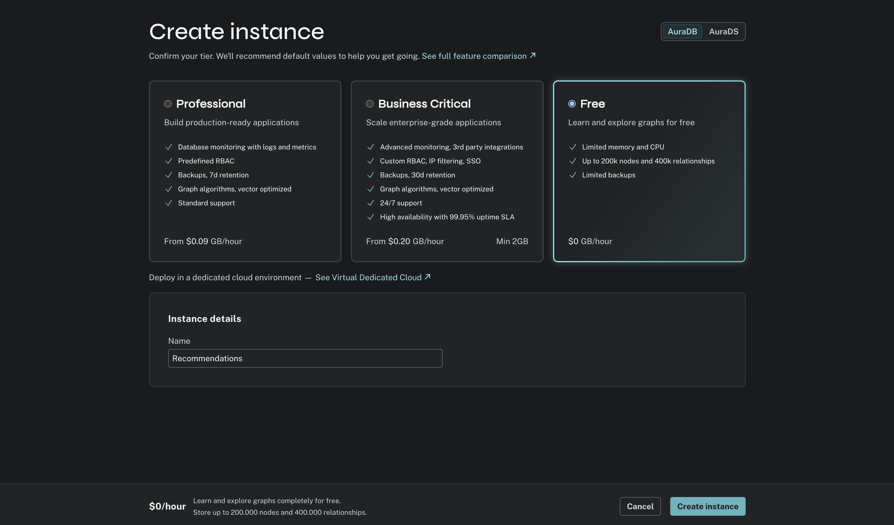
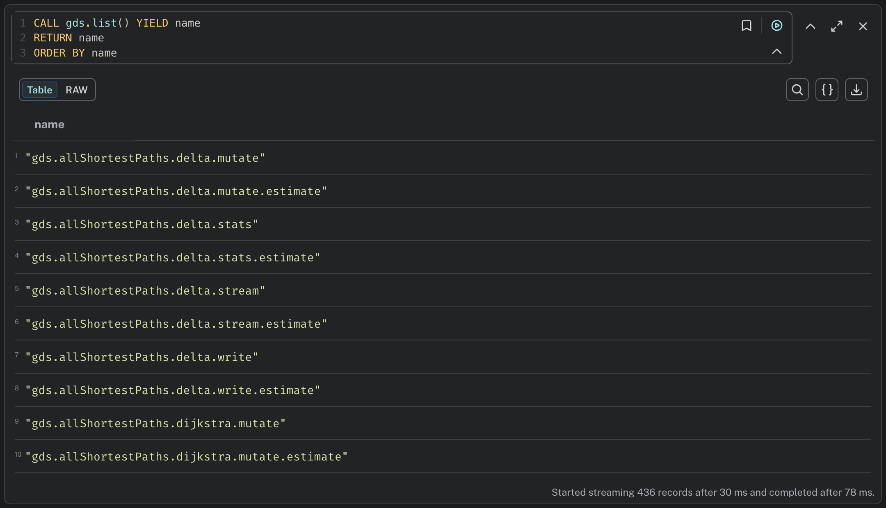

= Set up your GDS environment
:type: lesson
:order: 3
:optional: true

In this lesson, you will set up your own Neo4j environment. You will then install Graph Data Science to work alongside the course sandbox.

[NOTE]
.Optional
====
You do not have to setup an environment to continue the course.

You will however get the most out of the course if you have the opportunity to experiment and explore the concepts covered.
====

You do not require your own Neo4j instance to complete this course. However, you will benefit from having access to one for freedom, flexibility and exploration.

By the end of this lesson, you will have:

* Chosen between Neo4j Aura (cloud) or Neo4j Desktop (local) for your learning environment
* Set up a Neo4j instance with GDS enabled
* Verified that GDS is working correctly
* Understood how to restore database dumps for hands-on practice

== Why set up your own environment?

Throughout this course, you will have access to a browser-based sandbox environment with pre-loaded data for following along with the lessons.

However, setting up your own environment allows you to:

* **Experiment freely** - Try variations of queries without affecting the course sandbox
* **Work offline** - Continue learning without an internet connection (Desktop only)
* **Build your portfolio** - Create projects with your own datasets
* **Prepare for real-world use** - Learn the setup process you'll need at work

== Choosing your environment

You have two options for learning GDS:

=== Neo4j Aura (cloud)

link:https://neo4j.com/product/auradb/[Neo4j Aura^] is Neo4j's fully managed cloud service. 

You can run the GDS plugin on a free Aura Instance right out of the box -- no payment or card details needed.

Signing up to an Aura free trial will give you full functionality for 14 days, however, you do not need a free trial for this course. 

**Choose Aura if you:**

* Want to access your database from anywhere
* Prefer not to install software locally
* Have limited local storage or computing resources
* Want automatic backups and updates

Later, when you translate your learning from this course to Aura Graph Analytics, the transition will be simpler in the cloud.

=== Neo4j Desktop (local)

link:https://neo4j.com/deployment-center/?gdb-selfmanaged&community[Neo4j Desktop^] is a local development environment for Neo4j.

**Choose Desktop if you:**

* Want to work offline
* Prefer local control of your data
* Need unlimited storage for experimentation
* Want faster query performance for large datasets

== Option 1: Setting up Neo4j Aura

Follow these steps to sign up to Aura and import the same dataset from this course:

* Navigate to link:https://neo4j.com/product/auradb/[AuraDB]
* Click **Start free** to create an account

image::images/lesson_3_aura_signup.png[Neo4j Aura signup page with Start Free button highlighted]

* Follow the signup flow and select a free instance. 

You can destroy and spin up as many free instances as you like. Once you're finished with this course, you can easily import your own data instead of the demo dataset.

To get started with the movie recommendations dataset:

* Download link:https://github.com/neo4j-graph-examples/recommendations/blob/main/data/recommendations-50.dump[this .dump file].

* Click Backup & Restore

image::images/backup_from_dump.png[Aura Instances page, Backup & restore option in the UI]

* Upload the .dump file

image::images/backup_from_dump_2.png[Backup and restore tab in Aura Instances page]

== Option 2: Setting up Neo4j Desktop

Follow these steps to install Desktop and set up GDS:

* Navigate to link:https://neo4j.com/deployment-center/?gdb-selfmanaged&community[Neo4j Desktop^]
* Download and install Neo4j Desktop for your operating system

image::images/lesson_3_desktop.png[Neo4j Desktop download page showing Download button]

* Launch Neo4j Desktop and create a new instance

image::images/lesson_3_create_instance_desktop.png[Neo4j Desktop main interface showing the create instance modal]

* Click the three dots next to your instance, and open the plugins window

image::images/lesson_3_install_gds_desktop.png[Neo4j Desktop menu with plugin window navigation]

* Install the Graph Data Science Library plugin

image::images/lesson_3_install_gds_step_2.png[Neo4j Desktop Plugins tab showing the Graph Data Science Library with Install button]

To get started with the movie recommendations dataset:

* Download link:https://github.com/neo4j-graph-examples/recommendations/blob/main/data/recommendations-50.dump[this .dump file].

* From your DBMS menu, select **Create new DBMS from Dump**

image::images/lesson_3_load_db_from_dump.png[Neo4j Desktop showing the load from .dump option]

Once the dump has been loaded, you will have a local version of the recommendations dataset available for querying and experimentation.

== Verifying your setup

After completing either setup option, verify that GDS is installed correctly.

Run these queries to confirm your setup is complete:

=== Check GDS version

[source,cypher]
.Verify GDS installation version
----
RETURN gds.version() AS gdsVersion // <1>
----

1. Call the GDS version function and return the version number

Expected result: A version number (e.g., "2.22.0")

image::images/lesson_3_gds_version.png[Neo4j Browser displaying GDS version query result in table format]

=== List available algorithms

[source,cypher]
.List all available GDS algorithms
----
CALL gds.list() YIELD name // <1>
RETURN name // <2>
ORDER BY name // <3>
----

1. Call gds.list() and get the name of each algorithm
2. Return the algorithm names
3. Sort alphabetically by name

Expected result: A list of algorithm names like `gds.pageRank`, `gds.louvain`, etc.

If both of these queries execute successfully, your environment is ready.

== Working with course materials

Throughout this course, you'll work with:

* **Browser sandbox:** Pre-configured environment with example tasks for following along
* **Your own instance:** For experimentation and practice

You can switch between the sandbox and your own instance at any time. The sandbox ensures you can always complete the course, while your own instance provides freedom to explore.

[.quiz]
== Check your understanding

include::questions/1-gds-installation.adoc[leveloffset=+1]

[.summary]
== Summary

In this lesson, you learned:

* How to choose between Neo4j Aura (cloud) and Neo4j Desktop (local) for your learning environment
* How to set up a Neo4j instance with GDS enabled
* How to verify your installation with test queries
* How to restore database dumps for hands-on practice

You now have a working environment to follow along with the course and experiment on your own.

In the next module, you'll learn the fundamentals of the GDS workflow: how to project graphs, run algorithms, and write results back to your database.
