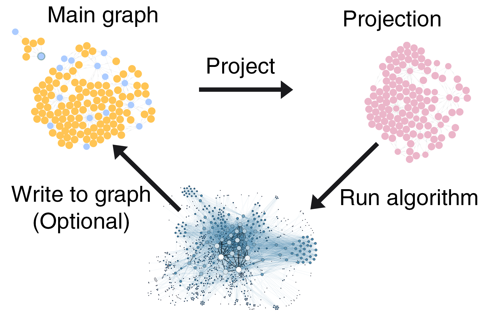

= Understand the GDS workflow
:type: lesson
:order: 1

[.transcript]
== The GDS workflow

Every GDS analysis follows the same basic two or three-step pattern:

. **Project:** Create an in-memory graph
. **Run:** Execute algorithms on the projection
. **Write:** Store results back to the database

This workflow separates your source data from analysis, enabling fast, iterative experimentation without modifying your original graph.

The reason we specify 'two __or__ three' is that you can choose to run an algorithm and write its results in a single operation instead of two. Or, you can chain multiple algorithm results to feed a final algorithm before writing back to the graph.

The reasons for this distinction will become clearer as you progress through the course. 

== Why this workflow?

- **Speed:** In-memory projections are orders of magnitude faster than querying the database directly
- **Safety:** Your source graph remains unchanged until you explicitly write results back
- **Flexibility:** Run multiple algorithms on the same projection, compare results, iterate quickly

== The three steps

=== 1. Project a Graph
The graph projected by GDS is an in-memory structure containing nodes and relationships -- just like your main graph. However, the in-memory graph you create is optimized for topology and property lookup operations.

When you 'project' a graph, you are literally instantiating a new sub-graph in memory. 

[TIP]
.Cypher Projections
====

[source,cypher]
.Project actors and movies into memory
----
MATCH (source:Actor)-[r:ACTED_IN]->(target:Movie) // <1>
WITH gds.graph.project( // <2>
  'actors-graph',
  source,
  target
) AS g
RETURN g.graphName AS graph, 
  g.nodeCount AS nodes, 
  g.relationshipCount AS rels // <3>
----

1. Match Actor nodes connected to Movie nodes via ACTED_IN relationships
2. Project these nodes into an in-memory graph named 'actors-graph'
3. Return the projection statistics

====

The graph projection above has three components:

. **Cypher query** +
This works in the same way as any other Cypher query you are used to running. However, instead of returning the graph results in the Neo4j Browser, you send it to GDS as a projection with the line that follows.

. **Call GDS** +
The GDS WITH statement works the same way as any WITH statement you are used to running in the Neo4j Browser. You call `gds.graph.project` to create the in-memory graph matched by the preceding Cypher statement.
+
In the configuration, you add the name of the graph. Next, you include nodes matched by your source and target variables.
+
In this basic example, you do not need to explicitly reference their relationships in the configuration -- they will be inferred and returned.

. **Return the stats** +
The final section returns the stats of the graph that you have projected into memory.

NOTE: There are several methods of graph projection in Neo4j. You may, for example, be familiar with Native projection. To project a similar graph using Native projection, you would run this:

[source,cypher]
.Native projection example
----
CALL gds.graph.project( // <1>
  'actor-graph-native', // <2>
  ['Actor', 'Movie'], // <3>
  'ACTED_IN' // <4>
)
YIELD graphName AS graph, nodeCount AS nodes, relationshipCount AS rels // <5>
----

[TIP]
.Projection breakdown
====
1. Call the native GDS projection procedure
2. Name the projection 'actor-graph-native'
3. Include Actor and Movie node labels
4. Include ACTED_IN relationships
5. Return the projection statistics
====

In this course, you will deal only with Cypher projection. Cypher projection is more flexible and more readily available across Neo4j products.

Once you understand Cypher projection, translation to Native projection is trivial.

=== 2. Run an algorithm
Once you have projected your graph into memory, you can run algorithms on it.

You can choose to manipulate only the in-memory graph, or you can write algorithm results back to your main graph immediately.

For example, the degree centrality algorithm performs a relatively simple operation: it assigns a score to each node by counting the number of outgoing relationships it has.

You can then use this score property to rank a node's overall importance. 

The command below will run the algorithm on the in-memory graph and return results. However, it will not write those results to the in-memory graph or the main graph.

[source,cypher]
.Run degree centrality in stream mode
----
CALL gds.degree.stream( // <1>
  'actors-graph', // <2>
  {} // <3>
)
YIELD nodeId, score // <4>
RETURN gds.util.asNode(nodeId).name AS name, score // <5>
ORDER BY score DESC // <6>
----

[TIP]
.Projection breakdown
====
1. Call the degree centrality algorithm in stream mode
2. Run it on the 'actors-graph' projection
3. Use default configuration (empty config map)
4. Get the node ID and centrality score for each node
5. Convert node IDs to actor names and return with scores
6. Sort by score in descending order
====

NOTE: You'll see lots of unfamiliar functions like `gds.util.asNode(nodeId).name` and `.stream` throughout the course. Don't worry if you don't understand it yet -- you'll learn about and practice using each of these functions in detail as you progress.

The command above has run degree centrality on the in-memory graph and returned a list of actors ranked by importance.

Again, there are three sections to the command.

. **Call the GDS algorithm** +
You call the GDS algorithm with `CALL gds.<algorithm>.<mode>`.
+
No matter what algorithm you use, your command will always begin with this syntax. Depending on the algorithm, you simply replace the algorithm name with whatever algorithm you're trying to run.
+
We will cover modes in more detail later. For now, just remember that `stream` means 'Run the algorithm, give me results, but don't write anything.'
+
You can find a complete list of available algorithms in the link:https://neo4j.com/docs/graph-data-science/current/algorithms/[GDS docs].

. **Configure the algorithm** +
Inside the parentheses you can include specific configurations for running the algorithm.
+
The first configuration parameter is the graph name -- in this case, 'actors-graph'. Further configuration settings can be added in the curly brackets.
+
In this case, we have left the remainder of the configuration empty, so the algorithm runs with its default settings.

. **YIELD and RETURN** +
In the final section, we accept the output from the algorithm, and tell GDS how we would like it to RETURN the results.

This command has not written anything back to either the main graph or the in-memory graph.

=== 3. Write results back
At the beginning of this lesson, you were told that there are 'two or three' steps to running an algorithm. 

That is because you can choose to either manipulate the in-memory graph before writing algorithm results, or you can write them directly back to the main graph.

The following command will run the same algorithm as in step 2: degree centrality. This time, it will write the results directly back to the main graph.

[source,cypher]
.Write degree centrality results to the database
----
CALL gds.degree.write( // <1>
  'actors-graph', // <2>
  {
    writeProperty: 'degree' // <3>
  }
)
YIELD centralityDistribution, nodePropertiesWritten // <4>
RETURN centralityDistribution.min AS minimumScore, centralityDistribution.mean AS meanScore, nodePropertiesWritten // <5>
----

[TIP]
.Projection breakdown
====
1. Call degree centrality in write mode
2. Run it on the 'actors-graph' projection
3. Write results to a property called 'degree'
4. Get statistics about the centrality distribution and count of properties written
5. Return minimum score, mean score, and total properties written
====

This has now written the degree centrality property back to the main graph. You can verify that it has done so by querying the main graph:

[source,cypher]
.Verify degree centrality was written
----
MATCH (n) // <1>
WHERE n.degree IS NOT NULL // <2>
RETURN n.name AS name, n.degree AS score // <3>
ORDER BY score DESC // <4>
----

[TIP]
.Projection breakdown
====
1. Match all nodes in the database
2. Filter to nodes that have the degree property
3. Return the node name and degree score
4. Sort by score in descending order
====

You can break this algorithm command into three sections.

. **Call the gds algorithm** +
Again, you call the algorithm with `CALL gds.<algorithm>.<mode>`
+
For writing back to the graph, the syntax is identical -- you just switch the `<mode>` from `stream` to `write`.

. **Configure the algorithm** +
Again, the syntax is identical to the previous step. However, when writing back to the main graph, you need to tell the algorithm what to write.
+
In this case, the algorithm generates a node property, so you must tell GDS what to call that property when writing back to the main graph.
+
The name of the property is arbitrary. If you really wanted to, you could name this property 'bananas'. 

Let's try that now, by running the algorithm again -- on the same graph projection. This time, we'll tell GDS to use 'bananas' as the writeProperty.

[source,cypher]
.Write degree centrality with custom property name
----
CALL gds.degree.write( // <1>
  'actors-graph', // <2>
  {
    writeProperty: 'bananas' // <3>
  }
)
YIELD centralityDistribution, nodePropertiesWritten // <4>
RETURN centralityDistribution.min AS minimumScore, centralityDistribution.mean AS meanScore, nodePropertiesWritten // <5>
----

[TIP]
.Projection breakdown
====
1. Call degree centrality in write mode
2. Run it on the 'actors-graph' projection
3. Write results to a property called 'bananas'
4. Get statistics about the centrality distribution and count of properties written
5. Return minimum score, mean score, and total properties written
====

And then we can validate that our `bananas` property has been written to the main graph.

[source,cypher]
.Verify custom property was written
----
MATCH (n) // <1>
WHERE n.bananas IS NOT NULL // <2>
RETURN n.name AS name, n.degree AS score, n.bananas AS bananas // <3>
ORDER BY score DESC // <4>
----

[TIP]
.Projection breakdown
====
1. Match all nodes in the database
2. Filter to nodes that have the bananas property
3. Return name, degree, and bananas properties
4. Sort by score in descending order
====

Now that you have finished with the graphs, we can run the following command to drop them.

[source,cypher]
.Drop all graphs in memory
----
CALL gds.graph.list()
YIELD graphName
CALL gds.graph.drop(graphName)
YIELD graphName AS droppedGraph
RETURN droppedGraph
----

This query returns a list of dropped graph names. You should see both 'actors-graph' and 'actor-graph-native' removed from memory.

== What's next

Now that you understand the workflow, you'll learn each step in detail. First up: graph projection.

[.quiz]
== Check your understanding

include::questions/1-choosing-execution-mode.adoc[leveloffset=+1]

include::questions/2-projection-reuse.adoc[leveloffset=+1]

[.summary]
== Summary

The GDS workflow has three steps: Project → Run → Write. This pattern enables fast, safe, iterative analysis without modifying your source data.

In the next lesson, you'll learn how to create graph projections using Cypher.

