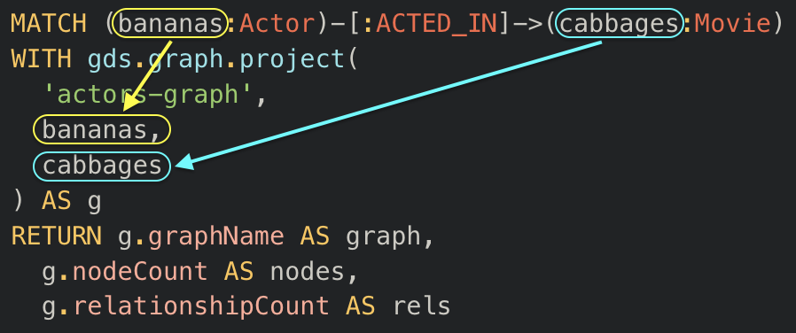

= Project a graph
:type: lesson
:order: 2
:sandbox: true

[.transcript]
== Introduction

In the previous lesson, you learned the three-step GDS workflow: **Project → Run → Write**. You saw how this pattern enables fast, safe, iterative analysis by separating your source data from algorithmic operations.

This lesson focuses exclusively on **Step 1: Projection**—the foundation of all GDS work.

By the end of this lesson, you will understand:

* How Cypher projections work in detail
* What graph structures you're creating when you project
* Why different projection types matter for algorithms

[NOTE]
.Algorithm requirements drive projection choices
====
Different algorithms have different requirements for graph structure. Some algorithms work optimally on monopartite graphs (single node type), while others are designed for bipartite graphs (two distinct node types). As you learn projection techniques throughout this module, keep in mind that your projection choices should be guided by which algorithms you plan to use. You'll learn more about algorithm-specific requirements in Module 3.
====

== Cypher Projection Anatomy

Let's revisit the example from the previous lesson and break it down completely.

[source,cypher,role=noplay]
.Basic Cypher projection example
----
MATCH (source:Actor)-[r:ACTED_IN]->(target:Movie) // <1>
WITH gds.graph.project( // <2>
  'actors-graph', // <3>
  source, // <4>
  target // <5>
) AS g
RETURN g.graphName AS graph, g.nodeCount AS nodes, g.relationshipCount AS rels // <6>
----

[TIP]
.Projection breakdown
====
1. Match Actor nodes connected to Movie nodes via ACTED_IN relationships
2. Call the GDS projection function
3. Name the projection 'actors-graph'
4. Include source nodes (Actors) in the projection
5. Include target nodes (Movies) in the projection
6. Return projection statistics
====

This projection has three main components:

=== 1. The Cypher Pattern

[source,cypher,role=noplay]
.Match the pattern
----
MATCH (source:Actor)-[r:ACTED_IN]->(target:Movie) // <1>
----

[TIP]
.Query breakdown
====
1. Match Actor nodes connected to Movie nodes via ACTED_IN relationships
====

This is standard Cypher. You're matching a pattern in your database:

- `source` nodes with the `Actor` label
- `target` nodes with the `Movie` label  
- `ACTED_IN` relationships connecting them

The variable names `source` and `target` are important—you'll reference them in the projection. 

However, just like the `writeProperty` value we created in the previous lesson, these variables are inherently arbitrary.

We could run the following, equally valid projection:

NOTE: While this works, we recommend using descriptive names like `source` and `target` in production code for clarity and maintainability.

[source,cypher]
.Projection with custom variable names
----
MATCH (bananas:Actor)-[:ACTED_IN]->(cabbages:Movie) // <1>
WITH gds.graph.project( // <2>
  'bananas-cabbages', // <3>
  bananas, // <4>
  cabbages // <5>
) AS g
RETURN g.graphName AS graph, g.nodeCount AS nodes, g.relationshipCount AS rels // <6>
----

[TIP]
.Projection breakdown
====
1. Match Actor and Movie nodes with arbitrary variable names
2. Call the GDS projection function
3. Name the projection 'actors-graph'
4. Include bananas (Actor) nodes in the projection
5. Include cabbages (Movie) nodes in the projection
6. Return projection statistics
====

The query returns the projection statistics: the graph name 'bananas-cabbages', the number of nodes (sum of Actor and Movie nodes), and the number of ACTED_IN relationships projected.

The variables you use for the nodes in your Cypher query, are the variables you will call as nodes in the graph projection.

As a general standard we use `source` and `target` only because many other projection configuration settings will refer to the first variable as `source` and the second as `target`. 

Defaulting to `source` and `target` for the initial variables just makes it easier to keep track.

=== 2. The projection call

[source,cypher,role=noplay]
.Project with configuration options
----
WITH gds.graph.project( // <1>
  'projection-call', // <2>
  source, // <3>
  target, // <4>
  {}, // <5>
  {} // <6>
) AS g
----

[TIP]
.Projection breakdown
====
1. Call the GDS projection function
2. Name the projection 'actors-graph'
3. Include source nodes in the projection
4. Include target nodes in the projection
5. First configuration map (for relationship properties)
6. Second configuration map (for projection options)
====

The `WITH` clause pipes your matched pattern into `gds.graph.project()`:

**`'actors-graph'`**: The name you'll use to reference this projection when running algorithms

**`source`**: Nodes matched by your source variable become nodes in the projection

**`target`**: Nodes matched by your target variable also become nodes in the projection

**Relationships**: Automatically inferred from the pattern between source and target

The curly brackets are there to house your other configuration settings. To create a simple projection, you do not need them. In fact, you could rewrite the same projection command without even referencing them.

[source,cypher,role=noplay]
.Simplified projection without configuration
----
WITH gds.graph.project( // <1>
  'actors-graph', // <2>
  source, // <3>
  target // <4>
) AS g
----

[TIP]
.Projection breakdown
====
1. Call the GDS projection function
2. Name the projection 'actors-graph'
3. Include source nodes in the projection
4. Include target nodes in the projection
====

We include them here just to acknowledge them, and remind you that they still exist in the background.

=== 3. The return statement

You have already dealt with this -- it's really no different from your normal return query when using pure Cypher. 

[source,cypher, role=noplay]
.Return projection metadata
----
RETURN g.graphName AS graph, g.nodeCount AS nodes, g.relationshipCount AS rels // <1>
----

[TIP]
.Query breakdown
====
1. Return the graph name, node count, and relationship count
====

This returns metadata about your projection:

- How many nodes were projected
- How many relationships were created
- The graph name for verification

== Try it yourself

Now that you understand how projections work, copy and paste the following query into the sandbox.

Replace the `?????` placeholders with the correct values and run it to project a graph of Actors who ACTED_IN Movies:

[source,cypher,role=noplay]
.Complete the projection (replace ????? with correct values)
----
MATCH (source:?????)-[r:ACTED_IN]->(target:?????) // <1>
WITH gds.graph.project( // <2>
  'my-projection', // <3>
  ?????, // <4>
  ????? // <5>
) AS g
RETURN g.graphName AS graph, g.nodeCount AS nodes, g.relationshipCount AS rels // <6>
----

[TIP]
.Projection breakdown
====
1. Match source and target nodes (fill in the labels)
2. Call the GDS projection function
3. Name the projection 'my-projection'
4. Include source nodes (fill in the variable)
5. Include target nodes (fill in the variable)
6. Return projection statistics
====

Once you've completed the query, run it to verify your projection was created successfully.

If you need help filling in the query, open the dropdown below for the full solution.

[%collapsible]
====
[source,cypher,role=nocopy noplay]
.Solution: Complete projection
----
MATCH (source:Actor)-[r:ACTED_IN]->(target:Movie) // <1>
WITH gds.graph.project( // <2>
  'my-projection', // <3>
  source, // <4>
  target // <5>
) AS g
RETURN g.graphName AS graph, g.nodeCount AS nodes, g.relationshipCount AS rels // <6>
----

[TIP]
.Projection breakdown
====
1. Match Actor nodes connected to Movie nodes via ACTED_IN relationships
2. Call the GDS projection function
3. Name the projection 'my-projection'
4. Include source (Actor) nodes in the projection
5. Include target (Movie) nodes in the projection
6. Return projection statistics
====

**Key points:**

- `source:Actor` matches Actor nodes
- `target:Movie` matches Movie nodes  
- Pass `source` and `target` variables into `gds.graph.project()`
- The ACTED_IN relationships are automatically inferred from your MATCH pattern
====

== What's next

You now understand how Cypher projections work: you match a pattern with standard Cypher, then pipe it into `gds.graph.project()` to create an in-memory graph.

But there's an important detail about what you've just projected that might surprise you. 

In the next lesson, you'll learn about different graph structure types and discover what type of graph your actors-movies projection actually created.

[.quiz]
== Check your understanding

include::questions/1-projection-components.adoc[leveloffset=+1]

[.summary]
== Summary

Cypher projections use standard MATCH patterns to define which nodes and relationships to project into memory. The basic syntax is: `MATCH (source)-[r]->(target) WITH gds.graph.project('name', source, target)`.

A projection has three components:

1. **Cypher pattern** - Standard MATCH defining which nodes and relationships to include
2. **Projection call** - `WITH gds.graph.project()` piping the matched pattern into GDS
3. **Return statement** - Returns metadata about the created projection

In the next lesson, you'll learn about different graph structure types and how GDS handles them.
