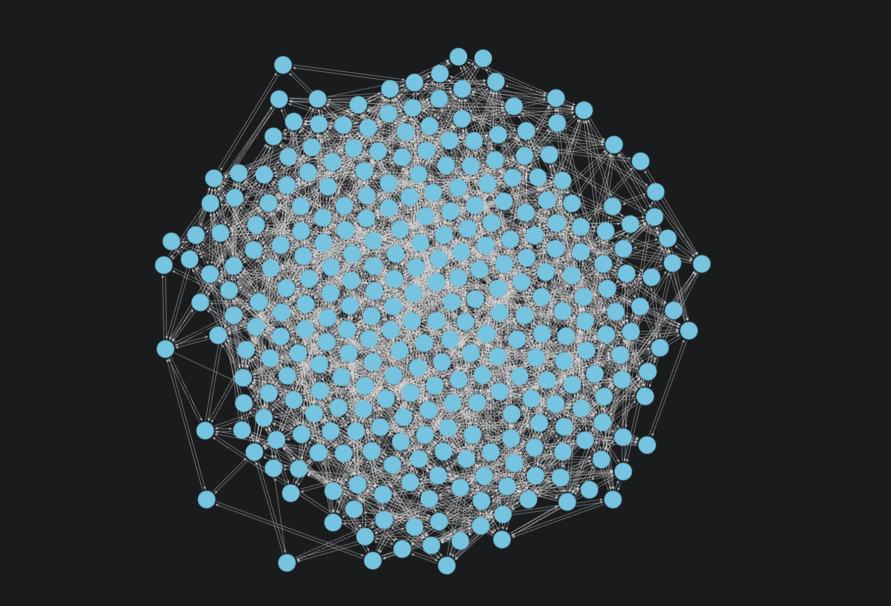
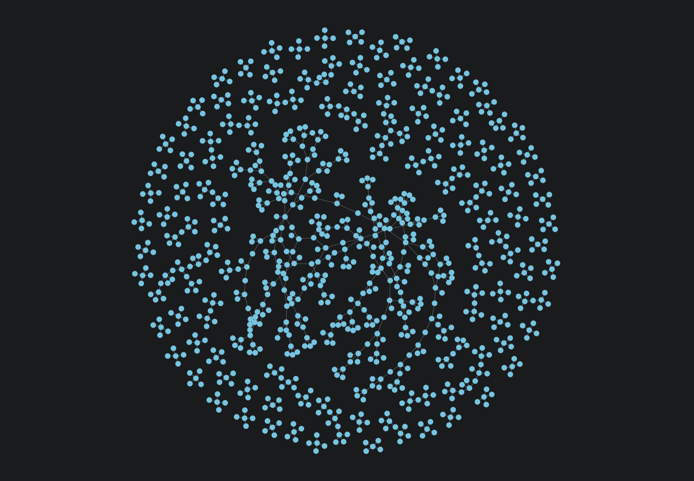

= Projecting monopartite graphs
:type: lesson
:order: 3
:sandbox: true

[.transcript]
== Introduction

In the previous lesson, you learned how to create basic Cypher projections. You projected actors and movies from your database into an in-memory graph.

Now let's understand what type of graph you actually created—and why it matters for the algorithms you'll run on it.

**Here's a critical detail:** the projection you created likely isn't what you might think it is.

Run this projection now:

[source,cypher]
.The actors-graph projection
----
MATCH (source:Actor)-[r:ACTED_IN]->(target:Movie) // <1>
WITH gds.graph.project( // <2>
  'actors-graph', // <3>
  source, // <4>
  target // <5>
) AS g
RETURN g.graphName, g.nodeCount, g.relationshipCount // <6>
----

[TIP]
.Projection breakdown
====
1. Match Actor nodes connected to Movie nodes via ACTED_IN relationships
2. Call the GDS projection function
3. Name the projection 'actors-graph'
4. Include source (Actor) nodes
5. Include target (Movie) nodes
6. Return projection statistics
====

Intuitively, you may think you projected a data model that looks like this:

image::images/actor_movie_model.png[A node, 'Actor', connected via an 'ACTED_IN' relationship to another node, 'Movie']

This is what's known as a 'bipartite graph', as in 'of two parts'. 

What you actually projected was this:

image::images/monopartite_model.png[An unidentified node, 'Node', connected via an '__ALL__' relationship to another node, 'Node']

This is what's known as a 'monopartite graph', or a 'graph of one part'.

By the end of this lesson, you will understand:

* What monopartite graphs are
* Why GDS creates monopartite graphs by default
* How monopartite structure affects algorithm results

== What is a monopartite graph?

A monopartite graph contains nodes of a **single type** (from the algorithm's perspective) with connections between them.

Consider a social network where all nodes are people, and they have only one type of relationship: `-[:FRIENDS_WITH]->`

You could also refer to this graph as a 'homogeneous graph' because it has only one node type __and__ one relationship type.

You could project that network with the following command:

[source,cypher,role=noplay]
.Project a social network
----
MATCH (source:Person)-[r:FRIENDS_WITH]->(target:Person) // <1>
WITH gds.graph.project( // <2>
  'social-network', // <3>
  source, // <4>
  target, // <5>
  {}, // <6>
  {} // <7>
) AS g
RETURN g.graphName, g.nodeCount, g.relationshipCount // <8>
----

[TIP]
.Projection breakdown
====
1. Match Person nodes connected to other Person nodes via FRIENDS_WITH relationships
2. Call the GDS projection function
3. Name the projection 'social-network'
4. Include source (Person) nodes
5. Include target (Person) nodes
6. First configuration map (empty - using defaults)
7. Second configuration map (empty - using defaults)
8. Return projection statistics
====

This command would create an in-memory projection that looks something like this:

For this particular graph, we actually __want__ all the nodes to be of the same type, and we have only one type of relationship anyway.

Running an algorithm on this non-specific graph will not change its output.

== The default projection behavior

However, let's return now to our Movies dataset. When we projected it using this command:

[source,cypher,role=noplay]
.Default projection behavior
----
MATCH (source:Actor)-[r:ACTED_IN]->(target:Movie) // <1>
WITH gds.graph.project( // <2>
  'actors-graph', // <3>
  source, // <4>
  target // <5>
) AS g
RETURN g.graphName, g.nodeCount, g.relationshipCount // <6>
----

[TIP]
.Projection breakdown
====
1. Match Actor nodes connected to Movie nodes via ACTED_IN relationships
2. Call the GDS projection function
3. Name the projection 'actors-graph'
4. Include source (Actor) nodes
5. Include target (Movie) nodes
6. Return projection statistics
====

We projected a graph that looks very similar to our social media graph.

**By default, GDS projections ignore node labels.**

Even though your source data has Actor and Movie labels, GDS treats this as a **monopartite graph**:

- All nodes become the same generic type (no distinction between `Actor` and `Movie`)
- Relationships connect nodes without type awareness
- Algorithms see a single node type with connections

It is important to be aware of precisely what you are projecting and why.

== Why this matters for algorithms

Earlier, we ran degree centrality on this graph. Remember, degree centrality counts the outgoing relationships of every node to rank them by importance.

Running degree centrality on a graph with two labels as if it is a graph with one label doesn't hugely impact our results. 

Degree centrality doesn't care what your nodes are, and it will count their outgoing relationships all the same.

However, the same is not true when we run other algorithms.

Take PageRank for example. We will deal with PageRank specifically in more detail later. For now, just remember:

* PageRank also aims to rank nodes by importance. 
* It calculates importance by measuring the relative importance of neighboring nodes.

Let's run PageRank on our current graph projection, and see what happens:

[source,cypher]
.Run PageRank on actors-graph
----
CALL gds.pageRank.stream( // (1)
  'actors-graph',         // (2)
  {}                      // (3)
)
YIELD nodeId, score       // (4)
RETURN gds.util.asNode(nodeId).title, score // (5)
ORDER BY score DESC // (6)
----

[TIP]
.Algorithm breakdown
====
1. Call PageRank algorithm in stream mode
2. Run on the 'actors-graph' projection
3. Configuration map (empty - using defaults)
4. Yield node IDs and PageRank scores
5. Convert node IDs to names and return with scores
6. Sort by score in descending order
====

The returned table shows you the nodeId of each node in one column and the PageRank score they received in the next.

You should notice that almost all of these nodes have received the same PageRank score.

This happens because we are explicitly giving GDS a node structure that looks like this:

image::images/kevin_and_ryan_nodes_only.png[Two small clusters of nodes, labeled only 'Node' with '__ALL__' relationships. Only one relationship connects them.]

We may intuitively __think__ it will interpret the node structure as this:

image::images/kevin_and_ryan_with_labels.png[Two small clusters of nodes, labeled with 'Actor' and 'Movie' labels with 'ACTED_IN' relationships. Only one relationship connects them.]

It won't. 

By default, many algorithms, PageRank included, will treat every single node and relationship the same. They will consider it a 'monopartite' graph, even if it is not.

The reason for this behavior is that most algorithms simply work better on a monopartite graph.

If you want to understand which movie is most important to increase user watch times, introducing actors into that signal will likely dilute it.

Many GDS algorithms will provide better results on two monopartite graphs than on a single graph with many labels. However, this decision is dependent on the use-case.

== Projecting a true monopartite graph

To understand how we can fix this, we need to reconsider what it is our projection is asking from the algorithm.

In this case, we want to know the 'most important actors'. We don't actually care about their movies. Therefore, we need not include their movies at all.

To create a graph of actors and their relationships to each other, we can project this graph:

[source,cypher]
.Project actors connected through movies
----
MATCH (source:Actor)-[:ACTED_IN]->(:Movie)<-[:ACTED_IN]-(target:Actor) // <1>
WITH gds.graph.project( // <2>
  'actors-only', // <3>
  source, // <4>
  target, // <5>
  {}, // <6>
  {} // <7>
) AS g
RETURN g.graphName AS graph, g.nodeCount AS nodes, g.relationshipCount AS rels // <8>
----

[TIP]
.Projection breakdown
====
1. Match Actor nodes connected through Movie nodes (Movies are not captured)
2. Call the GDS projection function
3. Name the projection 'actors-only'
4. Include source (Actor) nodes
5. Include target (Actor) nodes
6. First configuration map (empty - using defaults)
7. Second configuration map (empty - using defaults)
8. Return projection statistics
====

This gives us a new graph that, in theory, looks like this:

image::images/kevin_and_ryan_acting_relationships_with_labels.png[A graph of the working relationships of Kevin Bacon and Ryan Reynolds.]

GDS has skipped over the intermediate 'Movie' nodes, and has repinned those relationships directly between the actors. Now each actor has greater or fewer degrees between themselves and other actors in the graph.

Still, GDS still sees this graph as generic nodes with generic relationships:

image::images/kevin_and_ryan_acting_relationships_without_labels.png[A graph of the working relationships of Kevin Bacon and Ryan Reynolds represented as generic nodes and generic relationships.]

However, let's see what happens when we run PageRank on __this__ graph.

NOTE: In the examples below, we're illustrating the impact of projections on algorithms with `.stream()` mode—this runs the algorithm and shows results without writing them. You'll learn to use all five execution modes in detail in Module 3.

[source,cypher]
.Run PageRank on actors-only projection
----
CALL gds.pageRank.stream( // <1>
  'actors-only', // <2>
  {} // <3>
)
YIELD nodeId, score // <4>
RETURN gds.util.asNode(nodeId).name, score // <5>
ORDER BY score DESC // <6>
----

[TIP]
.Algorithm breakdown
====
1. Call PageRank algorithm in stream mode
2. Run on the 'actors-only' projection
3. Configuration map (empty - using defaults)
4. Yield node IDs and PageRank scores
5. Convert node IDs to names and return with scores
6. Sort by score in descending order
====

Now, PageRank returns Robert De Niro as the most important actor in the graph, and other actors have received descending values based on their relative 'importance'.

Before, PageRank could only use any actor's relationship to a movie. Every actor connected to a movie would only ever have one relationship to that movie, never directly to each other. That meant that any actors with same number of roles would necessarily be considered as important as each other.

In our current graph, we only consider them as a single social network.

Before, we were trying to treat a 'bipartite' graph (two types) as if it were a 'monopartite' graph (one type). Now, we are projecting a true 'monopartite' graph.

== What's next

You now understand what monopartite graphs are and why GDS creates them by default. You've seen how the graph structure affects algorithm results.

In the next lesson, you'll get hands-on practice creating different types of monopartite projections.

[.quiz]
== Check your understanding

include::questions/1-monopartite-identification.adoc[leveloffset=+1]

[.summary]
== Summary

A **monopartite graph** contains nodes of a single type with connections between them. By default, GDS projections create monopartite graphs—ignoring node labels and treating all nodes as the same type.

This default behavior can affect algorithm results. Some algorithms (like degree centrality) work fine on any structure, while others (like PageRank) produce more meaningful results when run on true monopartite graphs where all nodes genuinely represent the same entity type.

When you want to analyze relationships within a single entity type (like actors connected through their movies), you should project a true monopartite graph by excluding intermediate nodes.

