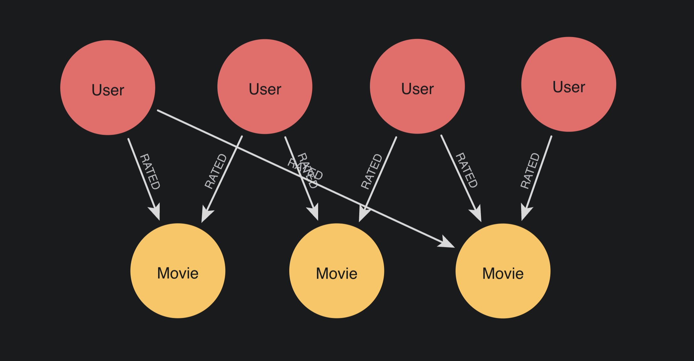

= Projecting bipartite and multipartite graphs
:type: lesson
:order: 6

[.transcript]
== Introduction

You've learned that GDS creates monopartite projections by default, treating all nodes as a single type regardless of their original labels.

But what if you need to preserve the distinction between node types? What if it matters that some nodes are Actors and others are Movies?

In this lesson, you'll learn about **bipartite** and **multipartite graphs**—graphs with two or more distinct node types—and how to create projections that preserve these distinctions in GDS.

By the end of this lesson, you will understand:

* What bipartite and multipartite graphs are
* The difference between multipartite and heterogeneous graphs
* Why preserving node labels matters for certain analyses
* How to configure projections to preserve multiple node types in GDS

== What is a bipartite graph?

A bipartite graph has **two distinct types** of nodes, with relationships only connecting nodes of different types—never nodes of the same type.

Think of it as a graph "of two parts."

Example: Customers purchasing products:

* `(:Customer)-[:PURCHASED]->(:Product)`
* `(:Customer)-[:PURCHASED]->(:Product)`
* `(:Customer)-[:PURCHASED]->(:Product)`

(No Customer-to-Customer connections)
(No Product-to-Product connections)

In a true bipartite graph:

- Type A nodes connect only to Type B nodes
- Type B nodes connect only to Type A nodes
- No connections exist between nodes of the same type

image::images/bipartite_graph_example.png[A bipartite graph. A row of Actor nodes in a top row connect to a row of Movie nodes in a bottom row. No nodes within the same row connect to each other.]

== What is a multipartite graph?

A multipartite graph contains **three or more distinct node types**.

You could also call this a 'heterogeneous graph' if it has **multiple relationship types** as well. 

In practice:

- **Multipartite** = multiple node types (3+)
- **Heterogeneous** = more than one node type __and/or__ multiple relationship types

Here's an example from the Movies dataset you're experimenting with:

image::images/multipartite_graph.png[A multipartite, heterogeneous graph. Many node types connect to each other via various relationships.]

In this image we have the following nodes and relationships:

* `(:Actor)-[:ACTED_IN]->(:Movie)`
* `(:User)-[:RATED]->(:Movie)`
* `(:Movie)-[:IN_GENRE]->(:Genre)`

This graph has four node types (`Actor`, `User`, `Movie`, `Genre`) and three relationship types, making it both multipartite and heterogeneous.

== Understanding what you're actually projecting

Remember when we projected actors and movies?

[source,cypher]
.Default projection without label preservation
----
MATCH (source:Actor)-[r:ACTED_IN]->(target:Movie) // <1>
WITH gds.graph.project( // <2>
  'actors-movies', // <3>
  source, // <4>
  target, // <5>
  {}, // <6>
  {} // <7>
) AS g
RETURN g.graphName, g.nodeCount, g.relationshipCount // <8>
----

[TIP]
.Projection breakdown
====
1. Match Actor nodes connected to Movie nodes via ACTED_IN relationships
2. Call the GDS projection function
3. Name the projection 'actors-movies'
4. Include source (Actor) nodes
5. Include target (Movie) nodes
6. First configuration map (empty - labels not preserved)
7. Second configuration map (empty - using defaults)
8. Return projection statistics
====

Even though this graph is naturally bipartite, GDS sees this projection as a monopartite graph—treating all nodes as a single generic type, ignoring the Actor and Movie labels.

image::images/kevin_and_ryan_nodes_only.png[Two small clusters of nodes, labeled only 'Node' with '__ALL__' relationships. Only one relationship connects them.]

This happens because we have not specified that labels should be preserved. GDS is projecting exactly what we asked for.

For certain algorithms, this doesn't matter. For others, you may actually __want__ to treat different node types as if they are the same.

In most cases, when your data has multiple types, you'll want to project a monopartite subgraph.

However, in some cases, you'll want to project multiple node types, and preserve the distinctions between node types in your projection.

== Preserving labels in projections

In earlier lessons, you saw the empty configuration settings in graph projection syntax.

To preserve labels, use these configuration parameters:

[source,cypher]
.Project bipartite graph with label preservation
----
MATCH (source:Actor)-[r:ACTED_IN]->(target:Movie) // <1>
WITH gds.graph.project( // <2>
  'actors-movies-bipartite', // <3>
  source, // <4>
  target, // <5>
  {
    sourceNodeLabels: labels(source), // <6>
    targetNodeLabels: labels(target), // <7>
    relationshipType: type(r) // <8>
  },
  {}
) AS g
RETURN g.graphName, g.nodeCount, g.relationshipCount // <9>
----

[TIP]
.Projection breakdown
====
1. Match Actor nodes connected to Movie nodes via ACTED_IN relationships
2. Call the GDS projection function
3. Name the projection 'actors-movies-bipartite'
4. Include source (Actor) nodes
5. Include target (Movie) nodes
6. Preserve source node labels
7. Preserve target node labels
8. Preserve relationship types
9. Return projection statistics
====

**Key configuration parameters:**

* `sourceNodeLabels: labels(source)`: Preserves the label(s) from source nodes
* `targetNodeLabels: labels(target)`: Preserves the label(s) from target nodes
* `relationshipType: type(r)`: Preserves the relationship type

Now GDS creates a properly labeled bipartite graph:

image::images/actor_movie_model.png[An Actor node connects to a Movie node via an ACTED_IN relationship.]

- **Actor nodes** retain their Actor label
- **Movie nodes** retain their Movie label
- **Relationships** retain their types

You do not have to use all three of these settings at any given time -- but there's no harm in doing so.

== Creating multipartite projections

The same configuration works for three or more node types:

[source,cypher]
.Project multipartite graph with multiple node types
----
MATCH (source)-[r]->(target) // <1>
WHERE source:Actor OR source:Movie OR source:User OR source:Genre AND target:Actor OR target:Movie OR target:User OR target:Genre // <2>
WITH gds.graph.project( // <3>
  'movies-network-multi', // <4>
  source, // <5>
  target, // <6>
  {
    sourceNodeLabels: labels(source), // <7>
    targetNodeLabels: labels(target), // <8>
    relationshipType: type(r) // <9>
  },
  {}
) AS g
RETURN g.graphName, g.nodeCount, g.relationshipCount // <10>
----

[TIP]
.Projection breakdown
====
1. Match any source and target nodes with relationships
2. Filter to include only Actor, Movie, User, or Genre nodes
3. Call the GDS projection function
4. Name the projection 'movies-network-multi'
5. Include source nodes
6. Include target nodes
7. Preserve source node labels
8. Preserve target node labels
9. Preserve relationship types
10. Return projection statistics
====

This preserves all four node types (`Actor`, `Movie`, `User`, `Genre`) and their relationship types in a single projection.

== When label preservation matters

**Use default monopartite** (no label configuration) when:

- All nodes genuinely represent the same entity type
- Node labels don't affect your analysis goals
- You intentionally want to treat different node types as the same

**Preserve labels** (bipartite/multipartite) when:

- You need to distinguish between node types
- You'll filter algorithms by node type (e.g., run only on Actors)

== Algorithm considerations

Not all algorithms work well with multiple node types.

Throughout this course, as you happen across an algorithm, we'll show you how to decide on your projection type, and explain the reasoning.

For now, to illustrate this, let's project our Users and Movies to a graph.

[source,cypher]
.Project user-movie bipartite graph
----
MATCH (source:User)-[r:RATED]->(target:Movie) // <1>
WITH gds.graph.project( // <2>
  'user-rated-movie', // <3>
  source, // <4>
  target, // <5>
  {
    sourceNodeLabels: labels(source), // <6>
    targetNodeLabels: labels(target), // <7>
    relationshipType: type(r) // <8>
  },
  {}
) AS g
RETURN g.graphName, g.nodeCount, g.relationshipCount // <9>
----

[TIP]
.Projection breakdown
====
1. Match User nodes connected to Movie nodes via RATED relationships
2. Call the GDS projection function
3. Name the projection 'user-rated-movie'
4. Include source (User) nodes
5. Include target (Movie) nodes
6. Preserve source node labels
7. Preserve target node labels
8. Preserve relationship types
9. Return projection statistics
====

Now, you have projected a graph that really does look like this:

image::images/user_rated_movie.png[a graph model of a User node connecting to a Movie node via a RATED relationship.]

The labels persist, and we can now use them when running an algorithm. 

=== Running node similarity

Node similarity is an algorithm that compares the similarity of each node to others based on the nodes they are both connected to. When you run it, it generates a new relationship between similar nodes, and gives that relationship a score property, based on how similar the two nodes are.

Two nodes are considered similar if they share many of the same neighbors.

You can link:https://neo4j.com/docs/graph-data-science/current/algorithms/node-similarity/[learn more about the node similarity algorithm in the GDS docs].

For now, all you need to know is that node similarity works extremely well on bipartite graphs.

Let's run node similarity on our bipartite `user-rated-movie` graph.

[source,cypher]
.Run node similarity on bipartite graph
----
CALL gds.nodeSimilarity.write( // <1>
  'user-rated-movie', // <2>
  {
    writeRelationshipType: 'SIMILAR', // <3>
    writeProperty: 'score' // <4>
  })
YIELD nodesCompared, relationshipsWritten // <5>
----

[TIP]
.Algorithm breakdown
====
1. Call node similarity algorithm in write mode
2. Run on 'user-rated-movie' projection
3. Write new relationships with type 'SIMILAR'
4. Write similarity scores as 'score' property
5. Yield the number of nodes compared and relationships written
====

[NOTE]
.write() mode
====
You're using `.write()` mode to persist results to the database. This is different from `.stream()` which only displays results. You'll learn when to use each execution mode in Module 3.
====

Now, to verify what it has done -- or rather, what it has not done -- run the following query:

[source,cypher]
.Check for User-to-Movie similarity (should be empty)
----
MATCH (u:User)-[r:SIMILAR]->(m:Movie) // <1>
RETURN u, r, m // <2>
LIMIT 1 // <3>
----

[TIP]
.Query breakdown
====
1. Try to match User nodes with SIMILAR relationships to Movie nodes
2. Return the matched users, relationships, and movies
3. Limit to 1 result (should return nothing)
====

This query should have returned `no changes, no records`. 

Node similarity only considers nodes to be similar if they have shared neighbors. A `User` node, in our model, is never a direct neighbor with another `User` node, and so a `User` will never be similar to a shared `Movie`.

In a bipartite graph, every node on one side exclusively connects to nodes on the other side of the divide.

The relationships that we created with the algorithm only exist between nodes **on the same side** of the graph.

Run the following query to see some of your new `SIMILAR` relationships.

[source,cypher]
.View similar users and movies
----
MATCH path = (:User)-[:SIMILAR]->(:User)-[:RATED]->(:Movie) // (1)
RETURN path // (2)
LIMIT 10 // (3)
----

[TIP]
.Query breakdown
====
1. Match a path showing similar users and the movies they have rated.
2. Return the complete path.
3. Limit to 10 results.
====

You should now find that `User` nodes have received SIMILAR relationships to each other, based on their movie rating behaviors.

image::images/user_movie_similar_bipartite.png[A once bipartite graph, now multipartite. A row of User nodes in a top row connect to a row of Movie nodes in a bottom row. The User nodes connect to each other with similarity relationships.]

You could use these newly inferred relationships in multiple ways -- not least, as part of a content recommendation system.

[.quiz]
== Check your understanding

include::questions/1-multitype-identification.adoc[leveloffset=+1]

include::questions/2-label-preservation-config.adoc[leveloffset=+1]

[.summary]
== Summary

**Bipartite graphs** have two distinct node types; **multipartite graphs** have three or more. When multiple relationship types are also preserved, these are often called **heterogeneous graphs**.

By default, GDS ignores node labels, creating monopartite projections. To preserve multiple node types, use:

[source,cypher]
.Configuration for label preservation
----
{ // <1>
  sourceNodeLabels: labels(source), // <2>
  targetNodeLabels: labels(target), // <3>
  relationshipType: type(r) // <4>
}
----

[TIP]
.Configuration breakdown
====
1. Configuration map for label preservation
2. Preserve source node labels
3. Preserve target node labels
4. Preserve relationship types
====

Label preservation matters when algorithms need to distinguish between node types, when you'll filter by type, or when you're analyzing relationships between different entities. Choose your projection structure based on your analytical goals.

You now understand bipartite and multipartite graphs—structures with two or more distinct node types. You've learned how to preserve these distinctions using label and relationship configuration settings. In the next lesson, you'll practice creating projections with multiple node types from the Movies dataset.

