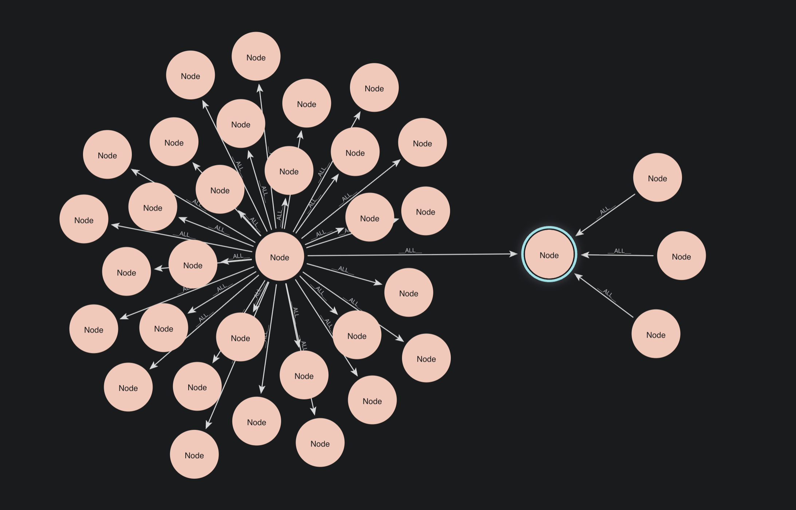
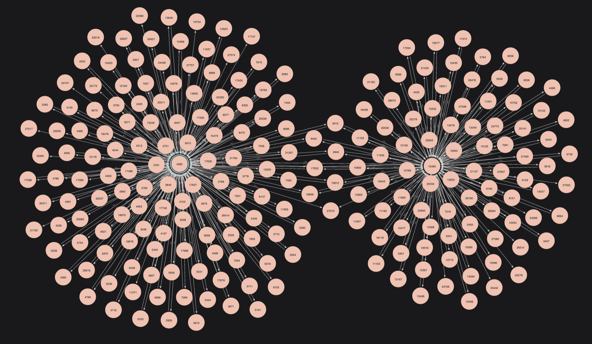
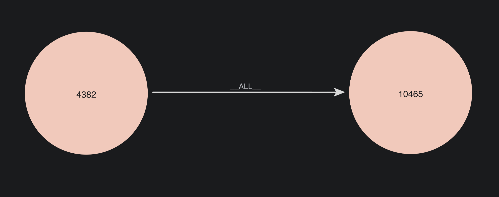
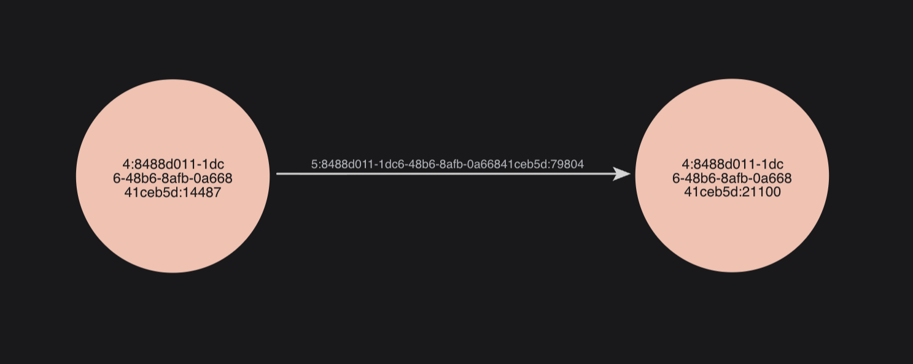
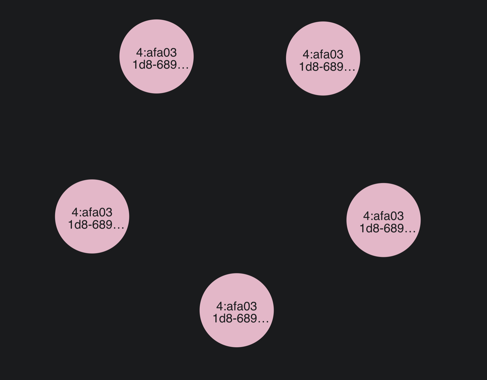
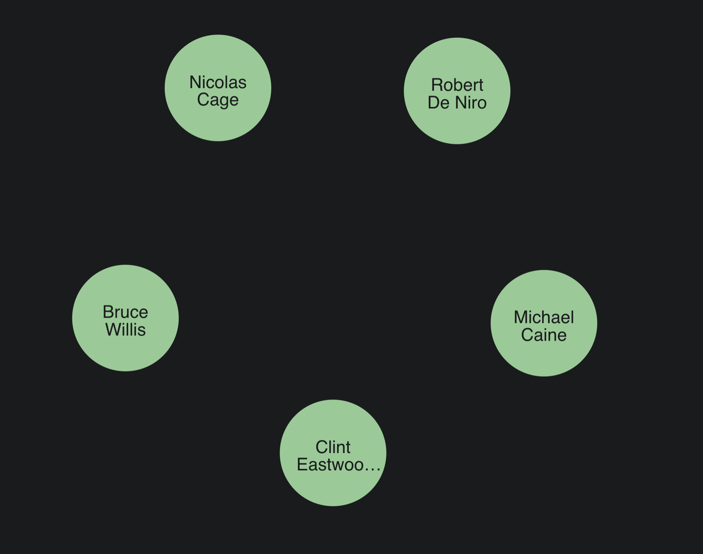

= Use GDS utility functions
:type: lesson
:order: 3

[.transcript]
== Introduction

Throughout this course, you've been using `gds.util.asNode()` in your queries without much explanation. It's time to understand what this function does and why it's essential for working with GDS results.

By the end of this lesson, you will understand:

* What `gds.util.asNode()` does and why you need it
* How GDS algorithms return node identifiers
* How to extract node properties using utility functions
* When to use `gds.util.asNode()` vs. other approaches

== You've already been using it

Look back at queries you've run in previous lessons. You've seen this pattern repeatedly:

[source,cypher]
.Stream degree centrality with node names
----
CALL gds.degree.stream('actor-network', {})
YIELD nodeId, score
RETURN gds.util.asNode(nodeId).name AS name, score
ORDER BY score DESC
----

That `gds.util.asNode(nodeId).name` is converting an internal node identifier into an actual node so you can access its properties.

== Why do we need this?
Remember back in module 2, you saw this image:

In this image, we can see generic nodes connected by generic relationships. However, it doesn't tell the whole story.

A more accurate image might look something like this:

If we zoom in on just two of those nodes, we'll see that they are not labeled as `Node` at all. Instead, they have specific id numbers, assigned by GDS.

These GDS nodeIds connect directly back to their elementIds in the main graph. So, we could instead think of them as looking like this.

By default, when you project into GDS, the shorter nodeId is what GDS will see. The nodeId is how it can identify specific nodes within a bank of generic ones.

You can rest assured that these nodes are indeed 'Kevin Bacon' and 'Ryan Reynolds'. However, you can't see either actor's name, a movie's title, or any other property just from the ID.

**The problem**: Algorithm results give you `nodeId`, but you need node properties like `name`, `title`, or `revenue` when streaming results.

**The solution**: `gds.util.asNode()` translates the internal ID back into the actual database elementId, allowing you to access its properties from the main graph.

== How it works

Let's see this in action. 

First, run PageRank on the actor network without converting node IDs:

[source,cypher]
.Stream PageRank with only nodeIds
----
CALL gds.pageRank.stream('actor-network', {})
YIELD nodeId, score
RETURN nodeId, score
ORDER BY score DESC
LIMIT 5
----

You'll see results like:

[options="header"]
|===
| nodeId | score
| 13100  | 13.085308348165379
| 15706  | 11.965633540351932
| 14810  | 11.103000757934282
| 12134  | 11.022973095444558
| 12233  | 10.806360168304192
|===

The `nodeId` is just a number. It doesn't tell you which actor it represents.

Now use `gds.util.asNode()` to connect to the actual node as it exists in the main graph:

[source,cypher]
.Stream PageRank with actor names
----
CALL gds.pageRank.stream('actor-network', {})
YIELD nodeId, score
RETURN gds.util.asNode(nodeId).name AS actor, score
ORDER BY score DESC
LIMIT 5
----

Now you should see something along the lines of:

[options="header"]
|===
| actor | score
| "Robert De Niro" | 13.085308348165379
| "Bruce Willis" | 11.965633540351934
| "Nicolas Cage" | 11.103000757934284
| "Clint Eastwood" | 11.022973095444556
| "Michael Caine" | 10.806360168304192
|===

=== **What happened?**

1. `nodeId` is the internal ID from the projection
+

image::images/step1_nodeId.png[The nodeId shown as the internal GDS identifier]

2. `gds.util.asNode(nodeId)` fetches the actual node from the main graph by getting the relevant elementIds.
+

 image::images/step2_1_asNode.png[The gds.util.asNode() function converting nodeId 13100 to the actual node with elementId in the main graph.]

3. `gds.util.asNode(nodeId).name` accesses the `name` property of the nodes in the main graph -- as you would with any normal Cypher variable.

== Extracting multiple properties

You can access any property of the node once you've converted it.

The following example first runs the algorithm, then assigns a variable to the nodes: `actor`.

Then, we simply access the full node, `actor`, as many times as we like to get its properties.

[source,cypher]
.Access multiple properties from converted node
----
CALL gds.pageRank.stream('actor-network', {})
YIELD nodeId, score
WITH gds.util.asNode(nodeId) AS actor, score
RETURN actor.name AS name, 
       actor.born AS born,
       score
ORDER BY score DESC
LIMIT 5
----

This returns:

[options="header"]
|===
| name | born | score
| "Robert De Niro" | 1943-08-17 | 13.085308348165379
| "Bruce Willis" | 1955-03-19 | 11.965633540351934
| "Nicolas Cage" | 1964-01-07 | 11.103000757934284
| "Clint Eastwood" | 1930-05-31 | 11.022973095444558
| "Michael Caine" | 1933-03-14 | 10.806360168304193
|===

**Pattern**: Use `WITH` to convert the nodeId once, then access multiple properties from the node.

== Extract community information

Run Louvain community detection and extract both the actor name and the community they belong to.

Fill in the blanks to return:

- The actor's name
- The communityId

[source,cypher,role=noplay]
.Extract actor name and community (replace ????)
----
CALL gds.louvain.stream('actor-network', {})
YIELD nodeId, communityId
RETURN ????, ????
ORDER BY communityId DESC
LIMIT 10
----

=== Solution

[%collapsible]
====
[source,cypher,role=nocopy noplay]
.Solution: Extract actor name and community
----
CALL gds.louvain.stream('actor-network', {})
YIELD nodeId, communityId
RETURN gds.util.asNode(nodeId).name AS actor, communityId
ORDER BY communityId DESC
LIMIT 10
----

You convert `nodeId` to access the `name` property, while `communityId` is already a meaningful value (the community identifier).
====

== Group community members

Now let's get more advanced. For each community, collect the names of its members.

[source,cypher,role=noplay]
.Collect community members (replace ????)
----
CALL gds.louvain.stream('actor-network', {})
YIELD nodeId, communityId
WITH gds.util.asNode(nodeId) AS actor, communityId
RETURN communityId, 
       collect(????) AS members,
       count(*) AS size
ORDER BY size DESC
LIMIT 5
----

Fill in the blank to collect actor names for each community.

=== Solution

[%collapsible]
====
[source,cypher,role=nocopy, noplay]
.Solution: Collect community members
----
CALL gds.louvain.stream('actor-network', {})
YIELD nodeId, communityId
WITH gds.util.asNode(nodeId) AS actor, communityId
RETURN communityId, 
       collect(actor.name) AS members,
       count(*) AS size
ORDER BY size DESC
LIMIT 5
----

**Key points:**

- We convert `nodeId` to `actor` in the `WITH` clause
- We then use `actor.name` multiple times without reconverting
- `collect()` aggregates all actor names for each `communityId`
====

== Other utility functions

GDS provides other utility functions you might encounter:

`gds.util.nodeProperty()`: Get a specific property without converting the full node:

[source,cypher,role=nocopy noplay]
.Get a single property efficiently
----
RETURN gds.util.nodeProperty('actor-network', nodeId, 'name')
----

This is more efficient if you only need one property, but less flexible than `asNode()`.

`gds.util.asNodes()`: Convert multiple node IDs at once:

[source,cypher,role=nocopy noplay]
.Convert multiple nodeIds
----
RETURN gds.util.asNodes([nodeId1, nodeId2, nodeId3])
----

Useful when working with lists of node IDs (like from pathfinding algorithms).

== When to use `gds.util.asNode()`

**Always use it when:**

- You need to display human-readable results from `stream` mode
- You want to access node properties (name, title, etc.) from algorithm output
- You're analyzing specific nodes identified by algorithms

**You don't need it when:**

- Using `write` or `mutate` modes (these don't return individual node results)
- Using `stats` mode (this returns aggregate statistics, not individual nodes)
- You only need the numeric node ID for further GDS operations

== What's next

You now understand how to convert internal node IDs into actual database nodes using `gds.util.asNode()`. This is essential for making streamed algorithm results readable and useful.

In the next lesson, you'll learn how to read the GDS documentation to understand algorithm requirements, configurations, and capabilities.

[.quiz]
== Check your understanding

include::questions/1-why-use-asnode.adoc[leveloffset=+1]

include::questions/2-when-not-needed.adoc[leveloffset=+1]

[.summary]
== Summary

GDS algorithms return internal node IDs (`nodeId`) that aren't meaningful on their own. Use `gds.util.asNode(nodeId)` to convert these IDs into actual database nodes so you can access their properties.

The pattern is: `gds.util.asNode(nodeId).propertyName`. For multiple properties, use `WITH gds.util.asNode(nodeId) AS node` to convert once, then access `node.property1`, `node.property2`, etc.

This utility function is essential for `stream` mode queries where you need human-readable results. Other modes (`stats`, `write`, `mutate`) don't require it because they don't return individual node data.

