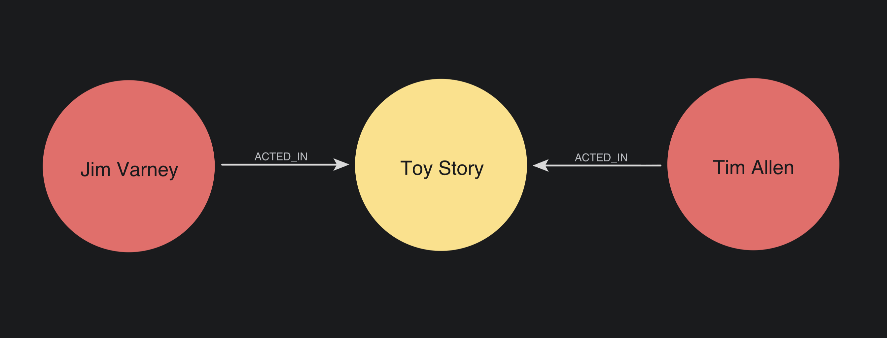
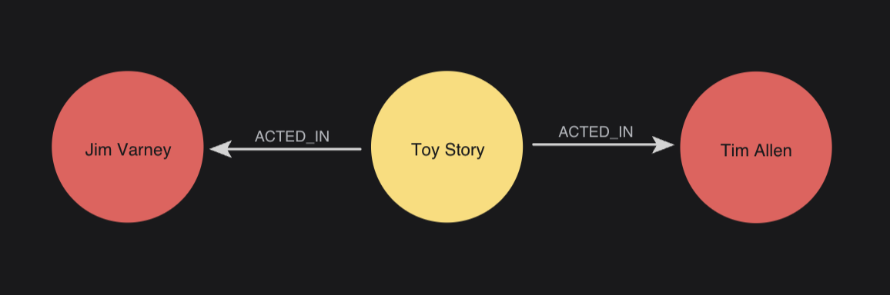
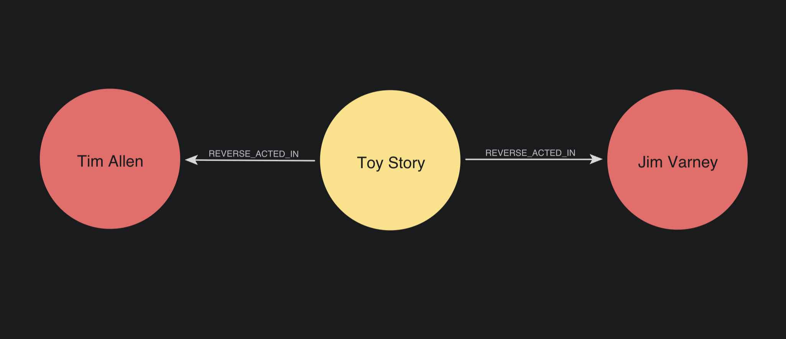
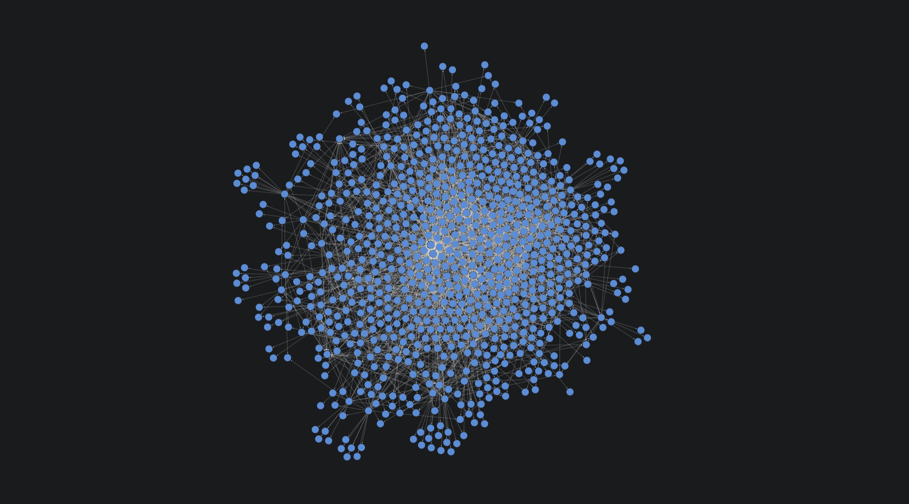
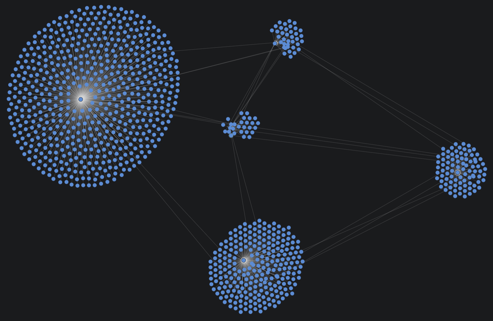
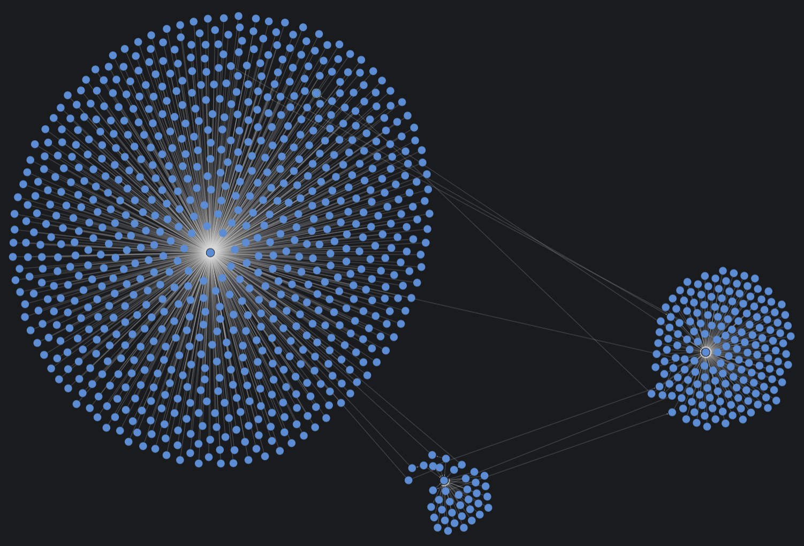
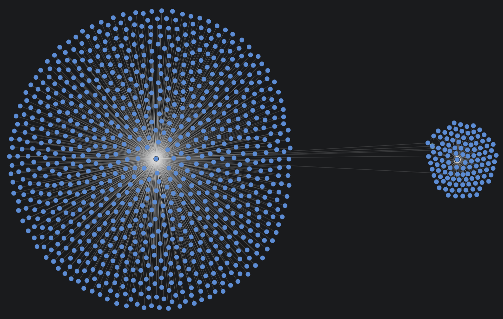

= Running algorithms
:type: lesson
:order: 6

[.transcript]
== Introduction

You've learned about execution modes and configuration. Now it's time to practice running algorithms with different configurations and see how those changes affect results.

In this lesson, you'll run degree centrality, PageRank and Louvain community detection on the actor collaboration network, experimenting with algorithm-specific configurations.

By the end of this lesson, you will understand:

* How to run algorithms on a directed graph
* How to interpret results from a directed graph
* How algorithm configuration affects results

== Setup: Create the Actor Network

First, check if the 'actor-network' graph exists and drop it if it does:

[source,cypher,role=noplay]
.Drop actor-network if it exists (replace ????)
----
CALL gds.????.????(????) // <1>
YIELD graphName // <2>
RETURN graphName // <3>
----

[TIP]
.Query breakdown
====
1. Call the graph drop procedure with error suppression (fill in procedure and parameters)
2. Yield the graph name
3. Return the graph name
====

Now, let's create a fresh actor collaboration projection in which `Actor` nodes who appeared in the same movies connect directly to each other:

[source,cypher,role=noplay]
.Project actor collaboration network (replace ????)
----
MATCH ???? // <1>
????( // <2>
  'actor-network', // <3>
  source, // <4>
  target, // <5>
  {},
  {}
) ???? // <6>
RETURN g.graphName, g.nodeCount, g.relationshipCount // <7>
----

[TIP]
.Projection breakdown
====
1. Match Actor nodes connected through Movie nodes (fill in pattern)
2. Call the GDS projection function (fill in function name)
3. Name the projection 'actor-network'
4. Include source nodes
5. Include target nodes
6. Alias the projection result (fill in alias)
7. Return projection statistics
====

This creates a directed graph of actors connected through shared movies. Every actor who appeared in a movie receives a relationship from every other actor who appeared in that movie.

image::images/jim_tim.png[Jim Varney the actor, connected to Tim Allen directly as seen in the Neo4j Browser.]

Now let's create a second directed projection of actors to movies. Note, the actor names are included for illustrative purposes only -- GDS does not actually see them.

[source,cypher]
.Project Actor-Movie network
----
MATCH (source:Actor)-[:ACTED_IN]->(target:Movie) // <1>
WITH gds.graph.project( // <2>
  'actor-movie-network', // <3>
  source, // <4>
  target, // <5>
  {}
) AS g
RETURN g.graphName, g.relationshipCount, g.nodeCount // <6>
----

[TIP]
.Projection breakdown
====
1. Match Actor nodes connected to Movie nodes via ACTED_IN relationships
2. Call the GDS projection function
3. Name the projection 'actor-movie-network'
4. Include source (Actor) nodes
5. Include target (Movie) nodes
6. Return projection statistics
====

This creates a graph of `Actor` nodes connected to the `Movie` nodes in which they appeared.

In theory, one might expect these to return similar results -- but let's run some experiments to find out what really happens.

== Degree centrality: default configuration

By now, you're familiar with degree centrality. It counts how many outgoing relationships each node has.

Let's run it in `stream` mode on our `'actor-network'` graph with default settings:

[source,cypher,role=noplay]
.Stream degree centrality (replace ????)
----
CALL gds.degree.????('actor-network', {}) // <1>
YIELD nodeId, score // <2>
RETURN gds.util.asNode(????).name AS actor, score AS degree // <3>
ORDER BY degree DESC // <4>
LIMIT 10 // <5>
----

[TIP]
.Algorithm breakdown
====
1. Call degree centrality in stream mode with default configuration
2. Yield node IDs and degree scores
3. Convert node IDs to names (fill in nodeId parameter)
4. Sort by degree in descending order
5. Limit to top 10 results
====

Since relationships are directed, this counts **outgoing** relationships—how many other actors each actor is connected to.

In our current graph, actor collaborations are symmetrical; two actors who appeared in the same movie will each receive a relationship from the other.

You can reconfigure degree centrality to count relationships in the opposite direction.

Complete the query below and run it to see what happens:

[source,cypher,role=noplay]
.Degree centrality with reversed orientation (replace ????)
----
???? gds.????.stream('????', { // <1>
  orientation: 'REVERSE' // <2>
})
YIELD nodeId, score // <3>
RETURN gds.util.asNode(nodeId).name AS actor, score AS degree // <4>
ORDER BY degree DESC // <5>
LIMIT 10 // <6>
----

[TIP]
.Algorithm breakdown
====
1. Call degree centrality in stream mode (fill in the procedure call and graph name)
2. Configure orientation to count incoming relationships
3. Yield node IDs and degree scores
4. Convert node IDs to actor names and return with degree
5. Sort by degree in descending order
6. Limit to top 10 results
====

This counts **incoming** relationships instead. However, our graph is completely symmetrical -- every actor is connected to their collaborators in both directions -- so the results remain the same.

However, let's now rerun degree centrality on our `Actor` -> `Movie` graph.

[source,cypher]
.Degree centrality on Actor-Movie network
----
???? ???.?????.?????('actor-movie-network', {}) // <1>
YIELD ??????, score // <2>
RETURN gds.util.asNode(??????).name AS actor, score AS degree // <3>
ORDER BY degree DESC // <4>
LIMIT 10 // <5>
----

[TIP]
.Algorithm breakdown
====
1. Call degree centrality in stream mode on 'actor-movie-network'
2. Yield node IDs and degree scores
3. Convert node IDs to names and return with degree
4. Sort by degree in descending order
5. Limit to top 10 results
====

Running this should return a table that looks much like the two previous tables. Robert De Niro still has the most movies, so he is still number 1. 

However, now run it again, reversing the orientation, as before. 

[source,cypher]
.Degree centrality with reversed orientation on Actor-Movie network
----
CALL gds.degree.stream('actor-movie-network', { // <1>
  orientation: 'REVERSE' // <2>
})
YIELD nodeId, score // <3>
RETURN gds.util.asNode(nodeId).name AS actor, score AS degree // <4>
ORDER BY degree DESC // <5>
LIMIT 10 // <6>
----

[TIP]
.Algorithm breakdown
====
1. Call degree centrality in stream mode on 'actor-movie-network'
2. Configure orientation to count incoming relationships
3. Yield node IDs and degree scores
4. Convert node IDs to names and return with degree
5. Sort by degree in descending order
6. Limit to top 10 results
====

The command returns a table that looks like this:

[options="header"]
|===
| actor | degree
| null | 4.0
| null | 4.0
| null | 4.0
| null | 4.0
| null | 4.0
| null | 4.0
| null | 4.0
| null | 4.0
| null | 4.0
| null | 4.0
|===

This has happened because the algorithm is now reversing the relationships. Remember, the bipartite graph looks like this:

However, when we reversed the relationships, the algorithm interpreted it as this:

With reversed relationships, PageRank now calculates the out-degree of Movie nodes instead, and so they receive the rank instead of the actors.

In the algorithm run, we specified:

`RETURN gds.util.asNode(nodeId).name AS actor`

However, we should have written:

`RETURN gds.util.asNode(nodeId).title AS movie`

Run it again now, with the correct node property:

[source,cypher]
.Degree centrality with reversed orientation on Actor-Movie network
----
CALL gds.degree.stream('actor-movie-network', { // <1>
  orientation: 'REVERSE' // <2>
})
YIELD nodeId, score // <3>
RETURN gds.util.asNode(nodeId).title AS movie, score AS degree // <4>
ORDER BY degree DESC // <5>
LIMIT 10 // <6>
----

You should have received a table that looks like this:

[options="header"]
|===
| movie | degree
| "Sabrina" | 4.0
| "Sudden Death" | 4.0
| "Waiting to Exhale" | 4.0
| "Heat" | 4.0
| "Tom and Huck" | 4.0
| "Jumanji" | 4.0
| "Toy Story" | 4.0
| "Grumpier Old Men" | 4.0
| "Father of the Bride Part II" | 4.0
| "GoldenEye" | 4.0
|===

This exercise illustrates __how__ the projection influences what we can gain from the algorithm. 

When you reversed the relationships on the `'actor-network'` projection, it went from this:

image::images/jim_tim.png[Jim Varney the actor, connected to Tim Allen directly as seen in the Neo4j Browser.]

To this:

image::images/jim_tim.png[Jim Varney the actor, connected to Tim Allen directly as seen in the Neo4j Browser.]

There was fundamentally no change between them because both relationships were reversed.

However, when you reversed the relationships on the `'actor-movie-network'` graph, it went from this:

To this:

Think about what degree centrality is actually doing here. It's counting **outgoing** relationships to define 'centrality'. So, when we change the direction, it is no longer determining the centrality of `Actor` nodes. It is determining the centrality of `Movie` nodes.

In this graph, all movies have a maximum cast of 4 members. So, when we use 'number of `ACTED_IN` relationships' as the metric, we receive a slew of top results, all with a score of 4.

The behavior of the algorithm is determined by the projection's data model and the direction of its relationships.

Let's test another configuration behavior with Louvain.

== Louvain: Default configuration

Louvain detects communities by grouping nodes that are more densely connected to each other than to the rest of the network.

It does this by progressively lumping densely connected nodes together into hierarchical clusters.

For example, if you were to imagine what Louvain was doing, it might look something like this:

**Level 1:** No clustering

**Level 2:** Identifies natural clusters

**Level 3:** Tries to make each cluster __more__ internally connected

**Level 4:** Clusters can no longer be any more internally connected than they currently are

It doesn't actually create these clusters with relationships, and it doesn't literally move nodes around -- it simply assigns them a `communityId` value.

The `communityId` value represents what clusters nodes would belong to if we hypothetically were to cluster them together. For example, in the images above, we created a 'Hub' node for each `communityId`. 

We then connected nodes with that `communityId` to their relevant hubs to simulate what Louvain is seeing.

To see this in action, let's run Louvain in `stream` mode with default settings:

[source,cypher]
.Stream Louvain communities by size
----
CALL gds.louvain.stream('actor-network', {}) // <1>
YIELD nodeId, communityId // <2>
WITH communityId, count(*) AS numActors // <3>
RETURN communityId, numActors // <4>
ORDER BY numActors DESC // <5>
LIMIT 10 // <6>
----

[TIP]
.Algorithm breakdown
====
1. Call Louvain algorithm in stream mode with default settings
2. Yield node IDs and their community assignments
3. Group by community and count members
4. Return community ID and size
5. Sort by size in descending order
6. Limit to top 10 communities
====

This shows the top 10 communities by size. Notice how many actors are in each community.

You will likely notice a clearly falling scale from the most populated network to the least populated.

=== Louvain: Analyzing default results

Let's see some actual actors in the largest community:

[source,cypher]
.View sample actors from largest community
----
CALL gds.louvain.stream('actor-network', {}) // <1>
YIELD nodeId, communityId // <2>
WITH communityId, COLLECT(gds.util.asNode(nodeId).name) AS actors, COUNT(*) AS size // <3>
ORDER BY size DESC // <4>
LIMIT 1 // <5>
RETURN communityId, size, actors[0..20] AS sampleActors // <6>
----

[TIP]
.Algorithm breakdown
====
1. Call Louvain algorithm in stream mode with default settings
2. Yield node IDs and their community assignments
3. Group by community, collect actor names, and count members
4. Sort by size in descending order
5. Limit to the largest community only
6. Return community ID, size, and first 10 actor names as sample
====

These actors likely work in similar circles, even if not together. You will also notice some more famous names here.

However, the power of Louvain -- and graph -- is that no two actors need to have worked directly with one another to be included in the same group.

Imagine that two actors had never met, but through a two-hop relationship, they are both connected to the same densely connected group of actors. They may be considered part of the same group if:

- They are more densely connected to other actors in this group than any other
- Moving them from any other group to this group does not decrease the overall average density of all clusters in the graph

For example, you likely got 'Tim Allen' and 'Al Pacino' in your top results. But they have never starred in a movie together.

These are not two actors that you would think of putting together. Yet, when we check the full IMDb graph, we see that they are far more connected than one might initially presume.

image::images/tim_al.png[Tim Allen and Al Pacino connected to each other through multiple actors.]

== Louvain: Custom Configuration

Louvain has several configuration options. Let's experiment with `maxLevels`.

By default, Louvain runs with 10 levels. That means that it will attempt to create more modular -- and usually larger -- clusters up to ten times.

Run the queries below, in sequence, to see what happens when we run Louvain at different `maxLevels` settings:

[source,cypher]
.Louvain with maxLevels: 1
----
CALL gds.louvain.stats('actor-network', { // <1>
  maxLevels: 1 // <2>
})
YIELD communityCount, modularity, ranLevels // <3>
RETURN communityCount, modularity, ranLevels // <4>
----

[TIP]
.Algorithm breakdown
====
1. Call Louvain in stats mode on 'actor-network'
2. Set maximum hierarchy levels to 1
3. Yield community statistics
4. Return community count, modularity, and levels run
====

Note the communityCount and try with 2 levels:

[source,cypher]
.Louvain with maxLevels: 2
----
CALL gds.louvain.stats('actor-network', { // <1>
  maxLevels: 2 // <2>
})
YIELD communityCount, modularity, ranLevels // <3>
RETURN communityCount, modularity, ranLevels // <4>
----

[TIP]
.Algorithm breakdown
====
1. Call Louvain in stats mode on 'actor-network'
2. Set maximum hierarchy levels to 2
3. Yield community statistics
4. Return community count, modularity, and levels run
====

Notice here how the communityCount drops significantly. This happens because Louvain has found that these smaller communities are more interconnected togther than they are apart.

Try again with `maxLevels` 20. Replace the `????` with the correct values and run the algorithm:

[source,cypher,role=noplay]
.Louvain with maxLevels: 20 (replace ????)
----
CALL gds.louvain.stats('actor-network', { // <1>
???? // <2>
})
YIELD communityCount, modularity, ranLevels // <3>
RETURN communityCount, modularity, ranLevels // <4>
----

[TIP]
.Algorithm breakdown
====
1. Call Louvain in stats mode on 'actor-network'
2. Set maximum hierarchy levels configuration (fill in maxLevels: 20)
3. Yield community statistics
4. Return community count, modularity, and levels run
====

Even though we told Louvain to try 20 levels, it has stopped after only 4. That happens because the communities have 'converged'. 

In other words, the connections within each community are not going to become any more dense through further iterations -- so the algorithm stops.

There are many other configuration settings to play around with. You can review these on the link:https://neo4j.com/docs/graph-data-science/current/algorithms/louvain/[Louvain docs]. 

== What's next

You've practiced running degree centrality and Louvain with different configurations on a directed graph. You've seen how algorithm parameters affect results.

In the next lesson, you'll learn how projection configuration affects algorithm behavior—specifically, how to change relationships to undirected and run PageRank and Leiden.

Before you continue, play around with the algorithm configurations in the sandbox or your own environment if you set one up.

[.quiz]
== Check your understanding

include::questions/1-degree-orientation.adoc[leveloffset=+1]

[.summary]
== Summary

Degree centrality counts relationships. You can configure orientation to count outgoing, incoming, or total connections.

Louvain detects communities through hierarchical clustering. Configuration options like `maxLevels` control the granularity of community detection. Use stats mode to test different configurations and find the right balance for your analysis.

