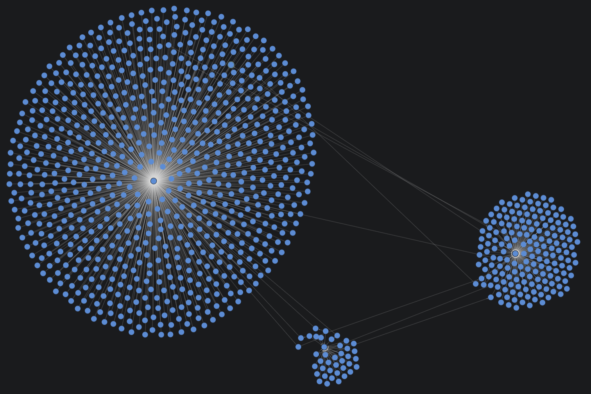
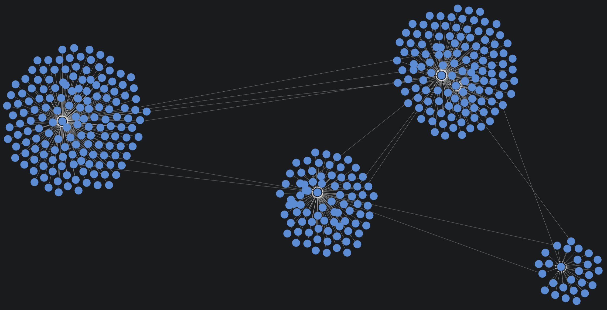

= Configuring projections with unweighted relationships
:type: lesson
:order: 8

[.transcript]
== Introduction

So far, you've treated all relationships equally. But what if some connections are stronger than others?

In this lesson, you'll create a user-movie bipartite network using rating data and run Leiden community detection with and without relationship weights.

By the end of this lesson, you will understand:

* How to project relationship properties as weights
* How Leiden behaves with and without weights
* How weights affect community detection
* When weighted projections are useful

== Why Relationship Weights Matter

Not all connections are equal. In a user-movie rating network:

- Users who rate movies highly have a stronger connection to those movies
- Users who rate movies poorly have a weaker connection

Rating scores provide natural relationship weights. When an algorithm like Leiden community detection uses these weights, it can detect communities of users who not only watched the same movies, but those who felt similarly about them.

== Create Two Projections: Unweighted and Weighted

Let's create a user-movie bipartite graph based on rating data. We'll create two versions—one without weights and one with rating scores as weights.

First, drop any existing graphs using `gds.graph.drop` in the sandbox.

Create an **unweighted** user-movie projection called `'user-movie-unweighted'`:

- Project User and Movie nodes with RATED relationships
- Make relationships **undirected** (Leiden requires this)
- No relationship properties needed

Hint: For undirected relationships, place `undirectedRelationshipTypes: ['*]` inside the second set of curly brackets.

=== Solution

[%collapsible]
====
[source,cypher]
.Solution: Create unweighted User-Movie projection
----
MATCH (source:User)-[r:RATED]->(target:Movie) // <1>
WITH gds.graph.project( // <2>
  'user-movie-unweighted', // <3>
  source, // <4>
  target, // <5>
  {}, // <6>
  {
    undirectedRelationshipTypes: ['*'] // <7>
  }
) AS g
RETURN g.graphName, g.nodeCount, g.relationshipCount // <8>
----

1. Match User nodes connected to Movie nodes via RATED relationships
2. Call the GDS projection function
3. Name the projection 'user-movie-unweighted'
4. Include source (User) nodes
5. Include target (Movie) nodes
6. First configuration map (empty - no relationship properties)
7. Configure all relationships as undirected
8. Return projection statistics

This projection treats all ratings equally—it doesn't matter whether a user gave a movie 5 stars or 1 star.
====

Now let's create a **weighted** version called `'user-movie-weighted'`:

- Same User-Movie pattern
- Make relationships **undirected**
- Add the `rating` property as a relationship weight using this syntax:

`relationshipProperties: r { .rating }`

[source,cypher]
.Create weighted User-Movie projection
----
MATCH (source:User)-[r:RATED]->(target:Movie) // <1>
WITH gds.graph.project( // <2>
  'user-movie-weighted', // <3>
  source, // <4>
  target, // <5>
  {
    relationshipProperties: r { .rating } // <6>
  },
  {
    undirectedRelationshipTypes: ['*'] // <7>
  }
) AS g
RETURN g.graphName, g.nodeCount, g.relationshipCount // <8>
----

1. Match User nodes connected to Movie nodes via RATED relationships
2. Call the GDS projection function
3. Name the projection 'user-movie-weighted'
4. Include source (User) nodes
5. Include target (Movie) nodes
6. Store the rating property as relationship weight
7. Configure all relationships as undirected
8. Return projection statistics

The key difference: `relationshipProperties: r { .rating }` stores the rating score (1-5) as a relationship weight.

Both projections are undirected, meaning Leiden can traverse relationships in either direction.

== Leiden: Comparing Unweighted vs Weighted

Leiden detects communities by finding groups of nodes more densely connected to each other than to the rest of the network.

It is similar to Louvain. However, whereas Louvain tends to create giant components like this:

Leiden excels at breaking those larger components down into smaller, more granular cluster like this:

Let's run Leiden on both projections using `stats` mode to compare the community structures.

First, on the **unweighted** graph:

[source,cypher]
.Leiden stats on unweighted graph
----
CALL gds.leiden.stats('user-movie-unweighted', {}) // <1>
YIELD communityCount, modularity, modularities // <2>
RETURN communityCount, modularity, modularities // <3>
----

1. Call Leiden in stats mode on unweighted graph
2. Yield community statistics
3. Return community count, final modularity, and level-by-level modularities

Now on the **weighted** graph:

[source,cypher]
.Leiden stats on weighted graph
----
CALL gds.leiden.stats('user-movie-weighted', { // <1>
  relationshipWeightProperty: 'rating' // <2>
})
YIELD communityCount, modularity, modularities // <3>
RETURN communityCount, modularity, modularities // <4>
----

1. Call Leiden in stats mode on weighted graph
2. Configure to use the 'rating' property as relationship weights
3. Yield community statistics
4. Return community count, final modularity, and level-by-level modularities

**Understanding the stats output:**

The `stats` mode gives us summary statistics about the community structure:

- **`communityCount`**: Total number of communities detected
- **`modularity`**: Quality score for the final community structure (higher = better separation)
- **`modularities`**: Quality scores at each level of the hierarchical clustering

**Comparing the results:**

Your unweighted graph likely returned with:

* **Lower modularity:** indicating lower-quality communities
* **Higher community count:** indicating greater difficulty in identifying distinct communities. 

This groups users and movies based on rating strength—higher ratings create stronger connections.

Compare the community counts. The weighted version often produces more nuanced communities because it considers how much users liked movies, not just that they watched them.

== Understanding Weighted Communities

Let's examine what's actually in these communities. First, the **unweighted** version:

[source,cypher]
.Examine communities in unweighted graph
----
CALL gds.leiden.stream('user-movie-unweighted', {}) // <1>
YIELD nodeId, communityId // <2>
WITH communityId, COLLECT(CASE WHEN 'User' IN labels(gds.util.asNode(nodeId)) THEN gds.util.asNode(nodeId).name END) AS users, COLLECT(CASE WHEN 'Movie' IN labels(gds.util.asNode(nodeId)) THEN gds.util.asNode(nodeId).title END) AS movies // <3>
WHERE size(users) > 0 AND size(movies) > 0 // <4>
RETURN communityId, size(users) AS userCount, size(movies) AS movieCount, users[0..3] AS sampleUsers, movies[0..3] AS sampleMovies // <5>
ORDER BY userCount + movieCount DESC // <6>
LIMIT 5 // <7>
----

1. Call Leiden in stream mode on unweighted graph
2. Yield node IDs and community assignments
3. Collect user names and movie titles separately by checking node labels
4. Filter to communities containing both users and movies
5. Return community details with sample members
6. Sort by total community size
7. Limit to top 5 largest communities

These communities group users who rated similar movies—regardless of whether they loved or hated them.

Now the **weighted** version:

[source,cypher]
.Examine communities in weighted graph
----
CALL gds.leiden.stream('user-movie-weighted', { // <1>
  relationshipWeightProperty: 'rating' // <2>
})
YIELD nodeId, communityId // <3>
WITH communityId, COLLECT(CASE WHEN 'User' IN labels(gds.util.asNode(nodeId)) THEN gds.util.asNode(nodeId).name END) AS users, COLLECT(CASE WHEN 'Movie' IN labels(gds.util.asNode(nodeId)) THEN gds.util.asNode(nodeId).title END) AS movies // <4>
WHERE size(users) > 0 AND size(movies) > 0 // <5>
RETURN communityId, size(users) AS userCount, size(movies) AS movieCount, users[0..3] AS sampleUsers, movies[0..3] AS sampleMovies // <6>
ORDER BY userCount + movieCount DESC // <7>
LIMIT 5 // <8>
----

1. Call Leiden in stream mode on weighted graph
2. Configure to use the 'rating' property as relationship weights
3. Yield node IDs and community assignments
4. Collect user names and movie titles separately by checking node labels
5. Filter to communities containing both users and movies
6. Return community details with sample members
7. Sort by total community size
8. Limit to top 5 largest communities

These communities group users who gave similar ratings to similar movies—they not only watched the same things, but felt similarly about them.

Scroll through the communities and compare the outputs from both. Certain anomalous movies from the unweighted graph, have likely been replaced by more appropriate movies in weighted version.

== When to Use Weighted Relationships

**Use relationship weights when:**

- Connections have varying strength or sentiment
- You want algorithms to prioritize stronger connections
- Your domain has meaningful numeric relationship properties

**Examples of useful weights in different domains:**

- **Recommendation systems**: Rating scores (user preferences)
- **Collaboration networks**: Number of joint projects (collaboration frequency)
- **Financial networks**: Transaction amounts (connection strength)
- **Routing/Logistics**: Distance or travel time (connection cost)
- **Communication networks**: Message frequency or duration (interaction strength)

Weights transform your analysis from "what's connected" to "how strongly it's connected."

== What's next

You've seen how relationship orientation and weights affect algorithm results. 

In the next lesson, you'll put this knowledge to the test with a challenge: projecting a weighted graph and analyzing it using Label Propagation, a community detection algorithm you'll explore through the GDS documentation.

[.quiz]
== Check your understanding

include::questions/1-weights-affect-communities.adoc[leveloffset=+1]

[.summary]
== Summary

Relationship weights capture connection strength or sentiment. Leiden community detection uses weights via the `relationshipWeightProperty` configuration to produce more nuanced communities.

Weighted community detection groups nodes by connection strength, not just connection presence. For user-movie ratings, this means grouping by taste (who liked what) rather than just viewing history (who watched what).

