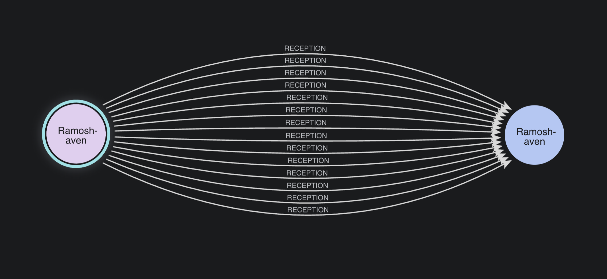
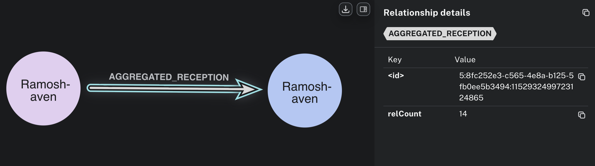
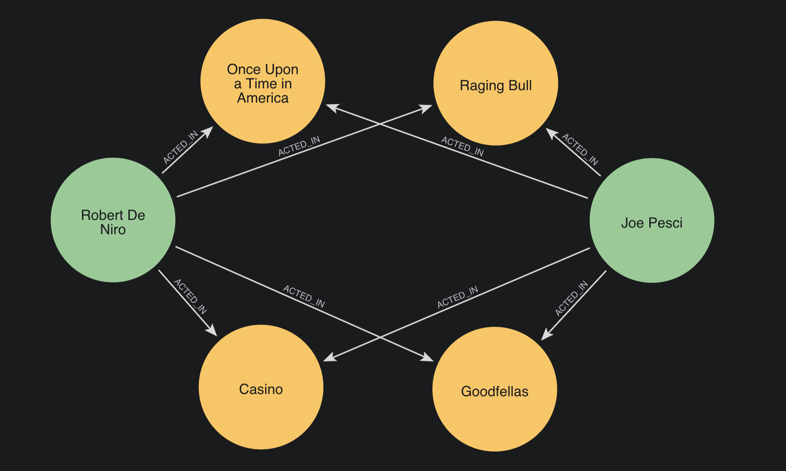
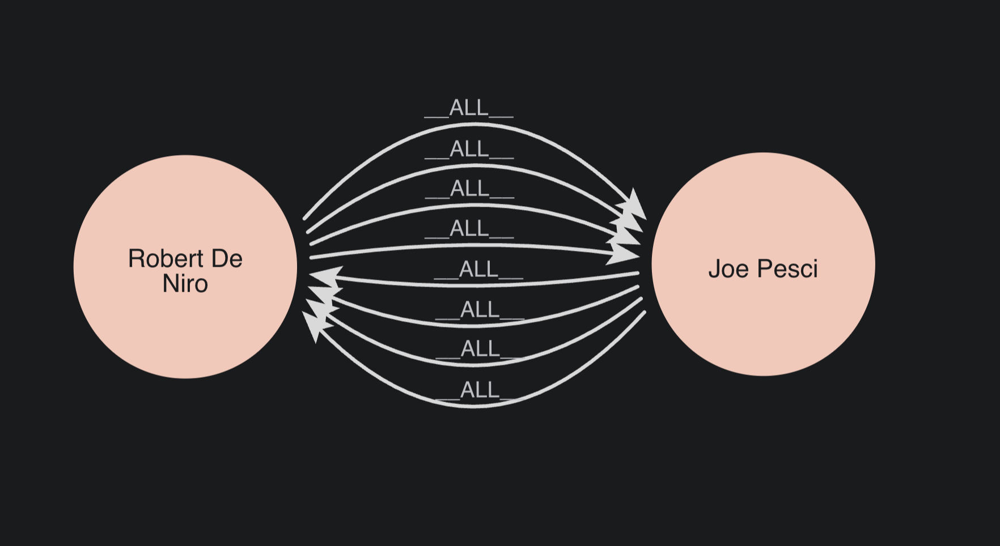
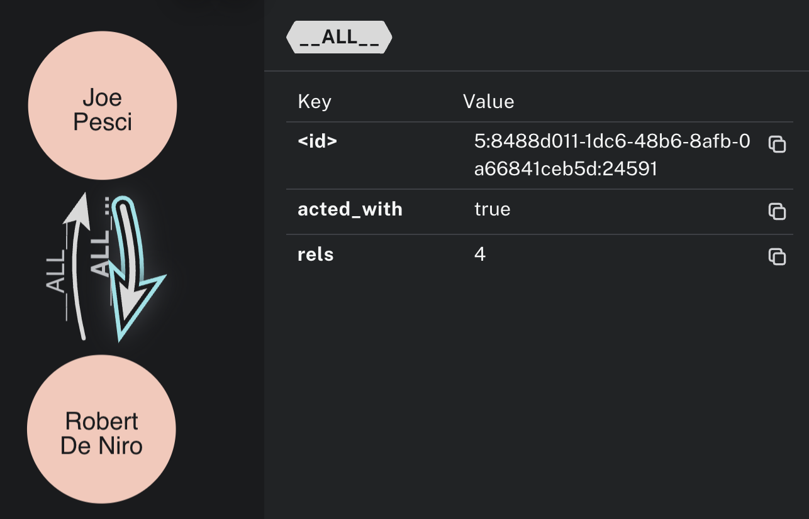

= Understand relationship aggregation
:type: lesson
:order: 1

[.transcript]
== Introduction

You've learned how to use existing relationship properties as weights in your projections. You have also learned how to project undirected relationships.

But what if you need to **create** weights by combining multiple relationships?

In this lesson, you'll learn about relationship aggregation—a technique for collapsing multiple parallel relationships into a single weighted relationship during projection.

By the end of this lesson, you will understand:

* What relationship aggregation is and why it's useful
* How aggregation functions work in Cypher projections
* When to use aggregation vs. existing properties
* How aggregation affects graph size and algorithm performance

== What is Relationship Aggregation?

**Relationship aggregation** combines multiple relationships between the same pair of nodes into a single relationship with a single weight to represent all of them.

This is useful for a number of use-cases, not least:

**Example 1**: In a graph tracking logistics operations, you may create a new relationship for every shipment between two locations.

Instead of projecting __all__ of these relationships separately, you can aggregate them to a single `relType` with a weight to represent the number of relationships in the original graph.

**Example 2**: Throughout this course, you have been using a collaboration network of actor to actor relationships, turning this:

image::images/actor_movie_actor.png[An Actor node connects to a Movie node, which in turn connects to another actor node.]

Into this:

image::images/actor_actor.png[An actor node connects to another actor node through an __ALL__ relationship.]

However, the connections made, are often not so simple as that. Consider for example, Robert De Niro and Joe Pesci.

When you create your projection, De Niro and Pesci will not be connected by a single, bidirectional relationship:

Two actors who worked together on four different movies would have four bidirectional relationships in your projection, adding up to eight in total. 

During projection, you can aggregate these into a single weighted relationship where the weight represents the collaboration count.

**Why this matters**:

- Reduces graph size (fewer relationships = faster algorithms)
- Captures relationship strength (frequency, intensity, cumulative value)
- Enables statistical summaries (average, sum, min, max)

== Aggregation vs. Existing Properties

Take a look at your existing property projection from lesson 8. 

[source,cypher]
.Projection with existing property as weight
----
MATCH (source:User)-[r:RATED]->(target:Movie)
WITH gds.graph.project(
  'user-movie',
  source, 
  target,
  {
    relationshipProperties: r { .rating }
  },
  {}
) AS g
RETURN g.graphName, g.relationshipCount
----

This projects one relationship per rating, using the existing `rating` property as the weight.

Now take a look at the projection you have been using to create your `'actor-network'` projection:

[source,cypher]
.Projection without aggregation (multiple parallel relationships)
----
MATCH (source:Actor)-[:ACTED_IN]->
  (:Movie)
    <-[:ACTED_IN]-(target:Actor)
WITH gds.graph.project(
  'actor-network',
  source, 
  target,
  {},
  {
    undirectedRelationshipTypes: ['*'] //Optional
  }
) AS g
RETURN g.graphName, g.relationshipCount
----

This query from earlier lessons has been allowing multiple relationships between two nodes.

Run it now, and check the number of relationships produced.

To create an aggregated version of it, we simply run the following modified version:

[source,cypher]
.Projection with relationship aggregation
----
MATCH (source:Actor)-[r:ACTED_IN]->
  (:Movie)
    <-[:ACTED_IN]-(target:Actor)
WITH source, target, count(r) AS numberOfRels
WITH gds.graph.project(
  'actor-network-aggregated',
  source, 
  target,
  {
    relationshipProperties: {rels: numberOfRels}
  },
  {
    undirectedRelationshipTypes: ['*'] //Optional
  }
) AS g
RETURN g.graphName AS graphName, g.relationshipCount
----

This projects one bidirectional relationship per actor pair, creating a weight from the count of duplicate relationships that were removed.

The key change is the `count(r) AS numberOfRels` aggregator at the top. When we add that to the Cypher statement, and include `numberOfRels` in `relationshipProperties:` it will automatically reduce parallel relationships to singletons.

Compare the relationship outputs from both, and you'll see that the aggregator version has reduced the overall rel count.

== How aggregation works

The key is using aggregation functions in a `WITH` clause **before** calling `gds.graph.project()`.

**Step 1**: Match the pattern that creates parallel relationships

[source,cypher,role=nocopy noplay]
.Step 1: Match the pattern
----
MATCH (source:Actor)-[r:ACTED_IN]->(:Movie)<-[:ACTED_IN]-(target:Actor)
----

This finds all actor pairs who worked on movies together. For a source and target who worked on 4 movies together, this pattern matches 4 times.

**Step 2**: Aggregate with a function

[source,cypher,role=nocopy noplay]
.Step 2: Aggregate the relationships
----
WITH source, target, count(r) AS numberOfRels
----

The `count(r)` function collapses those 4 matches into a single row with `collaborations = 4`.

**Step 3**: Project with the aggregated value

[source,cypher,role=nocopy noplay]
.Step 3: Project with the aggregated value
----
WITH gds.graph.project(
  'actor-network-aggregated',
  source, target,
  {
    relationshipProperties: {rels: numberOfRels}
  },
  {
    undirectedRelationshipTypes: ['*']
  }
) AS g
RETURN g.graphName, g.relationshipCount
----

The projection creates one relationship from source to target with `rels: 4`.

== When to Use Relationship Aggregation

**Use aggregated projections when:**

- Multiple relationships exist between the same node pairs (e.g., actors who worked on multiple movies together)
- You want to represent the frequency or count of connections as a weight
- You need to reduce graph size for performance

**Use non-aggregated projections when:**

- Each relationship between nodes is already unique
- You don't need to count or combine multiple relationships
- You're working with existing relationship properties (like `rating` or `imdbRating`)

**Example**: Robert De Niro and Joe Pesci worked on 4 movies together. Without aggregation, you'd have 4 separate relationships in your projection. With aggregation, you have 1 relationship with `rels: 4`.

[.quiz]
== Check your understanding

include::questions/1-what-aggregation-does.adoc[leveloffset=+1]

[.summary]
== Summary

Relationship aggregation collapses multiple parallel relationships into a single weighted relationship during projection. This reduces graph size and captures relationship frequency.

Use `count(r)` in a `WITH` clause before `gds.graph.project()` to count relationships between node pairs. The pattern is: match relationships, aggregate with `WITH source, target, count(r) AS numberOfRels`, then project with the count as a weight property.

Aggregation improves algorithm performance by reducing the number of relationships while preserving connection frequency information.

You now understand the concept of relationship aggregation and when to use it. You've seen how `count(r)` works in Cypher projections to collapse parallel relationships into single weighted relationships. In the next lesson, you'll practice aggregating relationships hands-on, building projections that count relationships between actors, directors, and other entities.

