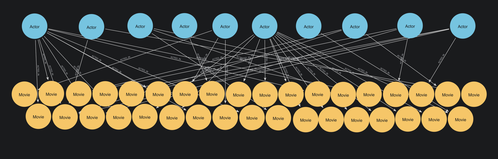
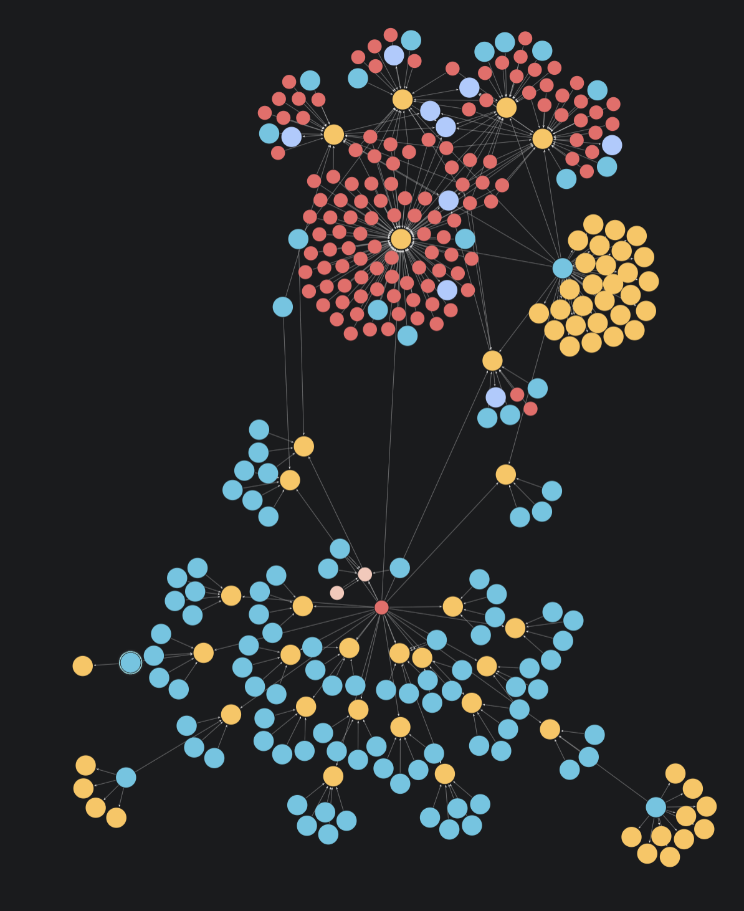
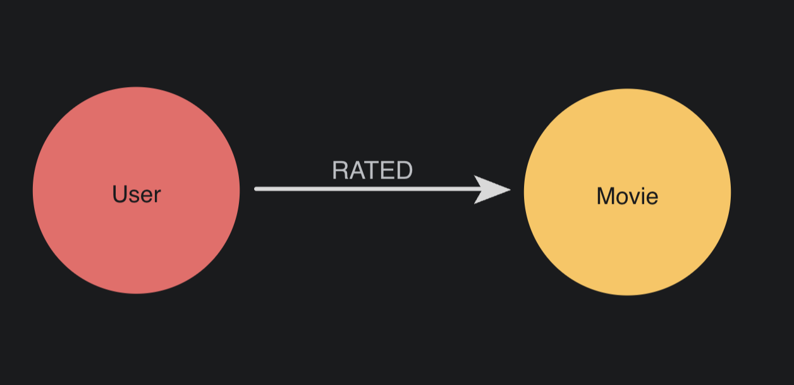
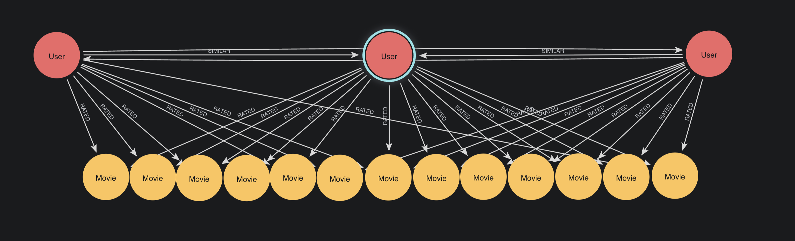

= Projecting bipartite and multipartite graphs
:type: lesson
:order: 6

[.transcript]
== Introduction

You've learned that GDS creates monopartite projections by default, treating all nodes as a single type regardless of their original labels.

But what if you need to preserve the distinction between node types? What if it matters that some nodes are Actors and others are Movies?

In this lesson, you'll learn about **bipartite** and **multipartite graphs**—graphs with two or more distinct node types—and how to create projections that preserve these distinctions in GDS.

By the end of this lesson, you will understand:

* What bipartite and multipartite graphs are
* The difference between multipartite and heterogeneous graphs
* Why preserving node labels matters for certain analyses
* How to configure projections to preserve multiple node types in GDS

== What is a bipartite graph?

A bipartite graph has **two distinct types** of nodes, with relationships only connecting nodes of different types—never nodes of the same type.

Think of it as a graph "of two parts."

Example: Customers purchasing products:

* `(:Customer)-[:PURCHASED]->(:Product)`
* `(:Customer)-[:PURCHASED]->(:Product)`
* `(:Customer)-[:PURCHASED]->(:Product)`

(No Customer-to-Customer connections)
(No Product-to-Product connections)

In a true bipartite graph:

- Type A nodes connect only to Type B nodes
- Type B nodes connect only to Type A nodes
- No connections exist between nodes of the same type

== What is a multipartite graph?

A multipartite graph contains **three or more distinct node types**.

You could also call this a 'heterogeneous graph' if it has **multiple relationship types** as well. 

In practice:
- **Multipartite** = multiple node types (3+)
- **Heterogeneous** = more than one node type __and/or__ multiple relationship types

Here's an example from the Movies dataset you're experimenting with:

In this image we have the following nodes and relationships:

* `(:Actor)-[:ACTED_IN]->(:Movie)`
* `(:User)-[:RATED]->(:Movie)`
* `(:Movie)-[:IN_GENRE]->(:Genre)`

This graph has four node types (`Actor`, `User`, `Movie`, `Genre`) and three relationship types, making it both multipartite and heterogeneous.

== Understanding what you're actually projecting

Remember when we projected actors and movies?

[source,cypher]
----
MATCH (source:Actor)-[r:ACTED_IN]->(target:Movie)
WITH gds.graph.project(
  'actors-movies', 
  source, 
  target,
  {},
  {}
) AS g
RETURN g.graphName, 
  g.nodeCount, 
  g.relationshipCount
----

Even though this graph is naturally bipartite, GDS sees this projection as a monopartite graph—treating all nodes as a single generic type, ignoring the Actor and Movie labels.

image::images/kevin_and_ryan_nodes_only.png[Two small clusters of nodes, labeled only 'Node' with '__ALL__' relationships. Only one relationship connects them.]

This happens because we have not specified that labels should be preserved. GDS is projecting exactly what we asked for.

For certain algorithms, this doesn't matter. For others, you may actually __want__ to treat different node types as the same.

In most cases, when your data has multiple types, you'll want to re-project a monopartite subgraph. 

However, in some cases, you'll want to preserve those distinctions in your projection.

== Preserving labels in projections

In earlier lessons, you saw the empty configuration settings in graph projection syntax.

To preserve labels, use these configuration parameters:

[source,cypher]
----
MATCH (source:Actor)-[r:ACTED_IN]->(target:Movie)
WITH gds.graph.project(
  'actors-movies-bipartite',
  source,
  target,
  {
    sourceNodeLabels: labels(source), //Preserves source labels
    targetNodeLabels: labels(target), //Preserves target labels
    relationshipType: type(r)         //Preserves rel types
  },
  {}
) AS g
RETURN g.graphName, g.nodeCount, g.relationshipCount
----

**Key configuration parameters:**

* `sourceNodeLabels: labels(source)`: Preserves the label(s) from source nodes
* `targetNodeLabels: labels(target)`: Preserves the label(s) from target nodes
* `relationshipType: type(r)`: Preserves the relationship type

Now GDS creates a properly labeled bipartite graph:

image::images/actor_movie_model.png[An Actor node connects to a Movie node via an ACTED_IN relationship.]

- **Actor nodes** retain their Actor label
- **Movie nodes** retain their Movie label
- **Relationships** retain their types

You do not have to use all three of these settings at any given time -- but there's no harm in doing so.

== Creating multipartite projections

The same configuration works for three or more node types:

[source,cypher]
----
MATCH (source)-[r]->(target)
WHERE source:Actor OR source:Movie OR source:User OR source:Genre
  AND target:Actor OR target:Movie OR target:User OR target:Genre
WITH gds.graph.project(
  'movies-network-multi',
  source,
  target,
  {
    sourceNodeLabels: labels(source),
    targetNodeLabels: labels(target),
    relationshipType: type(r)
  },
  {}
) AS g
RETURN g.graphName, g.nodeCount, g.relationshipCount
----

This preserves all four node types (`Actor`, `Movie`, `User`, `Genre`) and their relationship types in a single projection.

== When label preservation matters

**Use default monopartite** (no label configuration) when:

- All nodes genuinely represent the same entity type
- Node labels don't affect your analysis goals
- You intentionally want to treat different node types as the same

**Preserve labels** (bipartite/multipartite) when:

- You need to distinguish between node types
- You'll filter algorithms by node type (e.g., run only on Actors)

== Algorithm considerations

Not all algorithms work well with multiple node types.

Throughout this course, as you happen across an algorithm, we'll show you how to decide on your projection type, and explain the reasoning.

For now, to illustrate this, let's project our Movies and Users to a graph.

[source,cypher]
----
MATCH (source:User)-[r:RATED]->(target:Movie)
WITH gds.graph.project(
  'user-rated-movie',
  source,
  target,
  {
    sourceNodeLabels: labels(source),
    targetNodeLabels: labels(target),
    relationshipType: type(r)
  },
  {}
) AS g
RETURN g.graphName, g.nodeCount, g.relationshipCount
----

Now, you have projected a graph that really does look like this:

The labels persist, and we can now use them when running an algorithm. 

=== Running node similarity
Node similarity is an algorithm that compares a set of nodes based on the nodes they are connected to. When you run it, it will write new relationships back to the graph.

Two nodes are considered similar if they share many of the same neighbors.

Filtered node similarity is an extension of node similarity which allows you to choose specific node labels to be the source and target of the relationships created.

You can link:https://neo4j.com/docs/graph-data-science/current/algorithms/node-similarity/[learn more about the node similarity algorithm in the GDS docs].

For now, all you need to know is that node similarity works extremely well on bipartite graphs.

Let's run node similarity on our bipartite `user-rated-movie` graph.

NOTE: Here we're using `.write()` mode to persist results to the database. This is different from `.stream()` which only displays results. You'll learn when to use each execution mode in Module 3.

[source,cypher]
----
CALL gds.nodeSimilarity.write(
  'user-rated-movie',
  {
    writeRelationshipType: 'SIMILAR',
    writeProperty: 'score'
  })
YIELD nodesCompared, relationshipsWritten
----

Now, to verify what it has done -- or rather, what it has not done -- run the following query:

[source,cypher]
----
MATCH (u:User)-[r:SIMILAR]->(m:Movie)
RETURN u, r, m
LIMIT 1
----

This query should have returned `no changes, no records`. 

Node similarity only considers nodes to be similar if they have shared neighbors. A `User` node, in our model, is never a direct neighbor with another `User` node, and so a `User` will never be similar to a shared `Movie`.

In a bipartite graph, every node on one side exclusively connects to nodes on the other side of the divide.

image::images/user_movie_bipartite.png[A bipartite graph. A row of User nodes in a top row connect to a row of Movie nodes in a bottom row. No nodes within the same row connect to each other.]

The relationships that we created with the algorithm only exist between nodes **on the same side** of the graph.

Run the following query to see some of your new `SIMILAR` relationships.

[source,cypher]
----
MATCH path = (:User)-[:SIMILAR]->(:User)
  -[:RATED]->(:Movie)-[:SIMILAR]->(m:Movie)
RETURN path
LIMIT 10
----

You should now find that `User` nodes have received SIMILAR relationships to each other, based on their movie rating behaviors.

You could use these newly inferred relationships in multiple ways -- not least as part of a content recommendation system.

== What's next

You now understand bipartite and multipartite graphs—structures with two or more distinct node types. You've learned how to preserve these distinctions using label and relationship configuration settings.

In the next lesson, you'll practice creating projections with multiple node types from the Movies dataset.

[.quiz]
== Check your understanding

include::questions/1-multitype-identification.adoc[leveloffset=+1]

include::questions/2-label-preservation-config.adoc[leveloffset=+1]

[.summary]
== Summary

**Bipartite graphs** have two distinct node types; **multipartite graphs** have three or more. When multiple relationship types are also preserved, these are often called **heterogeneous graphs**.

By default, GDS ignores node labels, creating monopartite projections. To preserve multiple node types, use:

[source,cypher]
----
{
  sourceNodeLabels: labels(source),
  targetNodeLabels: labels(target),
  relationshipType: type(r)
}
----

Label preservation matters when algorithms need to distinguish between node types, when you'll filter by type, or when you're analyzing relationships between different entities. Choose your projection structure based on your analytical goals.

