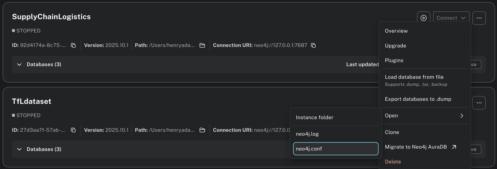

= Understand the five execution modes
:type: lesson
:order: 2

[.transcript]
== Introduction

Throughout Module 2, you've been running GDS algorithms using different operations:

- In the monopartite lessons, you used **stream** mode: `gds.degree.stream()` and `gds.pageRank.stream()` to view results directly in query output
- In the bipartite lessons, you used **write** mode: `gds.nodeSimilarity.write()` to persist SIMILAR relationships back to your database

You might have noticed the pattern: `gds.<algorithm>.<mode>()`.

These `.stream` and `.write` operations are two of **five execution modes** available for every GDS algorithm. Each mode determines where your results go and how you can use them.

In this lesson, you'll learn all five modes and when to use each one.

By the end of this lesson, you will understand:

* The five execution modes available for all GDS algorithms
* What each mode does and where results are stored
* When to choose each mode for your workflow

== Five ways to run algorithms

Every GDS algorithm supports five execution modes. Each serves a different purpose in your workflow:

1. **Stats:** Get summary statistics without viewing individual results
2. **Stream:** View results directly without storing
3. **Mutate:** Store results in the projection
4. **Write:** Persist results to your database
5. **Estimate:** Check memory requirements before running

Let's explore each one.

== Stats: Get Summary Statistics

The **stats** mode runs the algorithm and returns summary statistics without individual node results. This is perfect when you want to understand the overall algorithm outcome without viewing every single result.

Let's run Louvain in stats mode on the actor collaboration network -- without any YIELD or RETURN:

[source,cypher]
----
CALL gds.louvain.stats('actor-network', {})
----

As with other GDS operations, when we run this without a YIELD or RETURN, we get a full read-out of all outputs.

The output shows:

- `modularity`: The final modularity score—a measure of how well-divided the network is into communities (higher is better, range -0.5 to 1.0)
- `modularities`: Modularity scores at each hierarchical level the algorithm went through
- `ranLevels`: How many hierarchical levels Louvain ran (it builds communities of communities)
- `communityCount`: Total number of distinct communities detected in the network
- `communityDistribution`: Statistical summary of community sizes (min, max, mean, p50, p75, p90, p95, p99)
- `preProcessingMillis`: Time spent preparing the data before running the algorithm
- `computeMillis`: Time spent executing the actual Louvain algorithm
- `postProcessingMillis`: Time spent finalizing results after the algorithm completes
- `configuration`: The configuration parameters you provided (or defaults if you didn't specify any)

This tells you about the algorithm's execution and the distribution of results without returning thousands of individual rows.

Statistics from community detection algorithms are particularly important to pay attention to. Later, you'll learn to update algorithm configurations for yourself. 

In its default configuration, Louvain aggregates nodes into new, higher-level communities up to ten times. 

Check the ranLevels column from the previous output. You should see that it ran only 4 out of those possible 10. You should also notice that it identified around 1020 distinct communities.

The version below contains only a small tweak: maxLevels set to 3. This means that it will stop after creating 3 hierarchies.

Run the tweaked version below, and take note of the number of communities found. 

[source,cypher]
----
CALL gds.louvain.stats('actor-network', {
  maxLevels: 3
})
----

This time, your community count should be in a slightly different range to the previous run. This happens because we stopped the algorithm before it converged. In other words, we stopped it from combining too many small groups into one larger one.

The point here is not to remember configuration settings -- you'll learn that later. Instead, you should see the value of testing those configurations with the stats operator __before__ committing to fully running an algorithm.

**Use stats when you want to:**

- Understand overall algorithm behavior
- Test, reconfigure and iterate over an algorithm's configuration

=== Stats for Degree Centrality

Run degree centrality in stats mode to see the distribution of collaboration counts. 

In this case, we __are__ specifying the YIELD and RETURN. Not because we must, but because that's all we want to test.

Complete this query:

[source,cypher]
----
CALL gds.degree.?????('actor-network', {})
YIELD centralityDistribution
RETURN centralityDistribution.min AS minDegree,
  centralityDistribution.max AS maxDegree,
  centralityDistribution.mean AS avgDegree
----

=== Solution

[%collapsible]
====
[source,cypher]
----
CALL gds.degree.stats('actor-network', {})
YIELD centralityDistribution
RETURN centralityDistribution.min AS minDegree,
  centralityDistribution.max AS maxDegree,
  centralityDistribution.mean AS avgDegree
----

The centrality distribution shows you the range and average number of collaborations across all actors.

**Key points:**

- `.stats()` runs the algorithm but only returns summaries
- No individual node results are returned
- Perfect for understanding overall patterns
- Much faster output than streaming all results
====

== Stream: View results without commitment

The **stream** mode returns algorithm results directly in your query output. Results aren't stored anywhere—they exist only for the duration of your query.

This is perfect for exploration. You run the algorithm, see the results, and decide what to do next.

Let's stream PageRank results for the actor collaboration network:

[source,cypher]
----
CALL gds.pageRank.stream('actor-network', {})
YIELD nodeId, score
RETURN gds.util.asNode(nodeId).name AS actorName, score
ORDER BY score DESC
LIMIT 10
----

The output shows each actor's PageRank score. Higher scores mean the actor is more "important" in the collaboration network—they're connected to other well-connected actors.

Notice the pattern: `gds.<algorithm>.stream()` returns results you can immediately use in your query with `RETURN`, `WHERE`, or other Cypher clauses.

**Use stream when you want to:**

- Explore results before deciding whether to store them
- Run one-off analyses
- Feed results directly into other Cypher operations
- Avoid writing data back to your database
- Siphon results off to a csv or pandas dataframe via the Python driver

=== Stream degree centrality

Run degree centrality in stream mode to find the most collaborative actors.

Complete this query:

[source,cypher]
----
CALL gds.degree.?????(?????, {})
YIELD ?????, score
RETURN gds.util.asNode(?????).name AS actorName, score
ORDER BY score DESC
LIMIT 10
----

=== Solution

[%collapsible]
====
[source,cypher]
----
CALL gds.degree.stream('actor-network', {})
YIELD nodeId, score
RETURN gds.util.asNode(nodeId).name AS actorName, score
ORDER BY score DESC
LIMIT 10
----

The degree centrality algorithm scores show how many collaborations each actor has. Unlike PageRank, this is a simple count of direct connections.

**Key points:**

- `.stream()` returns results without storing them
- `YIELD nodeId, score` exposes the algorithm's output
- `gds.util.asNode()` converts nodeId back to the actual node
- Results exist only in this query's output
====

== Mutate: Store in the projection

The **mutate** mode stores algorithm results as properties **in your projection**—not in your Neo4j database.

When you mutate, the results stay in the in-memory graph. You can then run another algorithm that uses those results as input, or write them back to the main graph when ready.

Let's add PageRank scores to our projection:

[source,cypher]
----
CALL gds.pageRank.mutate('actor-network', {
  mutateProperty: 'pageRankScore'
})
YIELD nodePropertiesWritten, mutateMillis
RETURN nodePropertiesWritten, mutateMillis
----

The output tells you:

- `nodePropertiesWritten`: How many node properties were added (should match your node count)
- `mutateMillis`: How long the operation took

Now every node in your `actor-network` projection has a `pageRankScore` property. Other algorithms can use this property, but it **doesn't exist in your database**—only in the projection.

**Use mutate when you want to:**

- Chain algorithms together (one algorithm's output feeds into another)
- Keep your database clean (no intermediate results stored)
- Build complex workflows with multiple algorithm steps
- Generate features to use in a machine learning pipeline

=== Mutate with degree centrality

Complete this query and run it to add degree centrality scores to your projection.

[source,cypher]
----
CALL gds.degree.?????(?????, {
  mutateProperty: '?????'
})
YIELD nodePropertiesWritten
RETURN nodePropertiesWritten
----

=== Solution

[%collapsible]
====
[source,cypher]
----
CALL gds.degree.mutate('actor-network', {
  mutateProperty: 'degreeScore'
})
YIELD nodePropertiesWritten
RETURN nodePropertiesWritten
----

Your projection now has both `pageRankScore` and `degreeScore` properties on each node. These exist in memory and can be used by other algorithms or queries against the projection.

**Key points:**

- `.mutate()` stores results in the projection, not the database
- `mutateProperty` names the new property
- Multiple mutate operations can add multiple properties
- Results are temporary—they disappear when you drop the graph
====

== Write: Persist outputs to your database

The **write** mode stores algorithm results as properties **in your Neo4j database**. This makes results available to applications, visualizations, and future queries, even after you drop the projection.

Let's write PageRank scores to the database:

[source,cypher]
----
CALL gds.pageRank.write('actor-network', {
  writeProperty: 'pageRank'
})
YIELD nodePropertiesWritten, writeMillis
RETURN nodePropertiesWritten, writeMillis
----

The output shows:

- `nodePropertiesWritten`: Number of properties written to the database
- `writeMillis`: Time taken to write

Now you can query those properties directly from your database:

[source,cypher]
----
MATCH (a:Actor)
WHERE a.pageRank IS NOT NULL
RETURN a.name, a.pageRank
ORDER BY a.pageRank DESC
LIMIT 10
----

These PageRank scores now exist in your database as node properties. They'll remain even after you drop the graph projection.

**Use write when you want to:**

- Make results available to applications or dashboards
- Share insights with others querying the database
- Preserve results for long-term use
- Avoid re-running expensive algorithms

=== Write degree centrality

Write degree centrality scores to your database.

Complete this query:

[source,cypher]
----
CALL gds.degree.?????(?????, {
  ?????: 'collaborationCount'
})
YIELD nodePropertiesWritten
RETURN nodePropertiesWritten
----

=== Solution

[%collapsible]
====
[source,cypher]
----
CALL gds.degree.write('actor-network', {
  writeProperty: 'collaborationCount'
})
YIELD nodePropertiesWritten
RETURN nodePropertiesWritten
----

Now query your database to see the results:

[source,cypher]
----
MATCH (a:Actor)
WHERE a.collaborationCount IS NOT NULL
RETURN a.name, a.collaborationCount
ORDER BY a.collaborationCount DESC
LIMIT 10
----

**Key points:**

- `.write()` persists results to your database
- `writeProperty` names the property in your database
- Results survive after dropping the projection
- Perfect for sharing insights with applications and users
====

== Estimate: Check Memory Requirements

The **estimate** mode tells you how much memory an algorithm will need **without actually running it**. This is the last mode to understand because it helps you plan before executing any of the other four modes.

Before running an expensive algorithm on a large graph, you'll want to know if you have enough heap memory. The estimate mode answers that question.

Every execution mode has an estimate variant. Here's how to estimate memory for a write operation:

[source,cypher]
----
CALL gds.pageRank.write.estimate('actor-network', {
  writeProperty: 'pageRank'
})
YIELD nodeCount, relationshipCount, requiredMemory
RETURN nodeCount, relationshipCount, requiredMemory
----

The output shows how many nodes and relationships will be processed, and how much memory the operation requires.

GDS operates entirely in heap memory. For large graphs or complex algorithms, you may need to increase your heap size.

To check or modify heap settings, open your `neo4j.conf` file:

Default Neo4j settings are sufficient for all datasets in this course. However, in later courses, using larger datasets, you will learn how to update your config.

**Note:** It is unwise to edit your neo4j.conf without fully understanding how or why.

You can estimate any execution mode:

[source,cypher]
----
CALL gds.pageRank.stream.estimate('actor-network', {})
YIELD requiredMemory
RETURN requiredMemory
----

This shows the memory needed to run PageRank in stream mode.

For this graph of 10k nodes, the required memory is trivial. In fact, you would be surprised just how large a graph must be to require an adjustment to the neo4j.conf. 

**Use estimate when you want to:**

- Plan memory requirements before running expensive algorithms
- Verify your heap can handle the operation
- Compare memory needs across different algorithms
- Decide whether to run an algorithm on the full graph or a sample

=== Estimate degree centrality

Estimate the memory required to run degree centrality in write mode on your actor collaboration network.

Complete this query:

[source,cypher]
----
CALL gds.degree.?????.?????('actor-network', {
  writeProperty: 'collaborationCount'
})
YIELD ?????
RETURN ?????
----

=== Solution

[%collapsible]
====
[source,cypher]
----
CALL gds.degree.write.estimate('actor-network', {
  writeProperty: 'collaborationCount'
})
YIELD requiredMemory
RETURN requiredMemory
----

**Key points:**

- Every execution mode has a `.estimate()` variant
- Pattern is `gds.<algorithm>.<mode>.estimate()`
- Check `requiredMemory` against your heap size
====

== Choosing the Right Mode

Now that you've practiced all five modes, here's how to decide which one to use:

**Stats** when you want to understand the overall distribution and behavior of algorithm results without viewing individual node scores.

**Stream** when you're exploring data, running quick analyses, exporting results to csv or dataframe via the Python driver.

**Mutate** when you're chaining algorithms or developing a machine learning pipeline and don't want to retain results in the main graph.

**Write** when you need to persist results for applications, dashboards, or future queries, and you want them available even after dropping projections.

**Estimate** when you're planning your workflow and need to check memory requirements before running expensive operations.

A typical workflow might use all five:

1. **Estimate** to check memory requirements of any other mode
2. **Stats** to understand the distribution
3. **Stream** to explore specific results
4. **Mutate** to chain algorithms and build compound features
5. **Write** to persist final results to your database

== What's Next

You've practiced all five execution modes and understand when to use each one.

In the next lesson, you'll learn about GDS utility functions that help you work with algorithm results, specifically how to extract node properties from streamed results.

[.quiz]
== Check your understanding

include::questions/1-execution-mode-workflow.adoc[leveloffset=+1]

include::questions/2-estimate-before-running.adoc[leveloffset=+1]

[.summary]
== Summary

Every GDS algorithm supports five execution modes: stats (summary statistics), stream (view results), mutate (store in projection), write (persist to database), and estimate (check memory).

Each mode serves a distinct purpose in your workflow. Master when to use each mode, and you'll be able to efficiently explore, chain, and persist algorithm results.

