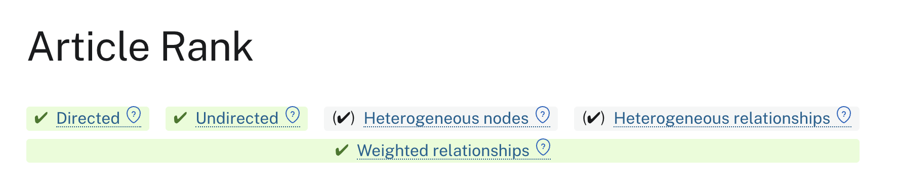
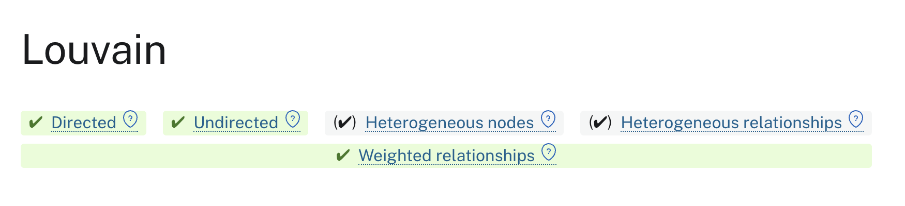

= Understand GDS documentation
:type: lesson
:order: 4

[.transcript]
== Introduction

You've learned about algorithm categories and execution modes. Now it's time to learn how to read GDS documentation so you can understand any algorithm on your own.

The GDS documentation follows a consistent structure across all algorithms. Once you understand this pattern, you can quickly learn any new algorithm and apply it to your problems.

In this lesson, you'll learn how to interpret algorithm documentation and extract the information you need to use an algorithm effectively.

By the end of this lesson, you will be able to:

* Navigate the GDS documentation structure
* Understand algorithm syntax and parameters
* Interpret algorithm examples and use cases
* Find configuration options for any algorithm


== GDS Documentation Structure

Every algorithm page in the GDS documentation follows the same structure:

- **Header:** Information about the algorithm's attributes
- **Introduction:** What the algorithm does and when to use it
- **Syntax:** The exact format for calling the algorithm
- **Examples:** Working code you can adapt
- **Configuration:** Available parameters and their effects
- **Results:** What the algorithm returns


== Understanding the header information

At the top of every algorithm's documentation, you will notice this header:



For each algorithm, you get a quick view that tells you what attributes the algorithm has, so you can decide whether or not it's right for your graph and intent.

The attributes are always the same:

- **Directed:** Whether or not the algorithm can run on a directed graph (where relationships have a specific direction)
- **Undirected:** Whether or not the algorithm can run on an undirected graph (where relationships have no direction)
- **Heterogeneous nodes:** Whether the algorithm supports graphs with multiple node types
- **Heterogeneous relationships:** Whether the algorithm supports graphs with multiple relationship types
- **Weighted:** Whether the algorithm can use relationship weights (numeric properties on relationships that represent strength, cost, distance, etc.)

At first glance, it can appear that each attribute has only two states, but there are actually three.

[opts="header",cols="1,1,1,1"]
|===
| {set:cellbgcolor:#f5f5f5}**Attribute**                   | {set:cellbgcolor: #e8f5e9}✓ Green                                  | {set:cellbgcolor: #f5f5f5}✓ Gray                                   | {set:cellbgcolor: #ffebee}x Red
| {set:cellbgcolor:#ffffff}**Directed**                    | {set:cellbgcolor: #e8f5e9}Runs well on directed graphs             | {set:cellbgcolor: #f5f5f5}Runs but ignores directionality          | {set:cellbgcolor: #ffebee}Does not run on directed graphs
| {set:cellbgcolor:#ffffff}**Undirected**                  | {set:cellbgcolor: #e8f5e9}Runs well on undirected graphs           | {set:cellbgcolor: #f5f5f5}Runs but ignores directionality          | {set:cellbgcolor: #ffebee}Does not run on undirected graphs
| {set:cellbgcolor:#ffffff}**Undirected**                  | {set:cellbgcolor: #e8f5e9}Runs well on undirected graphs           | {set:cellbgcolor: #f5f5f5}Runs but ignores directionality          | {set:cellbgcolor: #ffebee}Does not run on undirected graphs
| {set:cellbgcolor:#ffffff}**Heterogeneous nodes**         | {set:cellbgcolor: #e8f5e9}Can consider node labels                 | {set:cellbgcolor: #f5f5f5}Runs but ignores node labels             | {set:cellbgcolor: #ffebee}Does not run on graphs with labels
| {set:cellbgcolor:#ffffff}**Heterogeneous relationships** | {set:cellbgcolor: #e8f5e9}Can consider multiple relationship types | {set:cellbgcolor: #f5f5f5}Runs but ignores relationship types      | {set:cellbgcolor: #ffebee}Does not run on graphs with multiple relationship types
| {set:cellbgcolor:#ffffff}**Weighted relationships**      | {set:cellbgcolor: #e8f5e9}Can consider relationship properties     | {set:cellbgcolor: #f5f5f5}Runs with properties, but ignores them   | {set:cellbgcolor: #ffebee}Does not run on graphs with relationship properties
|===

These attributes help you quickly determine:

- If an algorithm is compatible with your graph's structure
- If you need to reconfigure your projections to run the algorithm
- If the algorith can handle relationship properties like `distance` or `cost`, etc.
- If the algorithm can consider node labels in its calculations

For example, if your graph has directed relationships, like -[:PURCHASED]-> but you want to run Leiden, you need to reconfigure your relationships to UNDIRECTED in your projection.

image::images/leiden_attributes.png[Leiden's attributes as seen in the GDS docs.]

However, if your community detection __required__ retaining the directionality of relationships, you could switch to Louvain, which can run on directed relationship types.



Or, if you absolutely had to use Leiden, you could add relationship weights to stand in for the directions.

Most algorithms support multiple configurations, but checking these attributes first saves time and helps you understand the algorithm's capabilities.


== Reading Algorithm Syntax

The syntax section shows you exactly how to call an algorithm. Here's an example for PageRank:

```
CALL gds.pageRank.stream(
  graphName: String,
  configuration: Map
)
YIELD
  nodeId: Integer,
  score: Float
```

This tells you:

- **Algorithm name**: `pageRank`
- **Execution mode**: `stream`
- **Required parameters**: graph name (String)
- **Optional parameters**: configuration (Map)
- **Return values**: nodeId and score


== Understanding Configuration Options

The configuration section lists all available parameters for an algorithm. Each parameter has:

- **Name** - What it's called in the configuration map
- **Type** - What kind of value it expects (String, Integer, Float, Boolean)
- **Default** - What happens if you don't specify it
- **Description** - What it does

For example, PageRank configuration might include:

- `maxIterations` (Integer, default: 20) - Maximum number of times PageRank should run sequentially on the modified graph
- `dampingFactor` (Float, default: 0.85) - Probability of following relationships
- `tolerance` (Float, default: 0.0000001) - Convergence threshold


== Working with examples

The examples section provides working queries you can adapt. They show:

- How to set up a projection for the algorithm
- How to call the algorithm with common configurations
- How to interpret and use the results

Always start with the simplest example and modify it for your needs.

In most cases, if you are stuck with a query, you can just copy paste the syntax from here into the browser, and modify the variables and parameters for your use-case.


== Finding what you need

When approaching a new algorithm in the documentation:

1. **Read the introduction** to understand what it does
2. **Check the syntax** to see required vs. optional parameters
3. **Review examples** to see it in action
4. **Explore configuration** to understand customization options
5. **Check results** to know what you'll get back


== What's next

You now know how to read and interpret GDS documentation. This skill lets you learn any algorithm independently and understand how to configure it for your specific needs.

In the next lesson, you'll dive deeper into algorithm configuration, learning how different settings affect results and how to tune algorithms for your use cases.


[.quiz]
== Check your understanding

include::questions/1-doc-structure-order.adoc[leveloffset=+1]

include::questions/2-attribute-indicators.adoc[leveloffset=+1]


[.summary]
== Summary

GDS documentation follows a consistent structure: introduction, syntax, examples, configuration, and results. Learning to read this structure lets you quickly understand any algorithm.

The syntax section shows required and optional parameters. The configuration section explains customization options. The examples section provides working code you can adapt. Together, these sections give you everything you need to use an algorithm effectively.

