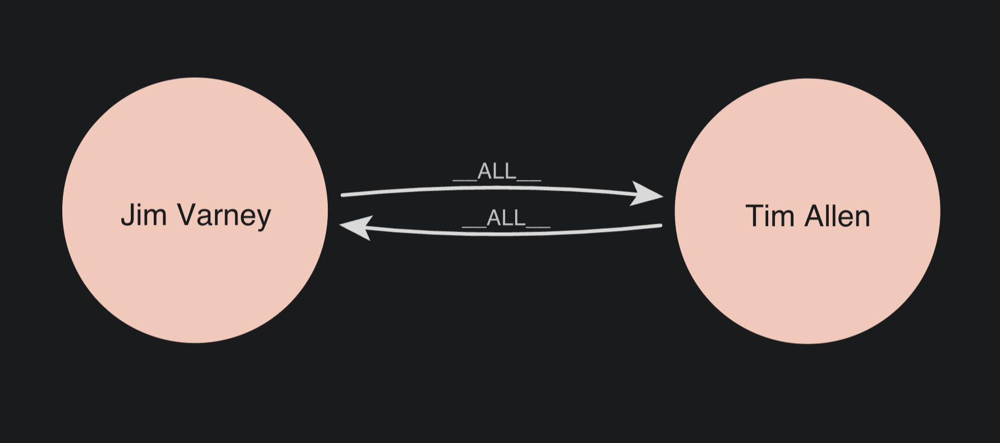
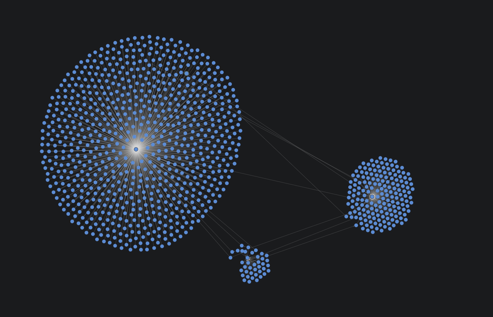
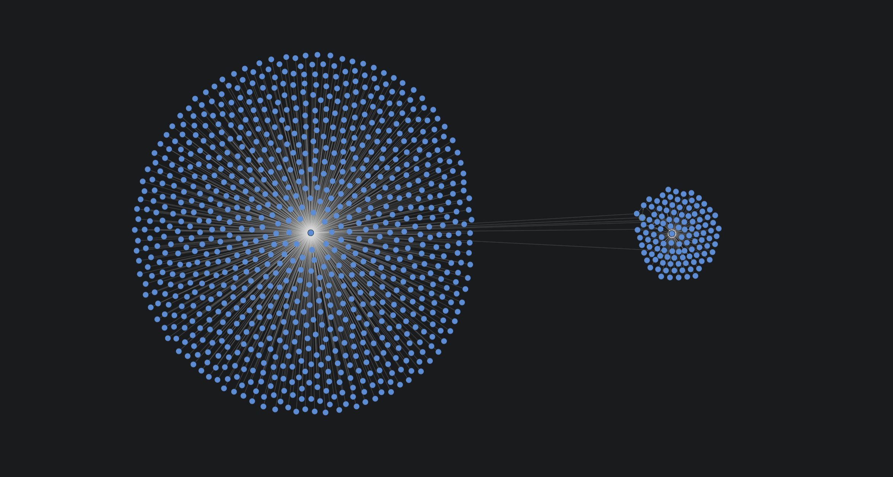
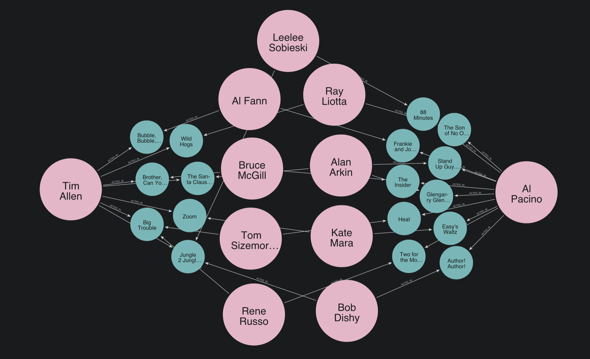

= Running algorithms
:type: lesson
:order: 6

[.transcript]
== Introduction

You've learned about execution modes and configuration. Now it's time to practice running algorithms with different configurations and see how those changes affect results.

In this lesson, you'll run degree centrality, PageRank and Louvain community detection on the actor collaboration network, experimenting with algorithm-specific configurations.

By the end of this lesson, you will understand:

* How to run algorithms on a directed graph
* How to interpret results from a directed graph
* How algorithm configuration affects results

== Setup: Create the Actor Network

First, check if the 'actor-network' graph exists and drop it if it does:

[source,cypher]
----
CALL gds.????.????(????) 
YIELD graphName
RETURN graphName
----

Now, let's create a fresh actor collaboration projection in which `Actor` nodes who appeared in the same movies connect directly to each other:

[source,cypher]
----
MATCH ????
????(
  'actor-network',
  source,
  target,
  {},
  {}
) ????
RETURN g.graphName, g.nodeCount, g.relationshipCount
----

This creates a directed graph of actors connected through shared movies. Every actor who appeared in a movie receives a relationship from every other actor who appeared in that movie.

Now let's create a second directed projection of actors to movies. Note, the actor names are included for illustrative purposes only -- GDS does not actually see them.

[source,cypher]
----
MATCH (source:Actor)-[:ACTED_IN]->(target:Movie)
WITH gds.graph.project(
  'actor-movie-network',
  source,
  target,
  {}
) AS g
RETURN g.graphName, g.relationshipCount, g.nodeCount
----

This creates a graph of `Actor` nodes connected to the `Movie` nodes in which they appeared.

image::images/jim_toystory.png[Jim Varney the actor, ACTED_IN Toy Story the movie, as shown in the Neo4j Browser.]

In theory, one might expect these to return similar results -- but let's run some experiments to find out what really happens.

== Degree centrality: default configuration

By now, you're familiar with degree centrality. It counts how many outgoing relationships each node has.

Let's run it in `stream` mode on our `'actor-network'` graph with default settings:

[source,cypher]
----
CALL gds.degree.stream('actor-network', {})
YIELD nodeId, score
RETURN gds.util.asNode(????).name AS actor, score AS degree
ORDER BY degree DESC
LIMIT 10
----

Since relationships are directed, this counts **outgoing** relationships—how many other actors each actor is connected to.

In our current graph, actor collaborations are symmetrical; two actors who appeared in the same movie will each receive a relationship from the other.

You can reconfigure degree centrality to count relationships in the opposite direction.

Complete the query below and run it to see what happens:

[source,cypher]
----
????
  orientation: 'REVERSE'
})
YIELD nodeId, score
RETURN gds.util.asNode(nodeId).name AS actor, score AS degree
ORDER BY degree DESC
LIMIT 10
----

This counts **incoming** relationships instead. Our graph is completely symmetrical -- every actor is connected to their collaborators in both directions.

However, let's now rerun degree centrality on our `Actor` -> `Movie` graph.

[source,cypher]
----
CALL gds.degree.stream('movie-network-directed', {})
YIELD nodeId, score
RETURN gds.util.asNode(nodeId).name AS actor, score AS degree
ORDER BY degree DESC
LIMIT 10
----

Running this should return a table that looks much like the two previous tables. Robert De Niro still has the most movies, so he is still number 1. 

However, now run it again, reversing the orientation, as before. 

[source,cypher]
----
CALL gds.degree.stream('movie-network-directed', {
  orientation: 'REVERSE'
})
YIELD nodeId, score
RETURN gds.util.asNode(nodeId).name AS actor, score AS degree
ORDER BY degree DESC
LIMIT 10
----

If you implemented this correctly, you would have received a table that looks like this:

[options="header"]
|===
| movie | degree
| "Sabrina" | 4.0
| "Sudden Death" | 4.0
| "Waiting to Exhale" | 4.0
| "Heat" | 4.0
| "Tom and Huck" | 4.0
| "Jumanji" | 4.0
| "Toy Story" | 4.0
| "Grumpier Old Men" | 4.0
| "Father of the Bride Part II" | 4.0
| "GoldenEye" | 4.0
|===

Instead the the command returns a table that looks more like this:

[options="header"]
|===
| actor | degree
| null | 4.0
| null | 4.0
| null | 4.0
| null | 4.0
| null | 4.0
| null | 4.0
| null | 4.0
| null | 4.0
| null | 4.0
| null | 4.0
|===

This exercise illustrates __how__ the projection influences what we can gain from the algorithm. 

When you reversed the relationships on the `'actor-network'` projection, it went from this:

To this:

There was fundamentally no change between them because both relationships were reversed.

However, when you reversed the relationships on the `'actor-movie-network'` graph, it went from this:

image::images/jim_toystory.png[Jim Varney the actor, ACTED_IN Toy Story the movie, as shown in the Neo4j Browser.]

To this:

image::images/reverse_acted_in.png[Toy Story connected to Tim Allen and Jim Varney via reversed relationships.]

Think about what degree centrality is actually doing here. It's counting **outgoing** relationships to define 'centrality'. So, when we change the direction, it is no longer determining the centrality of `Actor` nodes. It is determining the centrality of `Movie` nodes.

In the return statment, we specified the `name` property as an output for the first column. But it's no longer returning actors -- it's returning movies. The corrected query looks like this:

[source,cypher]
----
CALL gds.degree.stream('movie-network-directed', {
  orientation: 'REVERSE'
})
YIELD nodeId, score
RETURN gds.util.asNode(nodeId).title AS movie, score AS degree
ORDER BY degree DESC
LIMIT 10
----

In this graph, all movies have a maximum cast of 4 members. So, when we use 'number of `ACTED_IN` relationships' as the metric, we receive a slew of top results.

The behavior of the algorithm is determined by the projection's data model and the direction of its relationships.

Let's test another configuration behavior with Louvain.

== Louvain: Default configuration

Louvain detects communities by grouping nodes that are more densely connected to each other than to the rest of the network.

It does this by progressively lumping densely connected nodes together into hierarchical clusters.

For example, if you were to imagine what Louvain was doing, it might look something like this:

**Level 1:** No clustering

image::images/hierarchy_1.png[a cluster of nodes, densely connected, with no discernible shape]

**Level 2:** Identifies natural clusters

image::images/hierarchy_2.png[5 clusters of nodes with a few connections between them]

**Level 3:** Tries to make each cluster __more__ internally connected

**Level 4:** Clusters can no longer be any more internally connected than they currently

It doesn't actually create these clusters with relationships -- it simply assigns them a `communityId value`.

In the images above, new nodes representing that value have been created, and nodes that belong to it have been connected.

To see this in action, let's run Louvain in `stream` mode with default settings:

[source,cypher]
----
CALL gds.louvain.stream('actor-network', {})
YIELD nodeId, communityId
WITH communityId, COUNT(*) AS size
RETURN communityId, size
ORDER BY size DESC
LIMIT 10
----

This shows the top 10 communities by size. Notice how many actors are in each community.

You will likely notice a clearly falling scale from the most populated network to the least populated.

=== Louvain: Analyzing default results

Let's see some actual actors in the largest community:

[source,cypher]
----
CALL gds.louvain.stream('actor-network', {})
YIELD nodeId, communityId
WITH communityId, COLLECT(gds.util.asNode(nodeId).name) AS actors, COUNT(*) AS size
ORDER BY size DESC
LIMIT 1
RETURN communityId, size, actors[0..10] AS sampleActors
----

These actors likely work in similar circles, even if not together.

However, the power of Louvain, and graph, is that no two actors need to have worked directly with one another to be included in the same group.

Imagine that two actors had never met, but through a two-hop relationship, they are both connected to the same densely connected group of actors. In this case, they may be considered part of the same group.

For example, you likely got 'Tim Allen' and 'Al Pacino' in your top results. But they have never starred in a movie together.

These are not two actors that you would think of putting together. Yet, when we check the full IMDb graph, we see that they are far more connected than one might initially presume.

== Louvain: Custom Configuration

Louvain has several configuration options. Let's experiment with `maxLevels`.

By default, Louvain runs with 10 levels. That means that it will attempt to create more modular -- and usually larger -- clusters up to ten times.

Run the queries below, in sequence, to see what happens when we run Louvain at different `maxLevels` settings:

[source,cypher]
----
CALL gds.louvain.stats('actor-network', {
  maxLevels: 1
})
YIELD communityCount, modularity, ranLevels
RETURN communityCount, modularity, ranLevels
----

Note the communityCount and try with 2 levels:

[source,cypher]
----
CALL gds.louvain.stats('actor-network', {
  maxLevels: 2
})
YIELD communityCount, modularity, ranLevels
RETURN communityCount, modularity, ranLevels
----

Notice here how the communityCount drops significantly. This happens because Louvain has found that these smaller communities are more interconnected togther than they are apart.

Try again with `maxLevels` 20. Replace the `????` with the correct values and run the algorithm:

[source,cypher]
----
CALL gds.louvain.stats('actor-network', {
????
})
YIELD communityCount, modularity, ranLevels
RETURN communityCount, modularity, ranLevels
----

Even though we told Louvain to try 20 levels, it has stopped after only 4. That happens because the communities have 'converged'. 

In other words, the connections within each community are not going to become any more dense through further iterations -- so the algorithm stops.

There are many other configuration settings to play around with. You can review these on the link::https://neo4j.com/docs/graph-data-science/current/algorithms/louvain/[Louvain docs]. 

== What's next

You've practiced running degree centrality and Louvain with different configurations on a directed graph. You've seen how algorithm parameters affect results.

In the next lesson, you'll learn how projection configuration affects algorithm behavior—specifically, how to change relationships to undirected and run PageRank and Leiden.

Before you continue, you should try to play around with these algorithms in your free Aura instance.

If you have not yet set one up, feel free to head back to Module 1: Lesson 3, where you can follow the instructions to create one.

[.quiz]
== Check your understanding

include::questions/1-degree-orientation.adoc[leveloffset=+1]

[.summary]
== Summary

Degree centrality counts relationships. You can configure orientation to count outgoing, incoming, or total connections.

Louvain detects communities through hierarchical clustering. Configuration options like `maxLevels` control the granularity of community detection. Use stats mode to test different configurations and find the right balance for your analysis.

